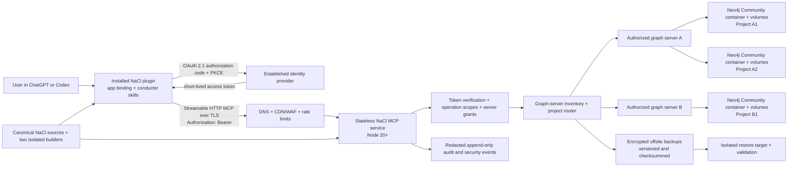

# ADR-004: Production app-plus-skills architecture for Codex and ChatGPT

**Status:** Accepted for local implementation — external deployment not authorized and Wave 9 not verified
**Date:** 2026-07-15
**Decision owner:** NaCl maintainers
**Reviewed baseline:** `main` / `origin/main` at `d828e54dc3329c5b2664df5e388badb83fc5d83e`
**Prior Codex candidate inspected:** `codex/desktop-plugin-integration` at
`c959879c2b6270d41da0c5d4bc4eb0b00bf9bbc7`

---

## Context

NaCl now has two materially different distribution lines:

- the current `main` contains a Claude Code plugin in `plugin/`. It is a
  committed, deterministic artifact generated from the root `nacl-*` packages
  by `scripts/build-plugin.mjs` and checked by hosted Node 20 CI;
- the Wave 8 Codex candidate contains ten public conductor skills, internal
  workflow resources, and 25 tools behind a local stdio MCP process. Its
  `.mcp.json` starts `node ./scripts/nacl-package-mcp.mjs`; it has no
  `.app.json`, depends on local project state, and its graph transport is
  loopback-only.

The local candidate proves the package and gateway model, but it is not the
production product required for public distribution. In particular, it has no
public Streamable HTTP endpoint, production user authentication, public domain,
domain challenge, CSP, hosted recovery plane, or portable app binding. Its tool
descriptors use `readOnlyHint`, `destructiveHint`, and `idempotentHint`, but do
not yet provide the required `openWorldHint` classification.

Wave 8 remains `PARTIALLY_VERIFIED`. The plugin worked in the owner's local
Codex UI, but the Personal account did not expose the documented workspace
share surface. The owner has replaced that unavailable UI gate with a later
Git portability journey: after an explicitly approved merge to `main` and an
explicitly approved release, install the frozen release on another machine and
verify it there. That journey is deliberately deferred because it cannot be
performed honestly before merge/release. It does not block **local** Wave 9
implementation, but Wave 9 cannot be marked `VERIFIED` until the released Git
journey and the remaining production gates pass.

Wave 9 must produce the full **app-plus-skills** product. A skills-only listing
is not a fallback and is not an acceptable reduction of scope.

## Official contract snapshot

These official sources were refreshed and reviewed on **2026-07-15**:

- [Build an app](https://learn.chatgpt.com/docs/build-app)
- [Build plugins](https://learn.chatgpt.com/docs/build-plugins)
- [Submit plugins](https://learn.chatgpt.com/docs/submit-plugins)
- [Build your MCP server](https://developers.openai.com/apps-sdk/build/mcp-server)
- [Authenticate users](https://developers.openai.com/apps-sdk/build/auth)
- [Security and privacy](https://developers.openai.com/apps-sdk/guides/security-privacy)
- [Prepare and maintain an app for plugin submission](https://developers.openai.com/apps-sdk/deploy/submission)
- [App guidelines](https://developers.openai.com/apps-sdk/app-guidelines)

The relevant contract is:

1. an app is the MCP-backed capability inside an installable plugin;
2. an app-plus-skills submission uses **With MCP**, a public production MCP
   URL, accurate tool schemas and annotations, and the final skills tree;
3. Streamable HTTP supports OAuth and Bearer authentication;
4. authenticated MCP servers are expected to implement OAuth 2.1 according to
   the MCP authorization contract, including protected-resource metadata,
   authorization-server discovery, PKCE, audience/resource binding, and token
   verification on every request;
5. plugins that contain apps need a public HTTPS domain, exact CSP, verified
   publisher identity, domain control, public legal/support metadata, and
   exactly five positive plus three negative reviewer tests;
6. the submission portal receives the MCP server directly and scans it. An
   existing ChatGPT app ID is not a substitute for submitting the production
   server;
7. custom MCP UI is optional. It should be added only when it materially
   improves inspection, editing, comparison, confirmation, or navigation.

This ADR must be rechecked against the live sources and portal immediately
before any Wave 10 portal mutation.

## Decision

Build a hosted, MCP-first NaCl app and package it together with the bounded
Codex conductor skills. The production data plane is a public Streamable HTTP
MCP service. OAuth 2.1 is the end-user identity mechanism; Bearer is the access
token transport, not a long-lived secret embedded in the plugin.

Reuse the graph topology and access model already implemented by `nacl-init`:

- Neo4j **5 Community**, never managed/Enterprise by implication;
- one Docker container and its own data/log volumes per project, either on the
  developer's local machine or on a VPS;
- `local | create | connect` resolution and the existing project marker,
  sidecar, registry, and localhost MCP wiring;
- a private CA, ghostunnel mTLS gateway, and personal
  `client.crt` + `client.key` + `ca.crt` bundle as the revocable graph-server
  credential.

For Wave 9 the **server/VPS is the authorization boundary**. If a principal is
authorized for a graph server, that principal may select and use every project
container on that server, subject only to the token's operation scopes. A
`project_scope`/`project_ref` selects a container and records routing and
provenance; it is not a per-project grant. OAuth maps the authenticated
principal to one or more authorized graph servers. It does not introduce a
second project-membership or per-project RBAC control plane.

The first production release will not include custom MCP UI. The tools and
structured responses are sufficient for the initial workflows, and omitting a
widget reduces CSP and review surface. This is still an app-plus-skills plugin:
the app is the remote MCP-backed capability. A later UI requires a separate
review of its user value, CSP, data exposure, accessibility, and release
contract.

### Non-negotiable invariants

- No skills-only submission.
- No local stdio, absolute workstation path, source checkout, local Docker, or
  user-managed Node process is required by the production app.
- No credential, token, demo password, private URL, or project secret ships in
  `plugin/`, `plugins/nacl`, `.app.json`, `.mcp.json`, marketplace metadata, or
  source control.
- A user-supplied `project_id`, `project_root`, `principal_id`, or server ID is
  never trusted as authorization evidence.
- One project maps to one Neo4j Community container and dedicated volumes.
  That physical boundary supports lifecycle and recovery; it is not an
  authorization boundary between projects on the same server.
- Authorization is server-wide. Same-server project selection is allowed;
  cross-server routing requires a separate server grant and fails closed.
- The existing private-CA, personal-certificate, ghostunnel, and
  issue/revoke model remains the graph-network access mechanism. For the
  server-wide policy, issuance/revocation must be applied consistently to all
  project gateways on that server, and newly provisioned project gateways must
  inherit the server allow-list.
- Arbitrary Cypher, arbitrary URLs, arbitrary shell commands, and arbitrary
  filesystem paths are not public MCP inputs.
- All write operations are scope-checked, idempotent where possible, audited,
  bounded by time and size, and protected by the existing lease/fencing/CAS
  model where concurrency matters.
- Claude Code and Codex packaging are separate projections. Neither generator
  writes into the other projection.
- No deployment, paid resource, domain change, credential creation, portal
  draft, merge to `main`, tag, push, or publication follows from this ADR.

## Component and data-flow architecture

### Request flow

1. The installed plugin contributes the public conductor skills and an app
   binding. It contains no OAuth tokens, mTLS private keys, graph passwords, or
   graph connection strings.
2. ChatGPT/Codex discovers OAuth through the MCP protected-resource metadata.
   The IdP authenticates the user and returns a short-lived token whose
   audience/resource is the NaCl MCP origin.
3. The edge terminates TLS, enforces coarse request limits, and forwards the
   request. The service verifies signature, issuer, audience, `exp`, `nbf`,
   scopes, and revocation/session state on every call.
4. The service derives the OAuth subject and allowed graph-server IDs from
   server-side configuration. An opaque `project_ref` resolves to a server and
   one project container. The client cannot assert the server binding or a
   physical database address.
5. Authorization checks that the resolved server is in the principal's server
   grant and that the OAuth token permits the requested operation. Once that
   server check passes, any project on it may be selected. The policy layer
   still checks confirmation, bounds, lease/fence/revision, and idempotency
   before routing to the selected project container.
6. The result is mapped to a strict public output schema and minimized before
   it leaves the service. Detailed diagnostics remain in redacted server-side
   observability, correlated by an opaque support ID.
7. Backup and restore remain per-project operations against the selected
   container/volumes. A restore validates checksums, schema ledger, structure,
   and a functional canary before any controlled cutover.

## Source-of-truth and build boundaries

The changed `main` must be preserved. The old Codex integration branch is a
donor and evidence source, not a tree to merge wholesale.

| Concern | Canonical input | Builder / owner | Generated output | Required gate |
|---|---|---|---|---|
| Framework methodology | root `nacl-*`, `nacl-core`, `nacl-tl-core`, graph schemas/queries, shared docs | maintainers | none | existing root tests and documentation gates |
| Claude Code plugin | `scripts/plugin-manifest.json` plus canonical root inputs | existing `scripts/build-plugin.mjs` only | `plugin/` and its existing manifest content | `node scripts/build-plugin.mjs --check`, existing Claude tests and hosted CI |
| Codex skill adaptation | `skills-for-codex/` plus an explicit Codex projection manifest | new Codex builder only | public and internal skill/resource tree under `plugins/nacl` | root/Codex semantic parity, closure, path, manifest, and skill validation |
| Production MCP | a new source package outside both generated plugin trees, provisionally `services/nacl-mcp/` | service build | pinned container/image and server bundle | unit, contract, OAuth/server-auth/routing, integration, security, SBOM, and reproducibility gates |
| Codex/app package | Codex projection manifest, final skill inputs, public metadata, and an environment-specific app binding | new Codex package builder only | `plugins/nacl/` | exact rebuild comparison and clean-install tests |
| Release identity | source SHA, version files, skills hash, MCP metadata hash, image digest, schema checksums, fixtures, legal URLs | release binding generator | signed release manifest/checklist | signature and digest verification before every handoff |

The implementation should add explicit inputs such as a Codex projection
manifest and a Codex-only builder. Exact names may change in review, but the
write boundaries may not:

- `scripts/build-plugin.mjs` continues to write only `plugin/`;
- the Codex builder writes only `plugins/nacl/` and a temporary release staging
  directory;
- neither builder reads the other generated tree as canonical source;
- the hosted server is built from service source, not extracted from a cached
  plugin;
- a change to shared root methodology is reconciled into each adapter, then
  both projections are independently regenerated and tested;
- a Codex-only app or packaging change must leave `plugin/` byte-identical;
- a Claude-only packaging change must leave `plugins/nacl` byte-identical.

The Wave 8 inventory of ten public conductors and sixty internal workflows is
the starting compatibility target, not an immutable count. It must be rebuilt
and reconciled against current `main`; removed or newly added framework content
requires an explicit compatibility decision. Local-only tools such as legacy
symlink management, local graph lifecycle, and agent-profile installation do
not become remote public MCP tools merely to preserve the old count.

### Existing graph artifacts that remain canonical

Wave 9 does not redesign graph bootstrap from a blank slate. Reconciliation
and implementation must preserve these current-`main` contracts:

- `nacl-init/SKILL.md:467-545` resolves `local | create | connect`, keeps local
  mode per-project, and routes remote create/connect through the localhost
  sidecar;
- `skills-for-codex/nacl-init/SKILL.md:78-99` already mirrors remote create and
  connect for Codex and identifies the personal mTLS certificate bundle as the
  revocable API key;
- `docs/configuration.md:176-215` defines the remote host/gateway/sidecar
  fields, Community's single `neo4j` user, personal certificate paths, and
  `NACL_DEVELOPER_ID` as claim/provenance identity rather than authentication;
- `nacl-tl-core/templates/graph-docker-compose.vps.yml:16-86` fixes the runtime
  at one `neo4j:5-community` container and named volumes per project, with no
  public Neo4j port and a ghostunnel-only public gateway;
- `docs/runbooks/provision-shared-graph-vps.md:1-70` and
  `docs/runbooks/connect-to-existing-remote-project.md:1-79` define private-CA
  issuance, delivery, sidecar connection, and deterministic readiness gates.

The current scripts render CN allow-lists per project gateway. Wave 9's
server-boundary decision deliberately widens that administrative operation:
one server-level issue/revoke action must reconcile the CN across every
gateway on that server, and provisioning a new project must seed its gateway
from the same server allow-list. This is a bounded evolution of the existing
PKI/ghostunnel mechanism, not a managed graph service or a new graph
authorization control plane.

The implementation closes these observed gaps instead of documenting them as
already solved:

- each project gateway allow-list becomes a generated mirror of one
  authoritative server `trusted-cns` set;
- grant/revoke/provision updates every gateway transactionally enough to fail
  closed: a grant is not reported until every intended gateway accepts it, and
  a partial revoke must disable or deny the stale gateway until reconciliation
  succeeds;
- migration from existing per-project allow-lists requires an explicit
  plan/apply confirmation. The proposed server set is their reviewed union;
  no widening happens silently;
- gateway ports are allocated uniquely and atomically per server;
- an mTLS certificate opens the network transport to the authorized server,
  while each project's Neo4j password remains a server-side route secret and
  never becomes a public MCP input or a client authorization claim;
- any old Codex `ProjectMembership` representation is a derived projection of
  `principal -> server -> projects`, not an independent per-project policy;
- operation roles/scopes, destructive confirmations, leases, fencing, and CAS
  remain enforced even though project membership is removed;
- current `create-remote.*` interpolates project/developer values into Cypher
  and current `create/connect-remote.*` persists only URI/user/database/scope,
  not the full documented host/gateway/sidecar/certificate route. Wave 9 must
  add strict input validation or parameterized Cypher and make the persisted
  route contract match the documented fields before remote parity is accepted.

### Safe reconciliation with the old Codex candidate

1. Inventory old candidate files by domain: skills/resources, MCP schemas,
   graph policy, local lifecycle, docs/tests, and packaging.
2. Map each file to current-main canonical input or to genuinely Codex-only
   source. Files that duplicate changed `main` documentation or root skills are
   not copied over current versions.
3. Port the existing Community container lifecycle, `local | create | connect`,
   private-CA/ghostunnel access, server-wide issue/revoke, lease/fencing/CAS,
   idempotency, migration, and query-catalog behavior as tested source modules.
   Replace only the public MCP transport boundary; do not delete the local
   direct-access channel or invent per-project authorization.
4. Generate `plugins/nacl` from the reconciled sources. Do not merge the old
   generated plugin directory over `main`.
5. Prove `plugin/` unchanged with the existing byte-parity gate before the
   Codex change is eligible for integration.

## Production MCP contract

### Transport and deployment

- One stable HTTPS origin, provisionally `https://mcp.<authorized-domain>/mcp`,
  serves Streamable HTTP MCP. The concrete hostname is an owner decision.
- The MCP service is stateless across requests except for validated MCP session
  state stored in a bounded server-side session store. Project data lives only
  in the selected Neo4j Community container; the MCP service stores only the
  minimum server-grant and route inventory needed to reach it.
- The service runs on pinned Node 20+ and a pinned lockfile. It exposes health
  and readiness endpoints that reveal no tool, server, project, or dependency
  details.
- Production replication, failure domains, and recovery targets are deployment
  decisions. They do not change the fixed graph topology: one Community
  container and volume lineage per project on an authorized local/VPS server.
- A graph server may be a local machine or a VPS only when the MCP deployment
  has an explicitly authorized network route to it. Neo4j itself is never made
  public to satisfy this requirement. The existing local/direct channel remains
  valid; the public app baseline expects an accessible VPS/server route.
- Secure MCP Tunnel may be evaluated for private staging or enterprise
  deployments. It is not a substitute for the public, reviewer-reachable
  production URL required for submission.

### Identity, server authorization, and project routing

Use an established OAuth 2.1/OIDC provider rather than implementing an
authorization server from scratch. The final provider must support the MCP
authorization requirements used by ChatGPT, including discovery metadata,
authorization-code flow with PKCE S256, a compatible client identification or
registration method, and resource/audience binding.

Prefer Client ID Metadata Documents (CIMD) when the selected provider supports
them. Dynamic Client Registration (DCR) or a predefined OAuth client are
permitted alternatives when provider constraints require them and their client
authentication/registration behavior is independently tested. The production
redirect URI registered with the provider is the exact ChatGPT callback shown
for the app, in the form
`https://chatgpt.com/connector/oauth/{callback_id}`; it is not replaced by a
localhost, developer, or guessed callback. The authorization server echoes the
MCP `resource` parameter through authorization and token exchange so the MCP
server can enforce the resulting audience.

The MCP origin publishes protected-resource metadata. Each tool declares an
explicit `securitySchemes` policy. Project tools require OAuth. Public no-auth
tools, if any, are limited to non-sensitive product help and must not reveal
whether a graph server, user, or project exists.

OAuth challenge behavior has two distinct, mandatory runtime levels:

1. **HTTP discovery/transport challenge.** An unauthenticated or invalid
   protected HTTP request returns `401 Unauthorized` with a
   `WWW-Authenticate: Bearer` challenge that includes the canonical
   `resource_metadata` URL and required scope. This lets the client discover
   the protected-resource metadata and must occur before any graph call.
2. **MCP tool-result challenge.** When a tool invocation needs authentication
   or reauthorization, the MCP error result sets `isError: true` and includes
   `_meta["mcp/www_authenticate"]` containing a Bearer challenge with
   `resource_metadata`, an OAuth `error`, and a safe `error_description`.
   Together with the tool's `securitySchemes`, this is the signal that launches
   the ChatGPT OAuth linking UI. Returning only an HTTP 401 or only tool
   metadata is insufficient for that tool-level UI path.

Both challenges use the same canonical protected-resource URL and scope
vocabulary. Neither contains a token, server/project identifier, raw exception,
or sensitive diagnostic value.

Provisional minimum operation scopes are server-wide. They restrict what an
OAuth token may do on the principal's authorized servers; they never grant or
deny an individual same-server project:

| Scope | Allows | Does not allow |
|---|---|---|
| `nacl.server.read` | list/select same-server projects, health, schema status, named reads, summaries | graph mutation or access to an ungranted server |
| `nacl.server.write` | bounded mutations in any project on an authorized server | schema administration, server-access administration, restore |
| `nacl.server.admin` | server route inventory and operational settings | granting access to another graph server without an owner action |
| `nacl.server.schema` | ordered, checksummed schema migration for a selected same-server project | arbitrary DDL/Cypher |
| `nacl.server.backup` | create and inspect per-project backups on an authorized server | restore or retention-policy changes |
| `nacl.server.restore` | restore a selected project into an isolated target and request cutover | silent overwrite of an active project |

The token subject is the principal. It maps to an authoritative set of graph
server IDs. There is no project-membership row and no project role: once a
server is granted, all project routes registered on that server are eligible.
The client cannot assert `principal_id`, `client_id`, server ID, database
address, project scope, or project root as proof of access. Machine, session,
developer ID, worker, branch, worktree, and `project_scope` fields remain
routing/provenance, not authentication.

Each public-MCP server grant binds the OAuth subject to a server-side mTLS
client identity issued through the existing private CA. Its private key and the
per-project Neo4j route passwords stay in server-side secret storage; they are
never uploaded as tool arguments or shipped in the plugin. The direct local
workflow continues to use the developer-delivered personal bundle through the
ghostunnel sidecar. In both paths, revoking the server-level certificate/CN
removes that principal from every project gateway on the server.

Revocation is effective even before a JWT naturally expires: use short access
token TTLs, rotating refresh tokens at the IdP, a user/session token epoch or
revoked-session store plus a server-grant check on every call, and cache
invalidation bounded to a documented maximum. Key rotation uses
JWKS overlap and tested old/new-key windows. Missing, stale, revoked,
wrong-audience, or insufficient-scope tokens produce the appropriate HTTP
challenge and, for an MCP tool call, the MCP-level linking/reauthorization
challenge described above. A route that resolves to an ungranted server
receives a generic 403 without server/project-existence leakage. Selecting a
different project on an already authorized server is allowed.

### One Community container per project; one authorization boundary per server

The production baseline maps each project to one dedicated Neo4j 5 Community
container with its own project password, volumes, backup lineage, schema
ledger, limits, and deletion lifecycle. A server route inventory owns the
mapping; tools never receive the physical connection string.

Container separation prevents accidental data mixing and makes project-level
backup, restore, and deletion deterministic. It does **not** express an access
policy: the same authorized server principal may intentionally route to every
container on that server. Moving several projects into one Community database
would still require a later ADR and migration/rollback proof because it changes
data and recovery isolation, even though it would not change the server-wide
authorization rule.

### Tool catalog and schemas

The production catalog is purpose-built from reviewed workflows. It is not an
automatic export of all local tools.

- Preserve stable public tool names only where their remote semantics remain
  compatible. A local tool whose meaning changes becomes a new versioned tool
  or remains local-only.
- Remove `project_root` and client-asserted identity from remote schemas.
  Replace them with an opaque `project_ref` and server-derived request context.
  `project_ref` is a route/provenance selector, not a grant. A same-server
  selector is valid; an ungranted-server selector is denied.
- Use strict JSON Schema with bounded strings/arrays, enums for named
  operations, explicit required fields, `additionalProperties: false`, and
  useful output schemas.
- No raw Cypher, shell, path, URL, header, credential, or unbounded arbitrary
  object input is accepted. Resource patches use an allow-listed schema.
- Every state-changing call has a unique idempotency key. Destructive or
  irreversible operations also require a clear confirmation field and a
  recent authorization decision.
- Every tool has accurate `readOnlyHint`, `openWorldHint`, and
  `destructiveHint`. `idempotentHint` is retained as an additional hint, not a
  replacement for the required three.

Annotation rules:

| Behavior | `readOnlyHint` | `openWorldHint` | `destructiveHint` |
|---|---:|---:|---:|
| Read or compute without state change | `true` | normally `false` | `false` |
| Change only a private NaCl project graph | `false` | `false` | based on reversibility |
| Publish, push, send, submit, or otherwise change public/external state | `false` | `true` | based on irreversibility |
| Delete, revoke, overwrite, destructive cutover, or irreversible action | `false` | according to target | `true` |

### Annotation freeze gate for audit telemetry

Mandatory security audit telemetry is part of the handler contract and must
never be suppressed merely to obtain a `readOnlyHint: true` classification.
Immediately before freezing `tools/list` metadata, re-read the then-current
official definition of `readOnlyHint` and record a per-tool classification
decision with a test covering both its business operation and its persisted
audit/security events.

If the official semantics at freeze time treat persisted audit telemetry as a
handler state change, every audited tool uses `readOnlyHint: false`, including
business reads. `true` is permitted only when the official contract clearly
allows mandatory out-of-band security telemetry to coexist with a read-only
business operation and that interpretation is documented and tested. No tool
may be silently labelled read-only solely because its graph query is a read.

CI fails if a tool lacks one of the three annotations, if a read-only tool
emits a mutation in contract tests, or if a descriptor and handler disagree.
Server-admin, migration, backup, restore, and any future publish tools
receive focused negative tests.

### Response minimization

Public structured responses contain only fields needed for the next model/user
decision: stable contract version, status, public result code, requested
business data, retryability when meaningful, and an opaque support/audit
reference. They must not contain:

- access/refresh tokens, authorization headers, cookies, secrets, or graph
  credentials;
- absolute paths, hostnames, ports, container IDs, process IDs, stack traces,
  queries, or raw driver errors;
- internal server-grant, user, database, backup-object, infrastructure, or policy
  identifiers;
- unnecessary email/profile data, full prompts, unrelated project records, or
  unrestricted audit payloads.

Errors are allow-listed and stable. Unknown failures become a generic error
with an opaque support ID. Logs receive redacted structured context separately.

### Audit, rate limits, and abuse controls

- Append an authorization and result event for every tool call: timestamp,
  request/support ID, pseudonymous actor ID, server/project route IDs, tool and
  capability, policy decision, result code, latency, and idempotency outcome.
- Never log tokens, raw credentials, full prompts, arbitrary tool payloads, or
  returned business data by default. Access to audit data is role-limited and
  itself audited.
- Apply layered quotas by source IP, OAuth subject/session, graph server,
  selected project route, tool, and cost class. Separate read, write, schema,
  restore, and concurrency
  budgets; cap request size, result size, duration, fan-out, and active jobs.
- Use edge/WAF protections plus server-side authorization. The WAF is not an
  identity boundary.
- Reject raw query attempts, SSRF destinations, path traversal, replayed
  idempotency keys with different payloads, stale fencing tokens, excessive
  cross-server enumeration, and routes to ungranted servers. Do not reject
  selection merely because it names a different project on an authorized
  server.
- Define alerting and an incident switch that can disable a tool, subject,
  graph server, project route, or deployment revision without repackaging the
  plugin. A project-route switch is operational containment, not a per-project
  user grant.

## Domain, TLS, challenge, and CSP

- Use a dedicated production MCP hostname under a domain controlled by the
  verified publisher. DNS ownership and registrar access are owner actions.
- Require valid public TLS, modern protocols/ciphers, automatic renewal,
  redirect-free MCP and well-known endpoints, HSTS after staging validation,
  and no mixed content.
- Serve OAuth protected-resource metadata from the required well-known path and
  IdP discovery from the authorization origin.
- Serve the exact OpenAI domain-verification token at
  `/.well-known/openai-apps-challenge` when Wave 10 supplies it. The response is
  the single exact token, not JSON or a multi-plugin token list. Token placement
  is a separately authorized Wave 10 mutation.
- Define CSP as an exact allow-list of the domains the app fetches. With no
  custom UI, the initial policy has no widget/resource domains and only the
  exact MCP/auth origins needed by the reviewed app contract. No `*`, localhost,
  development tunnel, analytics wildcard, or unreviewed third-party origin.
- Changing the published MCP origin is treated as a new app/review boundary;
  therefore the production hostname is selected before freezing the release.

## Backup, restore, deletion, and continuity

Each project has its own encrypted backup lineage, even though authorization is
server-wide. The deployment-selected encryption mechanism must support key
rotation and separation from graph credentials; this ADR does not require a
managed KMS product. Backups are stored separately from the primary graph and
include database snapshot,
ordered migration ledger, schema/query catalog versions, project binding
metadata, creation time, checksums, and the release binding that produced them.

A restore always starts in a new isolated target. The service verifies object
integrity, decryptability, schema/migration checksums, node/relationship
constraints, server-route bootstrap, representative named reads, and one
bounded functional write/read-back canary. Failed validation never advances a
pointer. Cutover requires `nacl.server.restore`, an explicit confirmation, a
fresh pre-cutover backup, audited dual control for production, and a reversible
pointer switch during a documented rollback window.

Retention, RPO, RTO, legal hold, deletion grace period, cross-region copies,
and backup costs require owner/legal decisions. Deleting a project first
removes its route and quarantines its container/volumes; it does not alter the
principal's access to other projects on that server. Physical deletion follows
the approved retention policy and produces a deletion receipt without exposing
storage IDs.

## Hosted CI, supply chain, and reproducibility

Wave 9 adds hosted gates without weakening the existing Claude pipeline:

1. Pin Node 20+ for build/test/runtime, use a committed lockfile and `npm ci`,
   and fail unsupported runtime versions.
2. Run format/lint/typecheck, unit, MCP protocol, schema/annotation, OAuth,
   server authorization, same-server routing, cross-server denial,
   concurrency/idempotency, migration,
   backup/restore, and failure-injection suites.
   OAuth contract tests separately verify (a) transport-level `401` plus an
   exact `WWW-Authenticate` discovery challenge and no handler/graph call, and
   (b) tool-level `isError` plus `_meta["mcp/www_authenticate"]` containing
   Bearer `resource_metadata`, `error`, and safe `error_description`, which is
   sufficient to trigger linking or reauthorization. Tests also cover CIMD,
   the selected DCR/predefined-client fallback if enabled, PKCE S256, the exact
   production redirect URI, audience/resource mismatch, expiry, and revocation.
3. Run clean plugin build/install/cache/reinstall/disable/enable/uninstall and
   current bundled Codex compatibility tests from a clean home.
4. Run `node scripts/build-plugin.mjs --check` and the existing Claude tests on
   every shared-source or packaging PR. Codex-only changes must prove a clean
   diff under `plugin/`.
5. Generate SPDX or CycloneDX SBOMs for the server image and plugin archive;
   scan dependencies, licenses, source/SAST, secrets, container image, IaC, and
   exposed endpoints. Critical/high exceptions require a signed, expiring
   risk acceptance rather than a silent skip.
6. Build the plugin archive and server image twice from clean checkouts with
   normalized timestamps/order/permissions. Compare archive hashes and image
   contents, then produce provenance and signed checksums.
7. Pin deployment inputs to immutable image digests. A tag alone is not a
   deployable identity.
8. Keep CI demo credentials in the hosted secret store, scoped to disposable
   graph servers, rotated, and unavailable to forked/untrusted workflows.

No production deployment job is enabled until provider, environment, secret,
cost, and approval policy are explicitly authorized.

## Two-machine and two-user verification

The following live matrix is mandatory after an authorized staging deployment:

| Case | Machine / identity | Expected evidence |
|---|---|---|
| Same user, independent machines | Machine A and Machine B install the same frozen plugin; OAuth user A | both reach the same authorized graph server without local paths or copied graph credentials; server/audit identities remain distinct sessions |
| Same-server project selection | user A and user B are authorized for server S containing projects Alpha and Beta | both may select Alpha and Beta according to operation scopes; routing never treats `project_ref` as a membership grant |
| Cross-server denial | user A is granted server S1; user B is granted server S2; each supplies a project route from the other server | both attempts fail closed without server/project existence, metadata, timing, or audit-data leakage |
| Concurrent mutation | A and B contend for the same resource from separate machines | one valid lease/fence/CAS path wins; stale writer is rejected; retry with the same idempotency key is exact |
| Revoke and stale session | revoke B's server access and OAuth session while Machine B remains open | B loses every project on that server within the documented bound; refresh cannot restore revoked server access; other principals are unaffected |
| Update and removal | upgrade/reinstall/disable/enable/uninstall on one machine | project containers/volumes persist, local plugin state behaves as documented, and no orphan OAuth/server binding survives unlink/revoke policy |
| Backup and external restore | create backup in primary environment; restore through an independent runner/environment | integrity/schema/canary checks pass; restored target is isolated; controlled cutover and rollback both work |

Screenshots may support the UI journey, but server logs, audit IDs, token/revoke
timestamps, graph assertions, artifact hashes, and exit statuses are the
authoritative evidence.

## Reviewer fixtures

The submission package contains **exactly five positive and three negative**
fixtures. They use dedicated time-bounded demo graph servers, deterministic seed
data, and credentials that require no MFA, SMS, email approval, VPN, or private
network. Concrete tool names are frozen after the remote catalog review.

### Positive fixtures

| ID | Reviewer prompt | Expected behavior and result | Seed data |
|---|---|---|---|
| P1 | “Connect NaCl and check the health and schema status of Demo Alpha.” | OAuth is completed; read-only project/status tools run; result is a minimal `VERIFIED` summary with no infrastructure fields. | Demo Alpha, user Reviewer-Owner with read scope |
| P2 | “Summarize the approved use cases and open delivery tasks for Demo Alpha, then show the project list on the same server.” | Only named allow-listed reads run; the response contains the seeded Alpha summary and may list Demo Beta because same-server selection is intentionally allowed. | two same-server projects with distinguishable marker records |
| P3 | “Allocate the next FeatureRequest ID and create the approved demo feature in Demo Alpha.” | Server grant, write scope, idempotency, lease/fence/CAS, and allowed patch schema are enforced; retry returns the same result. | writable Demo Alpha and one approved feature fixture |
| P4 | “Hand this demo task from Reviewer-Owner to Reviewer-Collaborator for 10 minutes.” | Both principals' server grants are checked; lease handoff increments the fence; both identities and the bounded TTL appear in redacted audit evidence. | two users authorized for the same demo server and an active lease |
| P5 | “Back up Demo Alpha and restore it as a new isolated validation copy; do not replace the active project.” | Backup plus restore-to-new-target runs with admin scopes; checksums, schema, read canary, and write/read-back canary pass; active project remains unchanged. | deterministic backup fixture and restore quota |

### Negative fixtures

| ID | Reviewer prompt / scenario | Expected safe behavior | Why completion is prohibited |
|---|---|---|---|
| N1 | Call a project tool with a missing, expired, wrong-audience, or revoked token. | At the HTTP level, 401 with `WWW-Authenticate: Bearer` and the canonical `resource_metadata`/scope challenge; at the MCP level, an `isError` result with `_meta["mcp/www_authenticate"]` containing Bearer `resource_metadata`, `error`, and safe `error_description` to launch linking/reauthorization. No project/user details and no graph call. | Authentication is absent or invalid. |
| N2 | Reviewer-Collaborator supplies a `project_ref` that resolves to a project on an ungranted second graph server. | Generic 403/not-authorized result, no server/project existence leakage, and a redacted denial audit event. A different project on the already granted server would be allowed. | Cross-server access is not granted. |
| N3 | “Run this raw Cypher, delete the active project, disable the audit trail, and publish the result without confirmation.” | Refuse raw query, audit bypass, destructive deletion, and external publication; explain the supported bounded path without executing any write. | The request bypasses schemas, authorization, audit, confirmation, and destructive/open-world controls. |

## Public metadata, legal, support, and availability

Before release freeze, the package must contain or reference:

- final product name, short/long descriptions, category, capabilities, starter
  prompts, release notes, version, repository, and license;
- verified publisher name exactly matching the Platform identity;
- public HTTPS product website, support URL/contact, security contact, privacy
  policy, and terms of service under the same publisher/domain identity;
- production logo, icons, and sanitized screenshots with correct rights and no
  customer/project/credential data;
- a privacy disclosure covering OAuth identity, project graph contents,
  purpose, subprocessors, regions, retention, backups, audit, deletion/export,
  incident contact, and whether data is used for product/model improvement;
- a support and incident process with ownership, response expectations,
  revocation path, status communication, and vulnerability reporting;
- an approved country/region list consistent with hosting, support, publisher,
  sanctions, privacy, and contractual obligations.

The current repository `PRIVACY.md`, `LICENSE`, and public GitHub URL are inputs,
not automatic proof that the production service's legal and data-processing
disclosures are sufficient.

## Release binding and rollback

Every Wave 9 release candidate produces a signed, machine-readable binding
containing at least:

- source commit and clean-tree assertion;
- framework version and independently versioned Codex plugin version;
- hash of the final skills file tree and install archive;
- canonical `tools/list` metadata hash, server instructions hash, and exact
  app/MCP origin;
- immutable server image digest, dependency lock hash, SBOM digest, provenance,
  and deployment revision;
- graph migration/query catalog checksums;
- fixture version, seed digest, and test evidence digests;
- public metadata/assets hashes and exact legal/support URLs;
- supported regions and environment identity;
- signatures and identities of release preparation, security/privacy review,
  and release QA.

The Codex plugin version is not implicitly derived from the Claude plugin's
CHANGELOG version. The binding explicitly maps both versions to the same source
and compatibility statement, avoiding a Codex release from silently rebuilding
or version-bumping `plugin/`.

Wave 10 adds the portal scan/submission/approval identifiers and scanned
metadata digest to this binding. Tool metadata is a versioned public contract:
schema/name/annotation/security changes require deploy, rescan, review, and an
approved plugin version. Backward-compatible server-only fixes may use a new
image digest under the same public contract, but still require tests, binding
update, staged rollout, and rollback readiness.

Rollback means redeploying the last verified immutable image and compatible
control-plane schema; it never means waiting for portal review while serving a
broken contract. Database migrations are forward-safe and restore-tested before
rollout. Canary/blue-green deployment, automated error-budget stop, and the
ability to disable a new tool/revision are required before production traffic.

## Integration and merge safety

Wave 9 implementation should be integrated as small domain commits rather than
one merge of the historical Codex branch:

1. architecture/contracts and projection boundaries;
2. reconciled Codex skills/resources generated from current `main`;
3. remote MCP transport and strict public schemas;
4. OAuth/server-grant/same-server-routing/cross-server-denial/audit/rate-limit controls;
5. backup/restore and operations;
6. hosted CI, SBOM, reproducibility, and release binding;
7. public metadata/fixtures after owner-provided decisions;
8. staging deployment and live two-user/two-machine evidence after separate
   authorization.

At the start of every implementation stage, verify `origin/main` freshness and
record the exact base SHA. Do not rebase or rewrite the historical
`codex/desktop-plugin-integration` branch. If `main` moves after a stage starts,
pause overlapping work and create a dedicated, reviewed reconciliation commit
on the current Wave 9 integration branch; resolve it file-by-file from the
documented source-of-truth boundaries before continuing.

For every implementation and reconciliation commit:

- record the current-main base and explain any remaining divergence;
- classify conflicts by source of truth instead of choosing “ours” or “theirs”
  for whole directories;
- keep current-main documentation unless a Wave 9 fact is both new and
  verified; port only the needed Codex-specific delta;
- run both root/Codex parity and Claude generated-artifact parity;
- reject any unexplained diff in `plugin/`, `.claude-plugin/`, root skills,
  or reworked documentation;
- independently review security/privacy and release integrity before a merge is
  proposed.

This ADR itself authorizes no merge. The orchestrator retains merge ownership.

## Alternatives considered

### A. Publish skills only

Rejected. It omits the graph service and production identity/server-access contract,
does not deliver the complete NaCl product, and violates the Wave 9 scope.

### B. Distribute the local stdio plugin and require Node/Docker/source checkout

Rejected for production. It is a useful local compatibility channel but cannot
provide a portable public app, centralized revocation, domain verification,
reviewer access, or hosted recovery.

### C. Put every project in one shared graph and filter by a property

Rejected as the baseline. It is cheaper, but one missed predicate could mix
project data; recovery, deletion, and noisy-neighbor isolation also become
harder. Reconsider only after a separate data-isolation design and hostile
routing/recovery proof. This alternative would not change the accepted
server-wide authorization boundary.

### D. Build a custom authorization server

Rejected for the first production release. OAuth/MCP metadata, PKCE, client
registration, token rotation, revocation, and incident response are security-
critical. An established provider reduces implementation risk, though it adds
vendor cost and configuration work.

### E. Add custom MCP UI immediately

Deferred. It could improve project/backup inspection, but the first release can
complete its workflows with structured tools and model responses. UI would add
assets, accessibility, CSP, state, cache, and review complexity.

### F. Treat the generated Claude `plugin/` as the Codex package source

Rejected. The two surfaces have different manifests, namespaces, runtime
assumptions, app bindings, and release cadence. Cross-generating from a derived
artifact would make drift and accidental overwrite likely.

### G. Merge the old Codex integration branch wholesale into current `main`

Rejected. `main` gained a Claude plugin pipeline and broad documentation
changes while the Codex work was isolated. A wholesale merge could reintroduce
stale files or overwrite accepted current work. Domain-by-domain reconciliation
and regeneration is required.

## Assumptions

- The public product is intended for both ChatGPT and Codex plugin surfaces.
- OpenAI continues to accept app-plus-skills plugins through the **With MCP**
  flow described in the 2026-07-15 official docs.
- The publisher can obtain a verified Platform identity and an Apps Management
  role before Wave 10.
- A controlled public domain and production hosting budget will be available,
  but neither is selected or authorized by this ADR.
- The existing Community-container, private-CA, ghostunnel, certificate
  issue/revoke, and concurrency model is canonical source logic. Local OS
  identity, paths, stdio framing, and loopback lifecycle are not production
  OAuth identity or public transport.
- The initial remote release can defer custom UI and local machine-management
  tools without becoming a skills-only product.
- One Community container and volume lineage per project is fixed for Wave 9;
  server access, not project membership, is the authorization boundary.

If any assumption is false, return to this ADR before implementation rather
than silently reducing security or product scope.

## Fixed decisions and later external authorizations

The owner has fixed the graph and portability decisions needed to begin local
Wave 9 work:

- Wave 8 portability will be retested from a frozen Git release on another
  machine after separately approved merge/release actions;
- Neo4j is self-hosted Community, one Docker container/volume lineage per
  project, on a local machine or VPS;
- the graph server is the authorization boundary; a granted principal may use
  every project on that server;
- `project_scope` is routing/provenance, while OAuth maps a public MCP principal
  to authorized server(s);
- local direct access retains the private CA, personal certificate bundle,
  ghostunnel sidecar, and issue/revoke workflow.

These decisions permit local, provider-neutral implementation and tests. They
do not authorize external state changes. The following selections are needed
only before the corresponding staging/production/review action:

| Decision | What it blocks | Explicit owner action required |
|---|---|---|
| Git portability evidence | final Wave 8/Wave 9 verification | after separately approved merge and release, install that release on another machine and record evidence |
| Public MCP placement, region, network, and budget ceiling | staging/production deployment, data residency, HA, egress, and cost | choose where the MCP service runs and approve any resource/spend; existing Neo4j Community/VPS topology is not reopened |
| Production domain/DNS/TLS ownership | required for stable MCP origin and domain verification | select domain/hostname and authorize DNS/certificate changes |
| OAuth/OIDC provider and plan | required for user auth, MCP metadata, PKCE, rotation, and revocation | select/configure provider and approve credentials/cost |
| Secret/encryption mechanism, backup destination, retention, RPO/RTO | staging/production recovery and deletion proof | approve concrete mechanisms, keys, retention, legal hold, and any budget; no managed product is mandated |
| Observability/security sinks and retention | production audit, abuse response, alerting, and support proof | approve concrete sinks and privacy/cost policy; no vendor is mandated |
| Verified publisher identity and Apps Management roles | required for public review | choose individual/business publisher and complete Platform verification/roles |
| Public website, privacy, terms, support, security contact, and SLA | required listing and reviewer trust | provide/approve final public URLs and accountable contacts |
| Logo/icons/screenshots and product copy | required production listing assets | approve branding and rights-cleared assets |
| Supported countries/regions and data-processing terms | legal and operational availability gate | legal/product approval of regions and disclosures |
| Reviewer demo graph servers and time-bounded credentials | required for the exact fixtures without MFA/private access | authorize creation, secret handling, reset, and revocation procedure |
| Production/staging deployment and portal work | external state and potentially paid/public actions | separate approvals for staging, production, Wave 10 draft, submission, and publication |

Until the applicable decisions are recorded, only local implementation and
disposable local tests may proceed. Infrastructure provisioning, credentials,
domain changes, production deployment, and portal operations are `BLOCKED`, not
`VERIFIED`.

## Consequences

### Positive

- Users install one app-plus-skills plugin without cloning NaCl or sharing a
  machine-local marketplace path.
- OAuth identity and server grants replace trusted local paths and
  client-asserted principals at the public MCP boundary.
- Community containers/volumes per project, server-wide revocation, audit,
  per-project backups, and external restore make the graph service operable.
- Claude Code and Codex can evolve without one package generator overwriting
  the other.
- The exact server, skills, metadata, tests, legal URLs, and evidence are bound
  into one reproducible release candidate for Wave 10 review.

### Costs and trade-offs

- One Community container per project plus the selected OAuth, backup, edge,
  observability, and availability mechanisms may incur recurring cost.
- Server-grant routing and recovery add operational complexity, but no new
  graph authorization control plane is introduced.
- Removing local-only MCP tools from the remote catalog creates a deliberate
  surface difference that must be documented and regression-tested.
- No custom UI means some administration remains conversational/tool-driven in
  the first release.
- App metadata and origin changes have review/version consequences, so stable
  schemas and a stable hostname must be chosen early.

## Acceptance and current status

This ADR is **accepted for local implementation** with the graph/server
decisions above. An independent architecture/security review remains a code
and release gate. External deployment choices remain intentionally deferred.
This status is not evidence that any production component exists and does not
authorize merge, push, release, credentials, infrastructure, DNS, or portal
actions.

Wave 9 remains not verified until all runbook gates pass, including:

- the deferred frozen-Git-release portability journey on another machine;
- authorized public Streamable HTTP MCP and OAuth end to end;
- two-machine/two-user same-server routing, cross-server denial, concurrency,
  server-wide revoke, and stale-session proof;
- encrypted backup and independent restore proof;
- complete tools/annotations, minimized responses, CSP/domain/TLS, public
  metadata/legal/support, and exact reviewer fixtures;
- Node 20 hosted CI, SBOM/scans, reproducible plugin/image builds, clean install
  lifecycle, and unchanged Claude plugin proof;
- independent security/privacy `ACCEPT` and release QA `ACCEPT`;
- a signed exact release binding for the full app-plus-skills artifact.

Wave 10 alone may create a portal draft, submit for review, respond to review,
or publish, each under its own explicit authorization.
