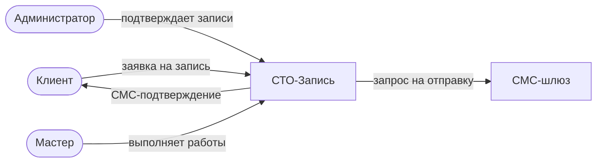
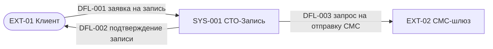
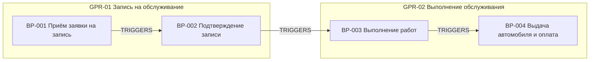
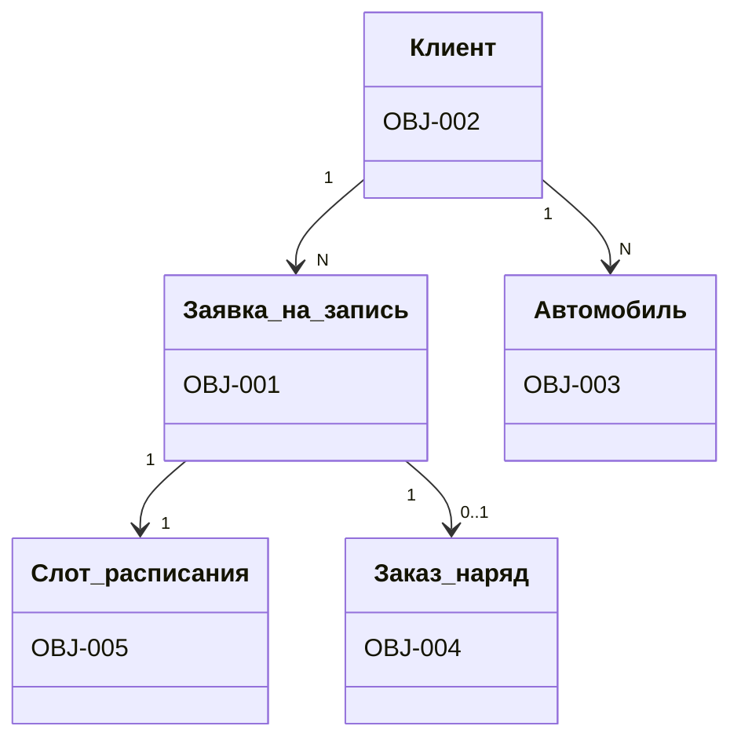
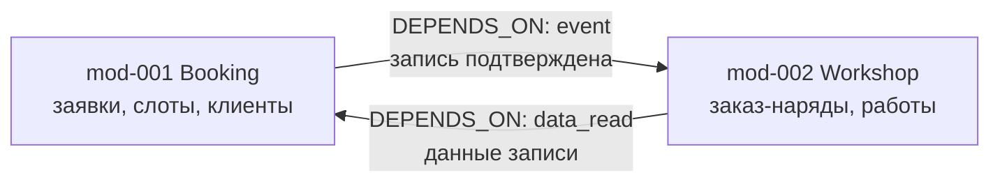
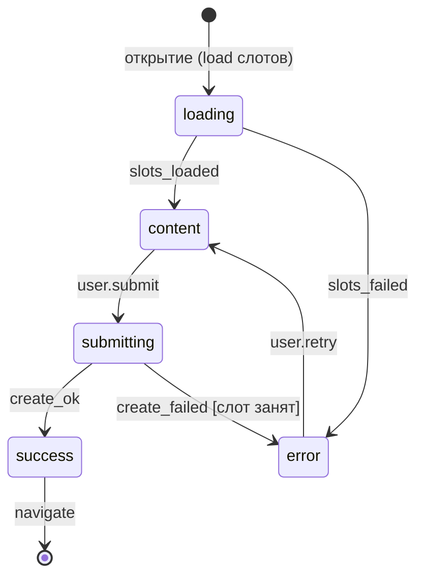

<!-- _class: lead -->

`A1-FIRST PRACTICE`

# Полный цикл разработки через ИИ

## Миф или быль?

Попробуем вместе собрать реально работающие приложения, пройдя все этапы
— от бизнес-анализа до разработки, — и найти ответ на вынесенный в заголовок
вопрос.

**Максим Никитин** · Founder ITSalt.ru · 59.9343° N · 30.3351° E

`2026`

<!--
Speaker notes:
- Представиться. Формат: 90–120 мин, два экрана — слайды и живой терминал.
- Сегодня мы не будем смотреть скриншоты. Пока я рассказываю — агент в соседнем
  окне **строит спецификацию настоящего мини-проекта**: бизнес-анализ, системный
  анализ, валидация, handoff в разработку.
- Сразу запустить pre-flight демо (см. demo-script.md): docker с Neo4j уже поднят,
  проект sto-demo инициализирован. Первый запуск /nacl-ba-full — на слайде с фазой 1.
- Обещание: к концу доклада в графе будет полная BA+SA спецификация,
  которую можно отдать в разработку.
-->


---

# Почему классические спецификации не работают с AI-агентами

Проект на 10–15 use case (сценариев использования) = **70+ markdown-файлов**
документации.

Три проблемы, которые накапливаются:

1. **Потеря контекста.** Агент не помнит вчерашних решений — каждая сессия
   начинается с перечитывания спеки: **~150 000 токенов** (токен — единица
   текста для LLM, ~¾ слова) до первой полезной работы.
2. **Drift.** Код меняется — документы молчат. Через месяц спека описывает
   систему, которой больше нет.
3. **Нет queryability.** «Какие use case затрагивают сущность *Заказ-наряд*?» —
   это grep по всем файлам и надежда, что имя написано одинаково.

> Граф даёт уверенность; grep даёт надежду.

<!--
Speaker notes:
- Подчеркнуть: проблема не в дисциплине команды, а в формате. Плоские файлы
  структурны только до уровня заголовков.
- Консистентность нельзя проверить: «у каждого процесса есть владелец?» —
  только глазами или хрупкими regex-скриптами.
- Мостик к следующему слайду: а что если спецификация — это не документы, а данные?
-->


---

# Три роли — три слоя

NaCl повторяет привычное разделение труда в команде разработки:

| Слой | Кто это в команде | Что производит | Скиллов |
|------|-------------------|----------------|---------|
| **BA** — Business Analysis | бизнес-аналитик | процессы, сущности, роли, правила — *«как работает бизнес»* | 14 |
| **SA** — System Analysis | системный аналитик | модули, доменная модель, сценарии использования (use case), формы — *«как устроена система»* | 10 |
| **TL** — TeamLead | техлид + разработчики | задачи, код, ревью, релизы — *«как это построить»* | 26 |

- **Скилл** — упакованная пошаговая инструкция для AI-агента
  (вызывается как команда: `/nacl-ba-full`).
- **Слой** = набор скиллов + его часть общего графа спецификации.
- Слои строго последовательны: SA читает результаты BA, TL — результаты SA.

Дальше в докладе «BA-слой», «SA-слой», «TL-слой» — именно в этом смысле.

<!--
Speaker notes:
- Ключевая мысль: методология не изобретает новые роли — она оцифровывает
  существующие. Аудитория-аналитики узнают здесь себя (BA и SA).
- Сегодня мы подробно проживём первые два слоя; TL покажу одним слайдом в конце.
- «Скилл» произносим часто — закрепить: это не модель и не магия, это
  инструкция, которую агент исполняет шаг за шагом.
-->


---

# Решение NaCl: спецификация — это граф

Все артефакты анализа — **типизированные узлы и рёбра** в графовой БД **Neo4j**:

```
BA-слой (14 скиллов)         SA-слой (10 скиллов)         TL-слой (26 скиллов)
процессы, сущности,    →     модули, домен, use cases, →  задачи, TDD-код,
роли, правила, глоссарий     формы, экраны, требования    ревью, QA, релизы
        ↓                            ↓                            ↓
   Neo4j (13 типов узлов)     Neo4j (12+12 типов узлов)     файлы + Git
```

**Cypher** — язык запросов к графовой БД (как SQL для таблиц, только про связи):

```cypher
MATCH (e:DomainEntity {name:"WorkOrder"})<-[:CONTAINS_ENTITY]-(:Module)
      -[:CONTAINS_UC]->(uc:UseCase)
RETURN uc.id, uc.name        // все UC, затронутые сущностью «Заказ-наряд»
```

<!--
Speaker notes:
- Cypher читается почти как предложение: «найди сущность, её модуль и все UC
  модуля» — показать пальцем по стрелкам запроса.
- 13 типов узлов в BA-слое, 12+12 — в SA-слое; полный каталог типов — в
  docs/methodology/. Дальше экономику этого подхода смотрим на следующем слайде.
-->


---

# Экономика планирования одного use case

**−99,6 %** контекста на каждый UC — и так в каждой сессии планирования.

| Подход | Что приходится читать агенту | Токены |
|--------|------------------------------|-------:|
| Markdown-спека | **всю спеку**: ~70 файлов — нужные факты разбросаны по ним | ~150 000 |
| Граф | один точечный Cypher-запрос + ответ | ~550 |

База сравнения честная: 150 тыс. токенов — стоимость чтения всей спеки. Чтобы
спланировать даже один UC, в классике агент вынужден прочитать широкий срез всех
файлов — он не знает заранее, где лежат нужные факты. Граф знает: запрос достаёт
ровно контекст одного UC.

<!--
Speaker notes:
- Токен — единица объёма текста для LLM (~3/4 слова); контекстное окно агента
  конечно, поэтому экономия токенов = больше полезной работы за сессию.
- Несправедливо ли сравнивать с чтением «всей спеки»? Нет: в классике агент не
  знает заранее, где лежат нужные факты, и читает широкий срез. Граф достаёт
  ровно контекст одного UC — это и есть −99,6 %.
- Эти же −99,6 % вернутся в самом конце, когда tl-plan строит задачи из графа.
-->


---

# Что ещё есть во фреймворке (справочно)

14 + 10 + 26 скиллов — это ядро трёх слоёв. Всего скиллов 57.
Остальное — крупными мазками:

| Группа | Что делает | Скиллы |
|--------|------------|--------|
| **Восстановление графа** | миграция старых markdown-спецификаций в граф; реконсиляция «код ↔ спека» — граф восстанавливается по living-коду; бэкфилл валидационных флагов после миграции | `nacl-migrate` (-ba, -sa), `nacl-tl-reconcile`, `nacl-sa-flags` |
| **Импорт документов заказчика** | DOCX / PDF / XLSX → Excalidraw-доска (онлайн-холст для схем) → граф: анализ полноты, синхронизация | `nacl-ba-import-doc`, `nacl-ba-analyze`, `nacl-ba-sync`, оркестратор `nacl-ba-from-board` |
| **Инкрементальные изменения** | новая фича через анализ влияния (impact) на граф; триаж входящих запросов «фича / баг / задача»; spec-first баг-фикс — сначала спека, потом код | `nacl-sa-feature`, `nacl-tl-intake`, `nacl-tl-fix` |
| **Публикация** | граф → markdown + Mermaid-диаграммы → база знаний (Docmost), доски | `nacl-render`, `nacl-publish` |
| **Здоровье проекта** | диагностика дрейфа доков и кода, поиск заглушек в коде, статус и «что делать дальше» | `nacl-tl-diagnose`, `nacl-tl-stubs`, `nacl-tl-status`, `nacl-tl-next` |
| **Автономные прогоны** | длинные циклы без человека — с проверяемым условием завершения; конвейер «запрос → staging» целиком | `nacl-goal`, `nacl-tl-conductor` |

Сегодня показываем ядро BA + SA; остальное — по ссылкам в конце.

<!--
Speaker notes:
- Ключевой мазок: фреймворк закрывает не только «зелёное поле». Можно прийти
  с существующим проектом — старыми markdown-доками или вообще только кодом —
  и ВОССТАНОВИТЬ граф: nacl-migrate (доки → граф), nacl-tl-reconcile
  (код ↔ спека). Для апгрейда старых графов на новые слои 2.15 есть отдельный
  гайд docs/runbooks/upgrade-graph-extensions.md — это инструкция агенту, не скилл.
- Импорт документов: клиент приносит ТЗ в Word — оно раскладывается на доску
  с цветами уверенности, аналитик правит, доска синхронизируется в граф.
- Автономные прогоны (nacl-goal) — отдельная большая тема: агент работает
  часами без человека, но условие завершения проверяемо детерминированно.
- Не задерживаться: это справочный слайд на 60–90 секунд, «ещё есть вот это».
-->


---

# Принцип автономии

> **Факты — от человека. Конструкции — от агента. Утверждение — человеком.**

| Только от пользователя (факты) | Агент строит сам (структуры) |
|---|---|
| Цели, границы, процессы, шаги | ID и нумерация (BP-001, UC-101…), связи, диаграммы |
| Сущности, атрибуты, правила | Матрицы (CRUD, роль×процесс), отчёты валидации |

«Агенты же галлюцинируют?» — да. Поэтому принцип держится
**не на доверии, а на четырёх конструкциях:**

1. **Фиксированный опрос.** Скилл предписывает: бизнес-факты — только из
   ответов пользователя или уже подтверждённого графа. Не из «знаний о мире».
2. **Метка допущения.** Всё, что агент предположил сам, несёт на узле
   `status: "assumption"` — допущение отделено от факта и видно запросом.
3. **Gate каждой фазы.** «Подтверждаете? (yes / redo / stop)» — модель
   не растёт, пока человек не утвердил.
4. **Валидация вместо фантазии.** Незаполненное остаётся дыркой — её поймает
   Cypher-проверка фазы валидации. «Дорисовывать» молча запрещено скиллом.

<!--
Speaker notes:
- Это ответ на главный скепсис зала, поэтому механика важнее лозунга:
  показать, что каждая из 4 конструкций — проверяемая, а не обещание.
- №2 можно показать живьём: MATCH (n {status:'assumption'}) RETURN n —
  список всех допущений модели одним запросом.
- №4 увидим в деле на фазе 8: я специально оставлю дырку, и валидация
  её найдёт — вместо того, чтобы агент тихо её «заполнил».
-->


---

# Как устроены оркестраторы ba-full / sa-full

```
L0-оркестратор (лёгкий контекст: прогресс + гейты)
 ├─ Phase 1 → Task-агент (изолированный контекст) → пишет в Neo4j
 ├─ [gate: подтверждение пользователя]
 ├─ Phase 2 → Task-агент → пишет в Neo4j
 ├─ ...
 └─ Phase 10
```

Три ключевых механизма:

- **Делегирование.** Каждая фаза — суб-агент со своим контекстным окном
  (рабочей памятью модели).
  Иначе оркестратор «сгорел» бы к 3–4 фазе: фазы порождают сотни узлов.
- **Граф = общая память.** Фаза 4 не читает вывод фазы 2 из контекста —
  она *запрашивает граф* (`MATCH (bp:BusinessProcess)…`).
- **Resume detection.** Перед стартом — Cypher-запросы «что уже есть в графе?»:
  прерванный прогон продолжается с первой незавершённой фазы, а не с нуля.

<!--
Speaker notes:
- Идемпотентность: все записи через MERGE — повторный прогон фазы не дублирует узлы.
- Resume можно показать живьём: прервать ba-full после фазы 2 и перезапустить —
  агент сам скажет «Phase 1–2: DONE, resuming from Phase 3».
- Это архитектурная необходимость для multi-phase AI-работ, не оптимизация.
-->


---

# Демо-стенд

**Подготовлено заранее** (≈10 минут по `docs/quickstart.md`):

```bash
docker compose -f graph-infra/docker-compose.yml up -d   # Neo4j — графовая БД
# схема графа: ba-schema + sa-schema + tl-schema → cypher-shell
# MCP-сервер neo4j в .mcp.json
#   (MCP — Model Context Protocol: стандартный мост Claude Code ↔ внешние системы)
```

**Первый живой шаг демо — инициализация проекта скиллом:**

```
cd ~/projects/sto-demo
/nacl-init "СТО Онлайн-запись"   # → CLAUDE.md (правила проекта) + config.yaml (конфиг)
```

| Окно | Что показывает |
|------|----------------|
| Терминал | Claude Code: `/nacl-init` → `/nacl-ba-full` → `/nacl-sa-full` |
| Neo4j Browser | «сырой» граф: узлы и связи (`localhost:3574`) |
| **SA Analyst Tool** | наше аналитическое приложение над графом — взгляд аналитика |
| Браузер | эти слайды |

<!--
Speaker notes:
- ЗАПУСК ДЕМО №0: выполнить /nacl-init прямо сейчас, показать созданные
  CLAUDE.md и config.yaml (порт графа, git-стратегия, команды тестов —
  все скиллы читают этот конфиг).
- Подчеркнуть: инфраструктура — обычный Docker + Node, ничего экзотического.
- SA Analyst Tool — собственная разработка: структурированный просмотр модели
  поверх того же графа (процессы, сущности, роли — без Cypher). Показывать
  будем оба взгляда: «сырой» Browser и аналитический.
- Сейчас граф ПУСТОЙ: в Browser выполнить MATCH (n) RETURN count(n) → 0.
  Всё, что появится дальше, появится у зала на глазах.
-->


---

# Сквозной пример: «СТО: онлайн-запись»

Автосервис, куда клиенты записываются онлайн. Маленький, но настоящий домен:



- **Процессы:** приём заявки → подтверждение записи → выполнение работ → выдача и оплата
- **Сущности:** Заявка на запись, Клиент, Автомобиль, Заказ-наряд, Слот расписания
- **Роли:** Клиент, Администратор, Мастер
- **Правила:** нельзя записаться на занятый слот; стоимость = работы + запчасти;
  выдача — только после оплаты

<!--
Speaker notes:
- Домен придуман для доклада: каждый в зале был в автосервисе, объяснять нечего.
- При этом в нём есть всё «взрослое»: статусные модели (заявка, заказ-наряд),
  конкурентный ресурс (слот), внешняя система (СМС), расчётные правила.
- Этот слайд — карта. Дальше мы построим всё это в графе по фазам.
-->


---

<!-- _class: lead -->

`01 · BA_FULL`

# Бизнес-анализ: 10 фаз в графе

Команда **`/nacl-ba-full`**: от интервью о границах системы — до пакета передачи
системному аналитику. Каждая фаза пишет типизированные узлы в Neo4j и
закрывается gate'ом.

**1** Контекст · **2** Процессы · **3** Workflow · **4** Сущности · **5** Роли ·
**6** Глоссарий · **7** Правила · **8** Валидация · **9** Handoff · **10** Публикация

<!--
Speaker notes:
- Это раздел 01 доклада. Дальше — обзор 10 фаз и по каждой фазе пара слайдов:
  «что/зачем/ожидаемый результат» + живой пример на домене «СТО».
- Запуск демо BA_FULL — на слайде обзора фаз.
-->


---

# `/nacl-ba-full` — 10 фаз бизнес-анализа

```
1 Контекст → 2 Процессы → 3 Workflow → 4 Сущности → 5 Роли
     → 6 Глоссарий → 7 Правила → 8 Валидация → 9 Handoff → 10 Публикация
```

После **каждой** фазы — confirmation gate: `yes / redo / stop`.

| Фазы | Характер | Что появляется в графе |
|------|----------|------------------------|
| 1–3 | интервью + конструирование | контекст, карта процессов, activity-диаграммы |
| 4–7 | каталогизация | сущности, роли, глоссарий, бизнес-правила |
| 8 | read-only проверка | отчёт валидации L1–L8 |
| 9 | **human gate** | пакет передачи BA→SA, трассируемость |
| 10 | опционально | рендер в markdown / Docmost |

<!--
Speaker notes:
- ЗАПУСК ДЕМО: в терминале набрать /nacl-ba-full — агент проверит пустой граф
  и начнёт фазу 1 с вопросов.
- Подчеркнуть: фазы 1–3 требуют человека (это интервью), 4–7 во многом
  автоматичны (агент извлекает из уже построенного графа и просит подтвердить).
- Фаза 9 — единственный обязательный human gate всей методологии: автономный
  цикл /goal через него пройти не может, это осознанное ограничение.
-->


---

# Как смотреть, что агент записал в граф

После каждой фазы я показываю результат. Два инструмента:

**1. Neo4j Browser — «сырой» граф** (`http://localhost:3574`)

1. Логин `neo4j`, пароль — из `graph-infra/.env` (поле `NEO4J_PASSWORD`)
2. Вверху — строка запроса: вставить Cypher со слайда → `Ctrl+Enter`
3. Результат — интерактивный граф: **кружки = узлы, стрелки = рёбра**;
   клик по узлу — его свойства; панель слева — все типы узлов и связей

**2. SA Analyst Tool — взгляд аналитика** (наша разработка)

Структурированный просмотр той же модели без Cypher: процессы, сущности,
роли, сценарии — в привычном аналитику виде.

Мини-словарь графа:

| Термин | Перевод | Это… |
|--------|---------|------|
| node | узел | «карточка» объекта (процесс, сущность, роль) |
| relationship | ребро, связь | типизированная стрелка между узлами |
| label | метка | тип узла (`BusinessProcess`, `UseCase`…) |
| property | свойство | поле узла (имя, статус, описание) |

<!--
Speaker notes:
- Этот слайд показывается один раз — дальше после каждого gate я просто
  переключаюсь в Browser/Analyst Tool и выполняю verify-запрос из ранбука.
- Все verify-запросы по фазам собраны в demo-script.md — не нужно их помнить.
- Прорепетировать переключение окон: слайды → терминал → Browser → слайды.
-->


---

# BA Фаза 1 — Контекст системы (`/nacl-ba-context`)

**Что делает:** фиксирует границы автоматизации — что внутри системы, что
снаружи; кто заинтересован; какие данные пересекают границу.

**Зачем:** без явной границы каждая следующая фаза «расползается» — анализ
начинает описывать весь бизнес вместо системы. Контекст — это рамка для
всех остальных фаз.

**Ожидаемый результат:**

| Узлы | Рёбра |
|------|-------|
| `SystemContext` — контекст системы (SYS-001) | `HAS_STAKEHOLDER` — имеет стейкхолдера |
| `Stakeholder` — заинтересованное лицо (STK-NN) | `HAS_EXTERNAL_ENTITY` — имеет внешнюю сущность |
| `ExternalEntity` — внешняя сущность (EXT-NN) | `HAS_FLOW` — имеет поток данных |
| `DataFlow` — поток данных (DFL-NNN) | |

Артефакт: контекстная диаграмма — генерируется из графа
(Mermaid — текстовый формат диаграмм).

4 под-шага: цели и границы (интервью) → внешние сущности (интервью) →
потоки данных (агент предлагает) → диаграмма (автоматически из графа).

<!--
Speaker notes:
- Пока агент задаёт вопросы фазы 1, объяснить: он спрашивает ТОЛЬКО факты
  (цели, кто пользователи, какие внешние системы) — потоки данных он
  СКОНСТРУИРУЕТ сам из описаний и попросит подтвердить.
- Это классическая контекстная диаграмма (C4 level 1 / IDEF0 A-0), но она
  не картинка, а подграф: диаграмма генерируется ИЗ узлов, а не рисуется.
-->


---

# Фаза 1 на примере СТО: вход → выход

**Вход (мои ответы агенту):**

> Система «СТО-Запись»: клиенты записываются на обслуживание онлайн.
> Цели: запись без звонка; администратор управляет расписанием; учёт работ.
> Стейкхолдеры: владелец СТО (загрузка и выручка), администратор (расписание).
> Внешние: Клиент (пользователь), СМС-шлюз (внешняя система).

**Выход (агент построил и записал в граф):**



`SystemContext ×1, Stakeholder ×2, ExternalEntity ×2, DataFlow ×3` — 8 узлов.

Gate: **«Границы и диаграмма верны? → yes»**

<!--
Speaker notes:
- Показать в Neo4j Browser: MATCH (s:SystemContext)-[r]->(n) RETURN s,r,n
- Обратить внимание на ID: SYS-001, EXT-01 — агент нумерует сам, сквозной счётчик,
  ID никогда не переиспользуются.
- Я отвечал 4 раза по одному предложению — структуру (направления потоков,
  имена) агент предложил сам.
-->


---

# BA Фаза 2 — Карта процессов (`/nacl-ba-process`)

**Что делает:** выявляет группы процессов (GPR) и бизнес-процессы (BP)
с триггерами и результатами; связывает процессы между собой.

**Зачем:** карта процессов — скелет всей модели. Позже автоматизируемые шаги
этих процессов станут use case'ами, а группы — кандидатами в модули системы.

**Ожидаемый результат:**

| Узлы | Рёбра |
|------|-------|
| `ProcessGroup` — группа процессов (GPR-NN) | `CONTAINS` — содержит (группа → процесс) |
| `BusinessProcess` — бизнес-процесс (BP-NNN) | `TRIGGERS` — запускает (результат одного = триггер другого) |
| `BusinessRole` — бизнес-роль (ROL-NN, предварительно) | `CALLS_SUB` — вызывает подпроцесс; `OWNS` — владеет; `PARTICIPATES_IN` — участвует |

Конвенция имён: **отглагольные существительные** — «Приём заявки»,
«Подтверждение записи» (не «Принять заявку»).

У каждого BP: триггер, результат, владелец, флаг `has_decomposition`
(нужна ли детализация workflow в фазе 3).

<!--
Speaker notes:
- Агент сам предлагает группировку: я описываю бизнес прозой, он структурирует
  и просит подтвердить. TRIGGERS-связи он выводит, сопоставляя результаты и
  триггеры («результат BP-001 = заявка принята» → «триггер BP-002»).
- has_decomposition — экономия времени: декомпозируем только то, что
  собираемся автоматизировать.
-->


---

# Фаза 2 на примере СТО: вход → выход

**Вход:** «Клиент выбирает время и оставляет заявку. Администратор её
подтверждает. В день визита мастер выполняет работы по заказ-наряду.
Потом администратор выдаёт автомобиль и принимает оплату.»

**Выход — карта процессов:**



| BP | Триггер | Результат | Владелец | Декомп. |
|----|---------|-----------|----------|---------|
| BP-001 | клиент хочет записаться | заявка создана | Администратор | ✔ |
| BP-002 | заявка создана | запись подтверждена | Администратор | — |
| BP-003 | клиент приехал | работы выполнены | Мастер | ✔ |
| BP-004 | работы выполнены | авто выдано, оплачено | Администратор | — |

✔ в колонке «Декомп.» = `has_decomposition`: в фазе 3 процесс будет разложен
на шаги. «—» — шаги моделировать не будем.

<!--
Speaker notes:
- Вход — буквально 4 предложения прозой. Группы, имена, триггер-цепочку
  агент предложил сам.
- Роли (Администратор, Мастер) уже появились как предварительные узлы —
  фаза 5 их обогатит.
- Почему ✔ только у BP-001 и BP-003: там многошаговая логика, которую мы
  собираемся автоматизировать — детализация даст use case'ы. BP-002 и BP-004 —
  по сути одно действие администратора; раскладывать их на шаги — лишняя
  работа без нового знания. Это решение принимаю я на gate, не агент.
- Где посмотреть: Neo4j Browser →
  MATCH (g:ProcessGroup)-[:CONTAINS]->(bp:BusinessProcess) RETURN g, bp
-->


---

# BA Фаза 3 — Workflow (`/nacl-ba-workflow`, по каждому BP)

**Что делает:** раскладывает каждый процесс с `has_decomposition=true` на шаги
в 3 «дорожки»: исполнители ← шаги → документы/артефакты. Решения и исключения —
явные узлы.

**Зачем:** здесь проводится **граница автоматизации** на уровне шага. Каждый шаг
получает стереотип: «Бизнес-функция» (останется ручным) или
**«Автоматизируется»** — из вторых потом родятся use case'ы.

**Ожидаемый результат (на каждый BP):**

| Узлы | Рёбра |
|------|-------|
| `WorkflowStep` — шаг процесса (BP-001-S01…) | `HAS_STEP` — имеет шаг; `NEXT_STEP` — следующий шаг (порядок, ветвления) |
| узлы-решения, исключения | `PERFORMED_BY` — выполняется кем (ровно одна роль на шаг) |
| | `READS` — читает / `PRODUCES` — создаёт (→ бизнес-сущность) |
| | `CALLS_SUB` — вызывает подпроцесс |

Артефакт: activity-диаграмма (Mermaid) + каноническая таблица шагов.

<!--
Speaker notes:
- Это самая «разговорная» фаза BA: я диктую шаги, агент предлагает стереотипы
  (по глаголам и контексту), исполнителей (из ролей процесса) и артефакты
  (из упомянутых существительных). Всё — с подтверждением.
- READS/PRODUCES — критичны: из них фаза 4 соберёт список сущностей,
  а фаза 4 построит CRUD-матрицу.
- Пока агент работает над BP-001 — самое время рассказать про стереотипы.
-->


---

# Фаза 3 на примере BP-001 «Приём заявки на запись»

**Вход:** «Клиент выбирает услугу и свободный слот, заполняет заявку.
Система проверяет, что слот ещё свободен, резервирует его и отправляет СМС.
Если слот занят — клиенту предлагаются другие.»

**Выход — шаги в графе:**

| Шаг | Название | Исполнитель | Стереотип | Артефакты |
|-----|----------|-------------|-----------|-----------|
| S01 | Выбор услуги и свободного слота | Клиент | Автоматизируется | READS: Слот расписания |
| S02 | Заполнение данных заявки | Клиент | Автоматизируется | PRODUCES: Заявка на запись |
| S03 | ◇ Слот всё ещё свободен? | — (решение) | — | |
| S04 | Резервирование слота и фиксация заявки | Администратор | Автоматизируется | PRODUCES: Заявка; READS: Слот |
| S05 | Отправка СМС о приёме заявки | Администратор | Автоматизируется | READS: Заявка |

`S03 —нет→ S01` (предложить другой слот) — исключение смоделировано явно.

Gate: **«Workflow верен? → yes»**, дальше BP-003 — и переход к фазе 4.

<!--
Speaker notes:
- Каждая строка таблицы — узел WorkflowStep c рёбрами PERFORMED_BY/READS/PRODUCES.
- Стереотип «Автоматизируется» у всех шагов — именно они в фазе 9 попадут
  в automation scope, а в SA станут UC-001 и UC-002.
- Показать в Neo4j: MATCH (bp {id:'BP-001'})-[:HAS_STEP]->(s) RETURN s ORDER BY s.id
-->


---

# BA Фаза 4 — Бизнес-сущности (`/nacl-ba-entities`)

**Что делает:** каталогизирует все бизнес-объекты, упомянутые в workflow
(автосбор по рёбрам `READS`/`PRODUCES`), описывает атрибуты, состояния
и связи; строит CRUD-матрицу «сущность × процесс».

**Зачем:** сущности — будущая доменная модель. Здесь они описываются
**только бизнес-типами** (Число, Текст, Дата, Перечисление, Да/Нет, Файл,
Ссылка) — никаких varchar и uuid: это язык заказчика, а не БД.

**Ожидаемый результат:**

| Узлы | Рёбра |
|------|-------|
| `BusinessEntity` — бизнес-сущность (OBJ-NNN) | `HAS_ATTRIBUTE` — имеет атрибут; `HAS_STATE` — имеет состояние |
| `EntityAttribute` — атрибут (OBJ-001-A01…) | `TRANSITIONS_TO` — переходит в (жизненный цикл, с условием) |
| `EntityState` — состояние (OBJ-001-ST01…) | `RELATES_TO` — связана с (сущность↔сущность, с кардинальностью) |

Артефакты: диаграмма сущностей, диаграммы состояний, **CRUD-матрица**
(C — создаёт, R — читает, U — изменяет, D — удаляет) — вычисляется из графа,
не заполняется руками.

<!--
Speaker notes:
- Сущности агент НЕ выдумывает: список собран из workflow-шагов фазы 3.
  Я только подтверждаю, дополняю атрибуты и состояния.
- Состояния появляются у сущностей с атрибутом-перечислением «Статус» —
  агент сам спросит про переходы и условия.
- CRUD-матрица — первый «вау-эффект» графа: она НЕ заполняется, а ВЫЧИСЛЯЕТСЯ
  из READS/PRODUCES-рёбер. Поменялся workflow — матрица пересчиталась.
-->


---

# Фаза 4 на примере СТО: вход → выход

**Вход:** подтверждаю 5 собранных сущностей; диктую атрибуты, например для
OBJ-001 «Заявка на запись»: номер (Число), дата и время слота (Дата),
услуга (Перечисление), комментарий (Текст), статус (Перечисление).

**Выход:**



Состояния OBJ-001: `новая → подтверждена → отменена` (+ `новая → отменена`).
CRUD-матрица: BP-001 **C**(Заявка) **R**(Слот); BP-002 **U**(Заявка);
BP-004 **U**(Заказ-наряд) — *C создаёт, R читает, U изменяет, D удаляет*.

<!--
Speaker notes:
- 5 сущностей × 3–6 атрибутов, два жизненных цикла (Заявка, Заказ-наряд).
- ДЕМО-ПРИЁМ: «забываю» дать атрибуты для OBJ-003 Автомобиль — фаза 8 поймает
  это как CRITICAL, покажем самовосстановление модели (слайд 23).
- Показать state-граф: MATCH (o {id:'OBJ-001'})-[:HAS_STATE]->(s) RETURN *
-->


---

# BA Фаза 5 — Бизнес-роли (`/nacl-ba-roles`)

**Что делает:** достраивает ролевую модель. Роли уже «всплыли» в фазах 2–3
(рёбра `OWNS` — владеет, `PARTICIPATES_IN` — участвует, `PERFORMED_BY` —
выполняет) — теперь агент извлекает их
из графа, дедуплицирует и просит описать: подразделение, зона ответственности.

**Зачем:** матрица «роль × процесс» — основа будущей модели прав доступа (SA)
и проверка полноты: процесс без владельца — это процесс, за который никто
не отвечает.

**Ожидаемый результат:**

- Обогащённые узлы `BusinessRole` (ROL-NN): полное имя, департамент,
  3–5 обязанностей
- **Матрица роль × процесс** (`O` — владелец, `P` — участник) — вычисляется из графа
- Опционально: дельта As-Is/To-Be (`delta_status: new / changed / removed`)

Встроенные проверки: нет ролей-сирот; у каждого процесса ровно один владелец;
ИТ-система не может быть владельцем процесса.

<!--
Speaker notes:
- Полу-автоматическая фаза: список ролей агент достал из графа, я лишь
  описываю обязанности.
- Кросс-проверка: если роль исполняет шаги процесса, но не связана с ним
  OWNS/PARTICIPATES_IN — агент предложит добавить ребро.
- As-Is/To-Be: если внедрение меняет оргструктуру (например, появляется
  диспетчер), это фиксируется прямо на узлах ролей.
-->


---

# Фаза 5 на примере СТО: вход → выход

**Вход:** «Администратор — отдел приёмки, управляет расписанием и оплатами.
Мастер — цех, выполняет работы по заказ-нарядам. Клиент — внешняя роль.»

**Выход — реестр и матрица:**

| Роль | Подразделение | Обязанности (фрагмент) |
|------|---------------|------------------------|
| ROL-01 Клиент | внешняя | подаёт заявки, приезжает на обслуживание |
| ROL-02 Администратор | отдел приёмки | подтверждает записи, выдаёт авто, принимает оплату |
| ROL-03 Мастер | цех | выполняет работы, ведёт заказ-наряд |

| Роль \ Процесс | BP-001 | BP-002 | BP-003 | BP-004 |
|----------------|--------|--------|--------|--------|
| Клиент | P | — | — | P |
| Администратор | **O** | **O** | — | **O** |
| Мастер | — | — | **O** | P |

**O** — владелец процесса (owner), **P** — участник (participant),
«—» — не участвует. Каждый процесс имеет ровно одного владельца ✔

<!--
Speaker notes:
- Матрица вычислена из OWNS/PARTICIPATES_IN/PERFORMED_BY — я её не заполнял.
- Где посмотреть: Neo4j Browser →
  MATCH (r:BusinessRole)-[x]->(bp:BusinessProcess) RETURN r, x, bp
- Это уже почти готовая модель прав: в SA фазе 3 роли превратятся в SystemRole
  c CRUD-правами на доменные сущности (ребро MAPPED_TO сохранит связь).
-->


---

# BA Фаза 6 — Глоссарий (`/nacl-ba-glossary`)

**Что делает:** собирает термины из **всех именованных узлов графа** (сущности,
роли, процессы, шаги), просит определения, выявляет синонимы.

**Зачем:** ubiquitous language. Если «Заявка» и «Запись» — одно и то же,
это надо зафиксировать *до* того, как в коде появятся `Booking` и `Request`
для одного понятия.

**Ожидаемый результат:**

| Узлы | Рёбра |
|------|-------|
| `GlossaryTerm` — термин глоссария (GLO-NNN) | `DEFINES` — определяет (→ сущность/роль/процесс) |
| | `ALIAS_OF` — синоним (→ канонический термин) |

**Мини-пример СТО:** «Запись» —`ALIAS_OF`→ «Заявка на запись» (канон);
GLO-004 «Заказ-наряд» —`DEFINES`→ OBJ-004.
Coverage-отчёт: 100 % сущностей и ролей имеют определения.

<!--
Speaker notes:
- Кандидатов агент собирает сам из графа — я только даю/правлю определения
  и указываю синонимы.
- DEFINES связывает термин с узлом-источником: глоссарий не отдельный документ,
  а слой поверх модели. Удалили сущность — увидим осиротевший термин.
- Быстрая фаза в малом домене, 2–3 минуты.
-->


---

# BA Фаза 7 — Бизнес-правила (`/nacl-ba-rules`)

**Что делает:** извлекает кандидатов в правила из уже построенного графа
(ограничения атрибутов, условия решений в workflow, guard'ы переходов
состояний), классифицирует и привязывает к модели.

**Зачем:** правила — это будущие требования (Requirement в SA) и проверки
в коде. Правило без привязки к сущности/процессу — мёртвый текст: его
никто не реализует и не протестирует.

**Ожидаемый результат:**

| Классификация | Рёбра трассировки |
|---------------|-------------------|
| `constraint` — ограничение | `CONSTRAINS` — ограничивает (→ сущность) |
| `calculation` — расчёт | `AFFECTS` — влияет на (→ атрибут) |
| `invariant` — инвариант | `APPLIES_IN` — применяется в (→ процесс) |
| `authorization` — полномочие | `APPLIES_AT_STEP` — применяется на шаге (→ шаг) |

Узлы `BusinessRule` (BRQ-NNN) + severity (critical / warning / info).
Валидация: **каждое правило имеет хотя бы одно ребро трассировки.**

<!--
Speaker notes:
- Агент сканирует граф и ПРЕДЛАГАЕТ кандидатов: «у перехода новая→подтверждена
  есть условие — это правило?». Я добавляю то, что в графе не видно.
- Четыре типа — это и подсказка для реализации: constraint → валидация формы,
  calculation → сервисная функция, authorization → проверка прав.
-->


---

# Фаза 7 на примере СТО: вход → выход

**Вход:** «Нельзя записаться на занятый слот. Стоимость заказ-наряда =
работы + запчасти. Автомобиль выдаётся только после полной оплаты.»

**Выход — каталог правил:**

| ID | Тип | Severity | Формулировка | Трассировка |
|----|-----|----------|--------------|-------------|
| BRQ-001 | constraint | critical | Нельзя записаться на занятый слот | CONSTRAINS → OBJ-005; APPLIES_IN → BP-001 |
| BRQ-002 | calculation | warning | Стоимость = работы + запчасти | AFFECTS → OBJ-004-A05; APPLIES_IN → BP-004 |
| BRQ-003 | invariant | critical | Выдача авто — только после полной оплаты | CONSTRAINS → OBJ-004; APPLIES_IN → BP-004 |

```cypher
MATCH (r:BusinessRule)-[t]->(target)
RETURN r.id, type(t), target.id   // у каждого правила есть привязка ✔
```

<!--
Speaker notes:
- BRQ-001 — то самое правило, которое пройдёт через ВСЮ цепочку: в SA станет
  требованием RQ-001 к UC-001, породит доменную ошибку ERR-SlotTaken и
  guard в state machine экрана. Запомните его — мы встретим его ещё трижды.
- Это и есть сквозная трассируемость: от фразы заказчика до проверки в коде.
-->


---

# BA Фаза 8 — Валидация (`/nacl-ba-validate`)

**Что делает:** прогоняет **8 уровней read-only Cypher-проверок** по BA-слою.
Ничего не пишет в граф — только отчёт.

**Зачем:** консистентность модели перестаёт быть ревью «глазами» —
это воспроизводимый набор запросов. Дыра, оставленная в любой фазе,
всплывает здесь, а не в разработке.

| Уровень | Проверяет |
|---------|-----------|
| L1 | у каждого BP есть триггер, результат, владелец |
| L2 | каждый BP с `has_decomposition` имеет шаги |
| L3 | у каждого шага есть исполнитель (`PERFORMED_BY`) |
| L4 | у каждой сущности есть атрибуты |
| L5 | каждая сущность используется хотя бы одним шагом |
| L6 | каждая роль участвует хотя бы в одном процессе |
| L7 | ключевые узлы покрыты глоссарием |
| L8 | каждое правило привязано к модели |

Severity: **CRITICAL** (блокирует handoff) / WARNING / INFO.
**Gate: при CRITICAL фаза 9 не начинается.**

<!--
Speaker notes:
- Сравнить с код-ревью: это lint для модели анализа.
- Все проверки — обычные Cypher-запросы, их можно читать, дополнять своими.
- Пока бежит валидация — напомнить про «забытые» атрибуты Автомобиля:
  сейчас увидим, как L4 их поймает.
-->


---

# Фаза 8 живьём: ловим заранее оставленную дырку

В фазе 4 я «забыл» описать атрибуты сущности OBJ-003 «Автомобиль». Отчёт:

```
=== BA Validation Report ===
L1 BP completeness ........ PASS
L2 Workflow coverage ...... PASS
L3 Step performers ........ PASS
L4 Entity attributes ...... FAIL  [CRITICAL]
    └─ OBJ-003 «Автомобиль»: 0 атрибутов
L5 Entity-process matrix .. PASS
L6 Role-process matrix .... PASS
L7 Glossary coverage ...... WARN  [1 термин без определения]
L8 Rules binding .......... PASS

Result: FAIL — 1 CRITICAL. Phase 9 заблокирована.
```

**Чиним:** даю атрибуты (гос. номер — Текст, марка и модель — Текст,
год выпуска — Число) → перезапуск → `L4 PASS`, **Result: PASS**.

<!--
Speaker notes:
- Ключевой момент демо: модель сама сказала, ЧТО и ГДЕ не так — не ревьюер.
- Починка — это точечный возврат в фазу 4 для одной сущности, не перепрогон
  всего: оркестратор зовёт nacl-ba-entities в режиме доработки.
- WARNING не блокирует: можно осознанно идти дальше, дырка зафиксирована.
-->


---

# BA Фаза 9 — Handoff BA→SA (`/nacl-ba-handoff`)

**Что делает:** формирует пакет передачи системному аналитику:
матрицу трассируемости (4 секции), **automation scope** с кандидатами в UC,
предложения по модулям, статистику покрытия.

**Зачем:** это контракт между слоями. Всё, что SA построит дальше, будет
**рёбрами связано** с BA-источниками — изменение бизнес-процесса через год
покажет, какие UC и требования затронуты.

| Секция матрицы | Будущее ребро |
|----------------|---------------|
| Автоматизируемые шаги → Use Cases | `AUTOMATES_AS` — автоматизируется как |
| Бизнес-сущности → Доменные сущности | `REALIZED_AS` — реализуется как |
| Бизнес-роли → Системные роли | `MAPPED_TO` — отображается в |
| Бизнес-правила → Требования | `IMPLEMENTED_BY` — реализуется требованием |

⚠️ **Единственный обязательный human gate методологии:** пакет утверждает
эксперт домена. Автономный прогон (`/goal`) здесь обязан остановиться —
`REFUSE_HUMAN_GATE_BA_SA_HANDOFF`.

<!--
Speaker notes:
- Объяснить, почему gate именно здесь: дальше каждый артефакт SA стоит
  дорого; ошибка в automation scope умножается на всю спецификацию.
- Рёбра создаются ПОСЛЕ подтверждения и только когда SA-узлы появятся —
  фаза 9 готовит план соответствий.
- Это место для вопросов зала: «а можно ли пропустить BA и начать с SA?» —
  можно, sa-full работает и без BA-слоя, но без трассируемости.
-->


---

# Фаза 9 на примере СТО: automation scope

**Вход:** подтверждаю кандидатов, предложенных из шагов «Автоматизируется».

**Выход — automation scope:**

| Шаги-источники | UC-кандидат | Приоритет |
|----------------|-------------|-----------|
| BP-001-S01, S02, S04 | UC-001 Создать заявку на запись | MVP |
| BP-002 (шаги подтверждения) | UC-002 Подтвердить запись | MVP |
| BP-003 (открытие наряда) | UC-003 Открыть заказ-наряд | MVP |
| BP-004 (закрытие и оплата) | UC-004 Закрыть заказ-наряд и принять оплату | Post-MVP |

**Предложения модулей** (из групп процессов):

- GPR-01 «Запись» → `mod-001 Booking`
- GPR-02 «Обслуживание» → `mod-002 Workshop`

Покрытие: 100 % автоматизируемых шагов имеют UC-кандидата; 0 шагов потеряно.

Gate: **«Утверждаете handoff-пакет? → yes»** — BA-слой готов. 🎉

<!--
Speaker notes:
- Список UC НЕ придуман: каждый кандидат восходит к конкретным шагам workflow.
- Приоритеты — моё решение как эксперта (MVP — minimum viable product,
  «минимальный первый запуск»; MVP-граница — это бизнес-решение).
- Где посмотреть: Neo4j Browser → MATCH (s:WorkflowStep)
  WHERE s.stereotype = 'Автоматизируется' RETURN s.id, s.name — это и есть
  automation scope, из которого собраны кандидаты.
- Итоговая статистика BA на следующем слайде — здесь зафиксировать момент:
  «бизнес-анализ занял ~NN минут разговора».
-->


---

# BA Фаза 10 — Публикация (опционально, `/nacl-publish`)

**Что делает:** рендерит граф в человекочитаемые артефакты —
markdown-страницы с Mermaid-диаграммами (`/nacl-render md`) и публикует
в базу знаний (Docmost) с правильной иерархией.

**Зачем:** стейкхолдерам не нужен Cypher. Им нужны страницы «Процессы»,
«Сущности», «Роли» — и они **генерируются из графа**, а не пишутся руками.

```
Neo4j-граф  ──/nacl-render──▶  markdown + Mermaid  ──/nacl-publish──▶  Docmost
   (истина)                       (представление)                    (доставка)
```

Ключевая инверсия: **документ — это view, граф — это данные.**
Изменилась модель → документ перегенерировался. Никакого ручного синка.

<!--
Speaker notes:
- Опциональная фаза: для демо можно показать сгенерированный markdown
  одного процесса — насколько он «человеческий».
- Та же логика работает и для SA-слоя (фаза 9 sa-full).
- Если время поджимает — пропустить, упомянув словами.
-->


---

# Итог BA-слоя: что в графе после `/nacl-ba-full`

```cypher
MATCH (n) RETURN labels(n)[0] AS type, count(*) ORDER BY type
```

| Тип узла | Кол-во | | Тип узла | Кол-во |
|----------|-------:|-|----------|-------:|
| SystemContext (контекст) | 1 | | BusinessRole (роли) | 3 |
| Stakeholder (стейкхолдеры) | 2 | | BusinessEntity (сущности) | 5 |
| ExternalEntity (внешние) | 2 | | EntityAttribute (атрибуты) | ~20 |
| DataFlow (потоки) | 3 | | EntityState (состояния) | 7 |
| ProcessGroup (группы) | 2 | | BusinessRule (правила) | 3 |
| BusinessProcess (процессы) | 4 | | GlossaryTerm (термины) | ~12 |
| WorkflowStep (шаги) | ~10 | | **+ ~120 рёбер** | |

**≈75 узлов и ~120 рёбер за один сеанс интервью.**
Каждый узел трассируем, каждая матрица вычислима, консистентность доказана
валидацией.

<!--
Speaker notes:
- Показать граф целиком в Neo4j Browser (MATCH p=()-[]->() RETURN p LIMIT 200) —
  визуально впечатляет.
- Сравнение: тот же объём в классике — 10–15 markdown-страниц, которые
  устареют к концу квартала.
- Перерыв / вопросы — и переходим к SA: «теперь из этого построим систему».
-->


---

<!-- _class: lead -->

`02 · SA_FULL`

# Системный анализ: 10 фаз

Команда **`/nacl-sa-full`** читает готовый BA-слой и строит систему: модули,
доменную модель, use case'ы с формами и требованиями. Каждый артефакт связан
ребром с BA-источником.

**1** Архитектура · **2** Домен · **3** Роли · **4** UC-реестр · **5** Детализация ·
**6** UI · **[6b** Расширения**]** · **7** Валидация · **8** Финализация ·
**9** Публикация · **10** Handoff в TL

<!--
Speaker notes:
- Это раздел 02 доклада. SA читает результаты BA из графа — не из контекста.
- Языки: артефакты на русском, типы узлов на английском (они же — метки в графе).
-->


---

# `/nacl-sa-full` — 10 фаз системного анализа (+6b)

```
1 Архитектура → 2 Домен (по модулям) → 3 Роли → 4 UC-реестр
   → 5 Детализация UC (по одному) → 6 UI → [6b Расширения]
   → 7 Валидация → 8 Финализация → 9 Публикация → 10 Handoff в TL
```

**Что читает из BA:** процессы и их группы, автоматизируемые шаги, сущности
с атрибутами, роли, правила. **Что создаёт:** модули, доменную модель,
use case'ы с формами и требованиями, системные роли, UI-архитектуру.

| Особенность | Зачем |
|-------------|-------|
| Каждый артефакт SA связан ребром с BA-источником | трассируемость и impact-анализ |
| Фаза 2 идёт **по модулям**, фаза 5 — **по одному UC** | контроль качества на каждом шаге |
| Фаза 6b опциональна (v2.15) | connected-spec: экраны, slices, ошибки, resilience |
| Resume detection по графу | прерывание безопасно |

<!--
Speaker notes:
- ЗАПУСК ДЕМО: /nacl-sa-full в том же проекте. Агент увидит готовый BA-слой
  и handoff-пакет — предложит импортировать.
- Главное отличие от BA: SA-фазы более автономны — большая часть фактов уже
  в графе, агент конструирует и просит подтверждать.
- Языки сохранены: SA-артефакты по-русски, имена узлов/типов — английские.
-->


---

# SA Фаза 1 — Архитектура (`/nacl-sa-architect`)

**Что делает:** декомпозирует систему на **модули** (Bounded Contexts —
«ограниченные контексты», термин DDD), строит Context Map — карту
зависимостей между модулями — и фиксирует нефункциональные требования.

**Зачем:** модуль — единица владения: каждая доменная сущность и каждый UC
будут принадлежать ровно одному модулю. Это граница команд, деплоя
и будущих сервисов.

**Ожидаемый результат:**

| Узлы | Рёбра |
|------|-------|
| `Module` — модуль (mod-NNN), 3–8 на систему | `DEPENDS_ON` — зависит от: чтение данных / вызов операции / событие |
| `Requirement {type:'NFR'}` — нефункциональное требование | `SUGGESTS` — предлагает (группа процессов BA → модуль) |

Стартовая гипотеза модулей — **из групп процессов BA** (рёбра `SUGGESTS`
подготовлены фазой handoff). Агент предлагает, архитектор решает.

<!--
Speaker notes:
- DDD-словарь намеренно: Bounded Context, Context Map. Для аудитории
  аналитиков можно сказать «контуры системы».
- Типизированные зависимости (чтение данных / вызов операции / событие) —
  это уже архитектурное решение о связности, не картинка.
- NFR здесь общесистемные (производительность, доступность) — конкретные
  требования UC появятся в фазе 5.
-->


---

# SA Фаза 1 на примере СТО: вход → выход

**Вход:** соглашаюсь с предложением из BA-групп + добавляю NFR:
«подтверждение записи должно укладываться в рабочий день администратора».

**Выход — Context Map:**



| Узел | Источник |
|------|----------|
| mod-001 Booking | GPR-01 «Запись» (`SUGGESTS`) |
| mod-002 Workshop | GPR-02 «Обслуживание» (`SUGGESTS`) |
| RQ-NFR-001 «СМС — до 1 мин» | моё интервью |

Gate: **«Дерево модулей и Context Map верны? → yes»**

<!--
Speaker notes:
- Два модуля для демо достаточно; в реальных проектах 3–8.
- Обратить внимание: зависимость Workshop→Booking — чтение данных записи,
  Booking→Workshop — событие. Это ляжет в api-contracts на TL-слое.
-->


---

# SA Фаза 2 — Доменная модель (`/nacl-sa-domain`, по модулям)

**Что делает:** для каждого модуля строит доменную модель: сущности,
типизированные атрибуты, перечисления, связи. Основной режим — **IMPORT_BA**:
бизнес-сущности импортируются и уточняются.

**Зачем:** здесь бизнес-типы превращаются в системные: «Дата» → `datetime`,
«Перечисление» → `Enumeration` с конкретными значениями. Это модель, из
которой родятся таблицы БД и DTO.

**Ожидаемый результат (на модуль):**

| Узлы | Рёбра |
|------|-------|
| `DomainEntity` — доменная сущность (DE-{Name}) | `CONTAINS_ENTITY` — содержит (модуль → сущность) |
| `DomainAttribute` — атрибут ({Entity}-A{NN}) | `HAS_ATTRIBUTE` — имеет атрибут; `RELATES_TO` — связана (1:1, 1:N, N:M) |
| `Enumeration` — перечисление + `EnumValue` — значение | `HAS_ENUM` — имеет перечисление; `HAS_VALUE` — имеет значение |
| | **`REALIZED_AS`** — реализуется как (бизнес-сущность → доменная); **`TYPED_AS`** — типизируется как (атрибут → атрибут) |

Gate — после **каждого модуля**: entity count, attribute coverage.

<!--
Speaker notes:
- REALIZED_AS/TYPED_AS — кросс-слойные рёбра из handoff-плана: бизнес-сущность
  «Заявка на запись» ФИЗИЧЕСКИ связана с DE-Booking. Вопрос «что в системе
  реализует это бизнес-понятие?» — один MATCH.
- Агент работает по модулям последовательно: подтверждение после Booking,
  потом Workshop. На больших системах это спасает от лавины ошибок.
-->


---

# SA Фаза 2 на примере: OBJ-001 → DE-Booking

**Вход:** подтверждаю импорт сущностей BA в mod-001 и типы, предложенные агентом.

**Выход:**

| DomainAttribute | Тип | Из BA (`TYPED_AS`) |
|-----------------|-----|--------------------|
| Booking-A01 number | int, unique | «Номер» (Число) |
| Booking-A02 slot_datetime | datetime | «Дата и время слота» (Дата) |
| Booking-A03 service_type | enum → ENUM-ServiceType | «Услуга» (Перечисление) |
| Booking-A04 comment | string, nullable | «Комментарий» (Текст) |
| Booking-A05 status | enum → ENUM-BookingStatus | «Статус» (Перечисление) |

```
ENUM-BookingStatus: new / confirmed / cancelled   ← из EntityState BA!
DE-Booking RELATES_TO DE-ScheduleSlot (N:1), DE-Client (N:1)
OBJ-001 ─REALIZED_AS→ DE-Booking
```

mod-001: DE-Booking, DE-Client, DE-Vehicle, DE-ScheduleSlot.
mod-002: DE-WorkOrder (+ ENUM-WorkOrderStatus).

<!--
Speaker notes:
- Значения ENUM-BookingStatus не выдуманы: они импортированы из состояний
  EntityState, описанных в BA фазе 4. Жизненный цикл стал перечислением.
- nullable/unique агент предлагает из контекста, я подтверждаю.
- Показать кросс-слойное ребро: MATCH (o:BusinessEntity)-[:REALIZED_AS]->(d) RETURN *
-->


---

# SA Фаза 3 — Системные роли (`/nacl-sa-roles`)

**Что делает:** превращает бизнес-роли в **системные роли** с матрицей прав
доступа к доменным сущностям (CRUD).

**Зачем:** «Администратор подтверждает записи» (бизнес-язык) должно стать
«роль ADMIN имеет Update на Booking» (язык авторизации). Без этого права
доступа в коде пишутся «по памяти».

**Ожидаемый результат:**

| Узлы | Рёбра |
|------|-------|
| `SystemRole` — системная роль (role-NNN) | `HAS_PERMISSION` — имеет право (CRUD: создание/чтение/изменение/удаление) на доменную сущность |
| | **`MAPPED_TO`** — отображается в (бизнес-роль → системная роль) |

Источник прав — **граф**: какие шаги исполняет роль, какие сущности эти шаги
читают/создают. Агент предлагает матрицу, я корректирую.

<!--
Speaker notes:
- Снова конструирование из готовых фактов: PERFORMED_BY + READS/PRODUCES
  уже определяют черновик прав.
- Системных ролей может быть больше бизнес-ролей (системные акторы: SYSTEM
  для фоновых задач) или меньше (две бизнес-роли = один уровень доступа).
- MAPPED_TO закрывает третью секцию handoff-матрицы.
-->


---

# SA Фаза 3 на примере СТО: матрица прав

**Выход — CRUD-матрица (роль × доменная сущность):**

| Роль \ Сущность | Booking | ScheduleSlot | Client | Vehicle | WorkOrder |
|-----------------|---------|--------------|--------|---------|-----------|
| role-001 CLIENT | C R | R | C R U | C R U | R |
| role-002 ADMIN | C R U D | C R U D | R U | R | C R |
| role-003 MECHANIC | R | R | — | R | R U |

**C** — создание (Create), **R** — чтение (Read), **U** — изменение (Update),
**D** — удаление (Delete), «—» — нет доступа.

```
ROL-01 Клиент        ─MAPPED_TO→ role-001 CLIENT
ROL-02 Администратор ─MAPPED_TO→ role-002 ADMIN
ROL-03 Мастер        ─MAPPED_TO→ role-003 MECHANIC
```

Проверка консистентности: CLIENT создаёт Booking — потому что шаг
BP-001-S02 (исполнитель Клиент) делает `PRODUCES` Заявки. **Права выведены
из процессов, а не назначены интуитивно.**

Gate: **«Ролевая модель и права верны? → yes»**

<!--
Speaker notes:
- Матрица — будущий middleware авторизации и проверки в каждом UC.
- Несоответствие (роль делает шаг, но прав нет) валидация поймает позже.
- Где посмотреть: Neo4j Browser → MATCH (sr:SystemRole)-[p:HAS_PERMISSION]->
  (de:DomainEntity) RETURN sr.id, p.crud, de.id
- Здесь же — опциональные дельты As-Is/To-Be, если роли меняются при внедрении.
-->


---

# SA Фаза 4 — Реестр Use Cases (`/nacl-sa-uc stories`)

**Что делает:** создаёт реестр UC из **automation scope** BA-handoff: каждый
автоматизируемый шаг workflow получает свой use case (или входит в общий).

**Зачем:** UC — центральная единица всего конвейера дальше: детализация,
формы, требования, экраны, задачи разработки, ветки, PR — всё считается
«на один UC».

**Ожидаемый результат:**

| Узлы / свойства | Рёбра |
|------|-------|
| `UseCase` — сценарий использования (UC-NNN) | **`AUTOMATES_AS`** — автоматизируется как (шаг BA → UC) — ключевая трасса |
| `user_story` — история («Как…, я хочу…, чтобы…») | `CONTAINS_UC` — содержит (модуль → UC) |
| `priority` — приоритет: MVP (первый запуск) / Post-MVP / Nice-to-have | `ACTOR` — актор-исполнитель (UC → системная роль) |
| `has_ui` — есть ли интерфейс (true/false) | `DEPENDS_ON` — зависит от (UC → UC, по потоку сущностей) |

Gate: пользователь может **merge / split / поменять акторов** кандидатов.

<!--
Speaker notes:
- AUTOMATES_AS закрывает первую секцию handoff-матрицы: теперь от шага
  бизнес-процесса можно дойти до UC одним ребром.
- DEPENDS_ON между UC агент выводит из потока сущностей: UC-003 зависит от
  UC-002 — нельзя открыть наряд по неподтверждённой записи.
- has_ui=false — для фоновых UC (например, отправка СМС) — валидатор не будет
  требовать от них форму.
-->


---

# SA Фаза 4 на примере СТО: реестр UC

| UC | User story (сокр.) | Актор | Приоритет | Модуль |
|----|--------------------|-------|-----------|--------|
| UC-001 Создать заявку на запись | Как клиент, я хочу записаться онлайн, чтобы не звонить | CLIENT | **MVP** | Booking |
| UC-002 Подтвердить запись | Как администратор, я хочу подтверждать заявки, чтобы управлять загрузкой | ADMIN | **MVP** | Booking |
| UC-003 Открыть заказ-наряд | Как мастер, я хочу открыть наряд по записи, чтобы фиксировать работы | MECHANIC | **MVP** | Workshop |
| UC-004 Закрыть наряд и принять оплату | Как администратор… | ADMIN | Post-MVP | Workshop |

```
BP-001-S01 ─AUTOMATES_AS→ UC-001     UC-002 ─DEPENDS_ON→ UC-001
BP-001-S02 ─AUTOMATES_AS→ UC-001     UC-003 ─DEPENDS_ON→ UC-002
BP-001-S04 ─AUTOMATES_AS→ UC-001     UC-004 ─DEPENDS_ON→ UC-003
```

Gate: **«Реестр UC верен? → yes»** → фаза 5 детализирует MVP-UC по одному.

<!--
Speaker notes:
- 4 UC из 4 процессов — в малом домене почти 1:1; в реальных проектах один
  процесс часто даёт несколько UC.
- Цепочка DEPENDS_ON определит порядок волн разработки в tl-plan.
- acceptance criteria тоже записаны в свойства UC (не влезли на слайд).
-->


---

# SA Фаза 5 — Детализация UC (`/nacl-sa-uc detail`, по одному)

Самая насыщенная фаза. Для **каждого MVP-UC последовательно** — 5 под-шагов:

| Под-шаг | Что создаёт |
|---------|-------------|
| 5.1 Чтение контекста | BA-шаги, сущности, правила этого UC из графа |
| 5.2 Сценарий | `ActivityStep` — шаги сценария (UC-001-AS01…), актор User/System, альтернативы |
| 5.3 **Формы** | `Form` — форма, `FormField` — поле, **`MAPS_TO` — соответствует атрибуту домена** |
| 5.4 Требования | `Requirement` — требование (RQ-NNN) ← из бизнес-правил (`IMPLEMENTED_BY`) |
| 5.5 Runtime-контракт* | конечный автомат (FSM), транзакции, блокировки, повторы (retry), идемпотентность |

\* — обязателен, если UC асинхронный / статусный / с гонками
(агент определяет по эвристике из графа и обосновывает).

**Зачем такая глубина:** этот UC уйдёт в разработку **без устных уточнений** —
агент-разработчик прочитает всё из графа.

Gate — после каждого под-шага каждого UC.

<!--
Speaker notes:
- Это самая долгая фаза демо — детализируем ЖИВЬЁМ только UC-001,
  остальные можно отметить как «по образцу» (или пройти, если время есть).
- 5.5: для UC-001 runtime-контракт ОБЯЗАТЕЛЕН — есть гонка двух клиентов
  за один слот. Агент сам это определит по правилу BRQ-001 и статусной модели.
- Пока агент работает — следующий слайд: почему MAPS_TO это центр всей SA.
-->


---

# Form → MAPS_TO → DomainAttribute: несущая трассируемость

**Правило:** каждое поле ввода каждой формы обязано указывать ребром
`MAPS_TO` («соответствует») на доменный атрибут, который оно заполняет.

```
FormField (BookingCreate-F02 «Слот»)
   └─ MAPS_TO ─→ DomainAttribute (Booking-A02 slot_datetime)
                    └─ HAS_ATTRIBUTE ←─ DomainEntity (DE-Booking)
                         └─ REALIZED_AS ←─ BusinessEntity (OBJ-001)
```

Что это даёт:

- **Поле без источника данных = CRITICAL** (валидатор L4.1).
  Невозможна форма, рисующая данные «из воздуха».
- **Impact-анализ:** переименовали атрибут → один запрос показывает все
  формы и экраны, которые затронуты.
- **Типовая согласованность:** select на поле ↔ enum на атрибуте (L4.4).

Исключения честные: поля `display` / `action` (кнопки, надписи)
помечаются `field_category` и не требуют маппинга.

<!--
Speaker notes:
- Это «несущая стена» SA-слоя: через MAPS_TO связываются UI и домен.
- В классике это и есть главный источник багов: форма собирает не то,
  что хранит БД. Здесь несоответствие структурно невозможно.
- Цепочка на слайде — сквозная: от поля формы до бизнес-сущности 4 ребра.
-->


---

# SA Фаза 5 на примере UC-001 «Создать заявку на запись»

**Сценарий (ActivityStep):** AS01 User: открывает форму → AS02 System:
загружает свободные слоты → AS03 User: выбирает услугу и слот → AS04 User:
отправляет форму → AS05 System: проверяет слот, создаёт заявку, резервирует
→ AS06 System: отправляет СМС. *Альтернатива: слот занят → ошибка, выбор заново.*

**FORM-BookingCreate:**

| Поле | Тип | MAPS_TO |
|------|-----|---------|
| F01 service_type | select | Booking-A03 |
| F02 slot | select | Booking-A02 |
| F03 client_name | text | Client-A01 |
| F04 client_phone | phone | Client-A02 |
| F05 comment | textarea | Booking-A04 |
| F06 submit | action | — (exempt) |

**Требования:** RQ-001 «слот проверяется атомарно при создании»
(`BRQ-001 ─IMPLEMENTED_BY→ RQ-001`!), RQ-002 «телефон по маске»,
RQ-003 «СМС после успешного создания».
**Runtime-контракт:** конечный автомат (FSM) заявки, транзакция
create+reserve, пессимистичная блокировка слота, идемпотентность
(повторная отправка не создаёт дубль) по паре (клиент, слот).

<!--
Speaker notes:
- BRQ-001 встретилось второй раз: бизнес-правило стало требованием с ребром
  IMPLEMENTED_BY — четвёртая секция handoff-матрицы закрыта.
- Runtime-контракт агент потребовал сам: статусная сущность + гонка за слот.
  Восемь обязательных полей контракта — FSM, транзакция, блокировка, события,
  retry, гонка отмены, восстановление, ключ идемпотентности.
-->


---

# SA Фаза 6 — UI-архитектура (`/nacl-sa-ui`)

**Что делает:** (1) верифицирует маппинг форм на домен; (2) выявляет
переиспользуемые компоненты; (3) строит навигацию с проверкой
**достижимости** каждого UC.

**Зачем:** UC, до которого пользователь не может добраться из меню, —
мёртвая функциональность. Правило reachability: у каждой формы UC
с человеческим актором должна быть **точка входа** в UI.

**Ожидаемый результат:**

| Узлы | Рёбра |
|------|-------|
| `Component` — компонент UI (CMP-{Name}): отображение / раскладка / ввод / навигация / отклик | `USED_IN` — используется в (→ форма) |
| навигационные свойства: маршрут (route), роли, порядок в меню | **`HAS_INBOUND_ACTION`** — имеет входящее действие (→ форма) |

`HAS_INBOUND_ACTION` — «из этого компонента есть кнопка/пункт меню/ссылка,
открывающая эту форму». Отсутствие = **блокер**.

<!--
Speaker notes:
- Здесь агент сначала ПРОВЕРЯЕТ итог фазы 5 (все ли поля замаплены) — найдёт
  осиротевшие поля, предложит фиксы.
- Компоненты ищутся по паттернам форм: таблицы, статус-бейджи, пикеры.
- Reachability — простой, но редкий в спецификациях инвариант: «как
  пользователь сюда попадает?» задокументировано рёбрами, а не памятью дизайнера.
-->


---

# SA Фаза 6 на примере СТО: навигация и компоненты

**Компоненты:**

| Компонент | Тип | Используется в |
|-----------|-----|----------------|
| CMP-MainNav | navigation | все экраны |
| CMP-SlotPicker | input | FORM-BookingCreate |
| CMP-BookingTable | display | экран администратора |
| CMP-StatusBadge | display | заявки и наряды |

**Навигация и достижимость:**

```
CMP-MainNav  «Записаться» ──HAS_INBOUND_ACTION──▶ FORM-BookingCreate   (UC-001 ✔)
CMP-BookingTable  строка ──HAS_INBOUND_ACTION──▶ FORM-BookingConfirm  (UC-002 ✔)
CMP-MainNav  «Наряды» [MECHANIC] ──▶ FORM-WorkOrderOpen               (UC-003 ✔)
```

Меню учитывает роли: пункт «Наряды» виден только MECHANIC/ADMIN —
прямо из матрицы прав фазы 3.

Gate: **«Структура меню и доступ по ролям верны? → yes»**

<!--
Speaker notes:
- Каждая стрелка — ребро в графе. Валидатор позже проверит: у каждого
  актор-UC есть хотя бы одна входящая точка.
- Дизайнер получает не «нарисуй экраны», а каркас: формы с полями,
  компоненты, навигацию, роли.
- Где посмотреть: Neo4j Browser →
  MATCH (c:Component)-[:HAS_INBOUND_ACTION]->(f:Form) RETURN c, f
-->


---

# SA Фаза 6b — расширения connected-spec (v2.15, опционально)

Четыре слоя, которые доводят спецификацию до **исполняемой точности**:

| Шаг | Слой | Валидатор | Отвечает на вопрос |
|-----|------|-----------|--------------------|
| 1 | Screen state machines | L10 | как экран ведёт себя во времени? |
| 2 | Behavior slices | L11 | как проверить, что UC работает? |
| 3 | Domain errors | L12 | что и как сообщаем при ошибке? |
| 4 | Cache & degradation | L13 | что видит пользователь при сбое? |

**Один инвариант на все четыре:** каждый новый тип узла рождается
с обязательным родителем, обязательным кросс-слойным якорем и собственным
уровнем валидации — **он структурно не может осиротеть**.

Строго opt-in: отказ = `extensions: skipped`, валидаторы L10–L13 проходят
**вакуумно** (нет узлов слоя — нет проверок). Отсутствие слоя —
задокументированный выбор, а не дыра.

<!--
Speaker notes:
- Default — adopt; порядок шагов жёсткий (machines → slices → errors →
  resilience), потому что slices ссылаются на состояния экранов, а
  degradation — на ошибки.
- Verify-before-bulk: после первого UC каждого шага гоняется scoped-валидация;
  только при 0 CRITICAL агент обрабатывает остальные UC.
- Для демо делаем все 4 шага для одного UC-001.
-->


---

# 6b.1 — Screen State Machine (L10): SCR-BookingCreate

Экран — **детерминированный конечный автомат**, а не картинка:



Узлы: `Screen` — экран; `ScreenState` — состояние (начальное / загрузка /
контент / пусто / ошибка); `ScreenEvent` — событие (от пользователя / системы);
`Transition` — переход (отдельный узел: условие-guard, политика повторов,
граница транзакции); `ScreenEffect` — эффект (загрузка / изменение /
навигация / аналитика).

Валидатор L10: ровно одно начальное состояние; все состояния достижимы;
**из error есть выход**; нет двух переходов по одному событию без условий;
эффекты загрузки/изменения вызывают конкретный endpoint (адрес операции API).

<!--
Speaker notes:
- Frontend-разработчик получает БУКВАЛЬНО редьюсер: состояния, события,
  переходы. tl-plan вставит эту машину прямо в task-fe.md.
- «error без выхода» — классический прод-баг (вечный спиннер) — здесь
  отлавливается на этапе спецификации.
- Transition — узел, а не ребро: на нём живут guard и retry-семантика.
-->


---

# 6b.2 — Behavior Slices (L11): сценарии приёмки в графе

**Slice** («срез поведения») — сценарий приёмки Given/When/Then
(Дано / Когда / Тогда), живущий в графе, с **жёстким якорем**:

```
SLC-UC-001-HappyPath
  Given: выбран свободный слот
  When:  клиент отправляет форму записи
  Then:  заявка создана со статусом new, слот зарезервирован
  ── COVERS ──▶ SCRST-BookingCreate-Success   (якорь: состояние экрана)

SLC-UC-001-SlotTaken
  Given: слот занят другим клиентом за время заполнения
  When:  клиент отправляет форму
  Then:  ERR_SLOT_TAKEN, заявка НЕ создана, предложен выбор слота
  ── COVERS ──▶ SCRST-BookingCreate-Error
```

Инвариант L11: **каждый slice имеет якорь** — `COVERS` — покрывает
(→ состояние экрана) или `CALLS` — вызывает (→ операция API) —
и **наблюдаемый исход**. Прозы без привязки к модели не существует.

`VERIFIED_BY` — проверяется (→ требование): slice доказывает его выполнение.

<!--
Speaker notes:
- Отличие от Gherkin-файлов: сценарий не живёт в отдельном репозитории
  тестов — он ребром прикручен к экрану/endpoint'у, который проверяет.
- Удалили состояние экрана → валидация покажет осиротевший slice.
- Это будущие приёмочные тесты: QA-скилл на TL-слое читает slices из графа.
-->


---

# 6b.3 — Domain Errors (L12): таксономия ошибок

Ошибки — **доменные понятия, независимые от транспорта** (не HTTP-коды):

| DomainError — доменная ошибка | Severity — серьёзность | Презентация — как показываем |
|-------------|----------|-------------|
| ERR-SlotTaken | `user_fixable` — исправима пользователем | подсказка у поля слота: «Время уже занято, выберите другое» |
| ERR-SlotsLoadFailed | `retryable` — можно повторить | всплывающее уведомление + автоповтор |

```
RQ-001 ──MAY_RAISE──▶ ERR-SlotTaken                (может породить: кто)
ERR-SlotTaken ──PRESENTED_AS──▶ ERRP-SlotTaken     (показывается как: вид)
SCR-BookingCreate ──SHOWS──▶ ERRP-SlotTaken        (показывает: где, на экране)
ScreenEffect ──HANDLES──▶ ERR-SlotTaken            (обрабатывает: кто ловит)
```

Валидатор L12: каждая ошибка **(1) может быть кем-то порождена** и
**(2) имеет презентацию на достижимом экране**. Ошибок, молча уходящих
в лог, в спецификации не бывает.

<!--
Speaker notes:
- BRQ-001 встречается ТРЕТИЙ раз: правило → требование → доменная ошибка.
  Вся цепочка трассируема Cypher-запросом.
- severity задаёт стратегию: user_fixable → объяснить пользователю;
  retryable → повторить; unrecoverable → экран сбоя.
- Транспорт (HTTP 409 или gRPC-код) выберет TL-слой — домен от этого не зависит.
-->


---

# 6b.4 — Cache & Degradation (L13): поведение при сбоях

**CachePolicy** — политика кэширования: когда данным можно верить:

```
CACHE-ScheduleSlots (модуль Booking)
  CACHES (кэширует) → GET /slots — список слотов
  срок жизни (ttl): 60 сек; инвалидация: событие «запись создана/отменена»
```

**DegradationRule** — правило деградации: что видит пользователь при сбое:

```
DEG-UC-001-StaleSlots
  ON_ERROR (при ошибке) → ERR-SlotsLoadFailed
  DEGRADES_TO (деградирует в) → состояние «контент» с кэшированными слотами
  поведение: показать слоты из кэша + плашка «данные могли устареть»
```

Валидатор L13: политика кэша обязана что-то кэшировать; правило деградации
обязано иметь триггер (ошибка или возраст данных) **и** наблюдаемый fallback.

**Итог:** «что будет, если сервис слотов упадёт?» — записано в спецификации,
а не решается фронтендером в 23:00 перед релизом.

<!--
Speaker notes:
- Кэш и деградация связаны: деградация часто = «показать кэш с пометкой».
- Проверка консистентности: retry-политика против неretryable-ошибки — WARNING.
- На этом 6b завершена → переход к полной валидации. В демо:
  «extensions adopted» зафиксировано в прогрессе.
-->


---

# SA Фаза 7 — Валидация (`/nacl-sa-validate full`)

**13 внутренних уровней + 4 кросс-слойных.** Всё — read-only Cypher.

| Уровень | Одной строкой |
|---------|---------------|
| L1–L2 | данные консистентны, нет узлов-сирот |
| L3 | у каждого UC: требования, шаги, актор |
| **L4** | каждое поле ввода `MAPS_TO` атрибут (CRITICAL) |
| L5 | каждый UI-UC использует форму (`has_ui=false` — исключение) |
| L6 | нет циклов зависимостей UC; shared-сущности помечены |
| L7–L9 | FeatureRequest'ы, staleness, провенанс решений |
| L10–L13 | экраны, slices, ошибки, resilience (вакуумный pass, если слой не принят) |
| **XL6–XL9** | покрытие BA→SA: шаги→UC, сущности→домен, роли→роли, правила→требования |

Severity-модель: **1 CRITICAL блокирует** handoff; WARNING — порог
накопления (5+ в категории = системная проблема); INFO — наблюдения.

Gate: к фазе 8 — только с **0 CRITICAL**.

<!--
Speaker notes:
- XL-уровни замыкают трассируемость: «каждый автоматизируемый шаг BA дошёл
  до UC?» — теперь это запрос, а не вера.
- Exemption-флаги (явные исключения из проверок) честные и скудные:
  has_ui (нет интерфейса), field_category (служебное поле), shared (общая
  сущность), formless (экран без формы). У L11–L13 исключений нет вообще:
  якорь обязателен всегда.
- В демо ожидаем PASS с парой WARNING (недетализированные Post-MVP UC).
-->


---

# SA Фаза 8 — Финализация (`/nacl-sa-finalize`)

**Что делает:** агрегирует граф в итоговые артефакты — всё **вычисляется
запросами**, ничего не пишется руками.

| Секция | Содержимое |
|--------|------------|
| Статистика | модули, сущности, UC (% детализации), формы, требования, экраны… |
| Глоссарий SA | термины из домена + кросс-ссылки на BA-глоссарий |
| Traceability matrix | 4 категории покрытия BA→SA с процентами |
| **Readiness** — готовность | % готовности к разработке по модулям |
| Decisions / ADR | архитектурные решения (ADR — Architecture Decision Record) как узлы `Decision` с ребром `JUSTIFIES` — обосновывает |

**Порог готовности: ≥90 % по всем модулям и 0 CRITICAL** → можно в `/nacl-tl-plan`.

Readiness **adoption-aware** (v2.16): слой 6b не принят → строка
«— (not adopted)», а не «0 %». Отказ — это выбор, не недоделка.

<!--
Speaker notes:
- Decision-узлы: «почему два модуля, а не три?» — через год ответ есть
  в графе с обоснованием (JUSTIFIES → mod-001), а не в чьей-то памяти.
- Ниже порога — отчёт называет конкретные модули и проверки, которые тянут
  вниз: получаете приоритизированный список доработок.
-->


---

# SA Фазы 9–10 — Публикация и передача в разработку

**Фаза 9 (опц.):** `/nacl-publish docmost` — граф → страницы базы знаний:
модули, домен, роли, реестр UC, детали UC, экраны, отчёт валидации.

**Фаза 10 (опц.):** `/nacl-tl-plan` — мост в TL-слой:

```
SA-граф ──▶ Task — задачи (backend+frontend на каждый UC)
        ──▶ Wave — волны исполнения (порядок из зависимостей UC)
        ──▶ api-contracts — контракты API ──▶ файлы задач для агентов-разработчиков
```

- Один Cypher-запрос на UC вместо чтения ~70 файлов (**те самые −99,6 % токенов**)
- Волны строятся из `DEPENDS_ON`: UC-001 → волна 1; UC-002, UC-003 → волна 2…
- Screen state machine из 6b попадает **прямо в task-fe.md**

**Итоговая сводка демо:** 2 модуля, 4 UC (1 детализирован полностью),
5 доменных сущностей, 1 форма, 3+ требования, 1 экран-FSM, 2 ошибки,
кэш+деградация, валидация PASS.

<!--
Speaker notes:
- Здесь демо-граф «готов к разработке» — показать финальную статистику
  sa-full в терминале.
- Если аудитория девелоперская — можно запустить tl-plan и показать
  сгенерированный task-файл: это уже другой доклад, но клиффхэнгер хороший.
-->


---

<!-- _class: lead -->

`03 · КОНТУР И ИТОГИ`

# Контур качества, жизнь и итоги

30 уровней валидации на трёх границах. Граф реагирует на изменение,
доказательства вместо обещаний, мост в TL-слой — и что унести с собой.

Контур качества · Жизнь после постройки · Доказательства · TL-слой · Итоги

<!--
Speaker notes:
- Это раздел 03 — закрытие. Собираем всё вместе: контур валидации целиком,
  change propagation, доказательная база, мост в разработку, три принципа на вынос.
-->


---

# Контур качества целиком

**30 уровней валидации, 70+ Cypher-проверок** на трёх границах:

```
   BA-слой              SA-слой                Кросс-слой
  L1–L8 (8)        L1–L13 (13)              XL1–XL9 (9)
  ba-validate       sa-validate          обе validate-скиллы
```

Принципы контура:

- **Read-only.** Валидация никогда не меняет граф — только отчёт.
- **CRITICAL блокирует.** Один CRITICAL — handoff/release закрыт.
- **Вакуумный pass.** Не принятый слой расширений = 0 узлов = 0 проверок.
  Отсутствие — задокументированный выбор.
- **Исключения скудные и явные.** `has_ui=false`, `field_category`,
  `formless` — флаги на узлах, а не «договорились на словах».
- **Запросы читаемые.** Каждая проверка — обычный Cypher: можно посмотреть,
  оспорить, дополнить своей.

<!--
Speaker notes:
- Сравнение для зала: это CI для анализа. Документы не имеют компилятора —
  граф имеет.
- 52 проверки только в L8–L13 (слои 2.15) — каждая с defect-injection тестом.
- Вопрос «кто валидирует валидатор?» — следующий слайд (доказательная база).
-->


---

# Жизнь после постройки: граф реагирует на изменение

Спецификация ценна не в момент написания, а **через полгода, когда всё
поменялось**.

```cypher
// «Меняем сущность Слот расписания. Что затронуто?»
MATCH (n {id:'DE-ScheduleSlot'})
// направленный обход зависимостей →
// формы, экраны, UC, slices, кэш-политики, задачи
```

- **Тянешь узел — граф вычисляет всё зависимое** и ставит `review_status`
  ровно на затронутые артефакты. Точечно: широкий обход в эксперименте
  пере-флагивал в 20–52 раза больше нужного — поэтому он только для разведки.
- **Каждое решение — узел `Decision`** с цепочками `JUSTIFIES` / `SUPERSEDES`:
  «почему так построено» — один обход графа, даже год спустя.
- Устаревшие узлы не теряются: **L8 (staleness)** не даст уйти в релиз
  с непросмотренными последствиями изменения.

<!--
Speaker notes:
- Это главный ответ на «у нас уже есть спека в Confluence»: та спека не знает,
  что в ней устарело. Граф — знает и показывает.
- Демо-вариант, если есть время: поменять атрибут DE-ScheduleSlot и показать
  impact-запросом затронутые узлы.
-->


---

# Доказательства, а не обещания

Каждое расширение 2.15 принималось только через **фальсифицируемый бенчмарк**
на изолированном клоне графа реального проекта:

| Фаза | Слой | Defect-injection |
|------|------|------------------|
| 0 | change propagation + провенанс | 8/8 |
| 1 | screen state machines | 14/14 |
| 2 | behavior slices | 21/21 |
| 3 | domain errors | 27/27 |
| 4 | cache & degradation | 27/27, zero cross-talk |

- В граф **намеренно вносились дефекты** — валидатор обязан был поймать все
  и не дать ложных срабатываний на соседних слоях.
- Внешний аудит эксперта: подтверждён **с живым перепрогоном** всех четырёх
  харнессов — байт-в-байт с эталонными результатами.
- 5 лабораторных отчётов + серия из 5 статей — в открытом репозитории
  (`docs/research/`).

<!--
Speaker notes:
- Для профессиональной аудитории это ключевой слайд доверия: методология
  тестирует сама себя так же, как требует тестировать код.
- Head-to-head на реальном проекте: cross-file трассировка через граф
  находила связи, которые diff-ревью пропускал.
-->


---

# Что дальше: TL-слой — от графа к коду

Спецификация, которую мы построили, — вход для **26 скиллов разработки**:

```
/nacl-tl-plan ──▶ задачи + волны + api-contracts (из графа)
      │
/nacl-tl-dev-be / dev-fe ──▶ TDD — разработка через тесты:
      │                       красный → зелёный → рефакторинг
      │                       (тест пишет ОТДЕЛЬНЫЙ агент — изоляция автора теста)
/nacl-tl-review ──▶ код-ревью   /nacl-tl-qa ──▶ E2E через Playwright
      │
/nacl-tl-ship ──▶ commit + PR   /nacl-tl-deploy ──▶ CI/CD + health check
```

- Баг-фиксы — **spec-first** (`/nacl-tl-fix`): сначала чиним спецификацию
  в графе, потом код. Drift не появляется по построению.
- Слайсы из 6b становятся приёмочными тестами; screen FSM — каркасом
  фронтенд-кода; матрица прав — middleware.

**Полный цикл: интервью → граф → код → релиз — без потери трассируемости.**

<!--
Speaker notes:
- Это рамка следующего доклада; здесь — только мост, чтобы было видно,
  ЗАЧЕМ такая строгость на BA/SA: всё это потребляется машинами дальше.
- Упомянуть конвейер целиком: nacl-tl-conductor управляет batch'ами
  от intake до staging.
-->


---

# Итоги

Сегодня за один доклад мы построили **полную BA+SA спецификацию** мини-проекта —
живьём, в графе, с валидацией.

Три принципа, которые стоит унести с собой:

1. **Спецификация — это данные, а не документы.**
   Узлы и рёбра запрашиваемы, проверяемы и не дрейфуют молча.

2. **Факты — от человека, конструкции — от агента, утверждение — человеком.**
   Агент не выдумывает требования; человек не заполняет матрицы руками.

3. **Качество — это контур, а не ревью.**
   30 уровней валидации; CRITICAL блокирует; отсутствие слоя —
   задокументированный выбор.

Когда это применять: проекты от нескольких UC и дольше пары месяцев,
где спецификацию будут **читать агенты** и **менять люди**.

<!--
Speaker notes:
- Вернуться к обещанию слайда 01 — показать в Neo4j Browser итоговый граф
  (несколько сотен узлов) и счётчик: сколько минут заняли BA и SA.
- Честная оговорка: на мини-домене всё быстро; на реальном проекте BA — дни,
  SA — недели, но валидация и трассируемость окупаются именно там.
-->


---

# Вопросы?

**Всё открыто:**

- Репозиторий: `github.com/ITSalt/NaCl`
- Быстрый старт (10 минут): `docs/quickstart.md`
- Методология: `docs/methodology/` — overview, BA, SA, handoff, validation
- Исследования и бенчмарки: `docs/research/`
- Эта презентация и ранбук демо: `docs/presentations/ba-sa-live-demo/`
  (финальный PDF: `full-ai-dev-cycle-laf2026.pdf`)

**Связь:**

- Telegram-канал: **ITPepper** · `t.me/itpepper`
- Написать автору: **@MagzNikitin**

**Повторить демо у себя:**

```bash
git clone https://github.com/ITSalt/NaCl.git
# docs/presentations/ba-sa-live-demo/demo-script.md —
# пошаговый ранбук с готовыми ответами для домена «СТО»
```

Спасибо!

<!--
Speaker notes:
- Контакты: Telegram-канал ITPepper (t.me/itpepper), автор @MagzNikitin.
- Частые вопросы зала: «а если заказчик не знает ответов?» (assumptions +
  валидация), «можно ли без Neo4j?» (нет — граф и есть методология),
  «сколько стоит по токенам?» (фазы делегируются суб-агентам, см. слайд 05).
-->

