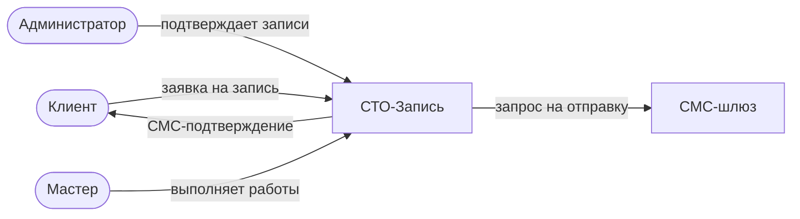

# Сквозной пример: «СТО: онлайн-запись»

Автосервис, куда клиенты записываются онлайн. Маленький, но настоящий домен:

- **Процессы:** приём заявки → подтверждение записи → выполнение работ → выдача и оплата
- **Сущности:** Заявка на запись, Клиент, Автомобиль, Заказ-наряд, Слот расписания
- **Роли:** Клиент, Администратор, Мастер
- **Правила:** нельзя записаться на занятый слот; стоимость = работы + запчасти;
  выдача — только после оплаты

<!--
Speaker notes:
- Домен придуман для доклада: каждый в зале был в автосервисе, объяснять нечего.
- При этом в нём есть всё «взрослое»: статусные модели (заявка, заказ-наряд),
  конкурентный ресурс (слот), внешняя система (СМС), расчётные правила.
- Этот слайд — карта. Дальше мы построим всё это в графе по фазам.
-->
