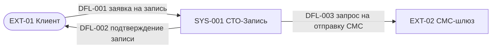

# Фаза 1 на примере СТО: вход → выход

**Вход (мои ответы агенту):**

> Система «СТО-Запись»: клиенты записываются на обслуживание онлайн.
> Цели: запись без звонка; администратор управляет расписанием; учёт работ.
> Стейкхолдеры: владелец СТО (загрузка и выручка), администратор (расписание).
> Внешние: Клиент (пользователь), СМС-шлюз (внешняя система).

**Выход (агент построил и записал в граф):**

`SystemContext ×1, Stakeholder ×2, ExternalEntity ×2, DataFlow ×3` — 8 узлов.

Gate: **«Границы и диаграмма верны? → yes»**

<!--
Speaker notes:
- Показать в Neo4j Browser: MATCH (s:SystemContext)-[r]->(n) RETURN s,r,n
- Обратить внимание на ID: SYS-001, EXT-01 — агент нумерует сам, сквозной счётчик,
  ID никогда не переиспользуются.
- Я отвечал 4 раза по одному предложению — структуру (направления потоков,
  имена) агент предложил сам.
-->
