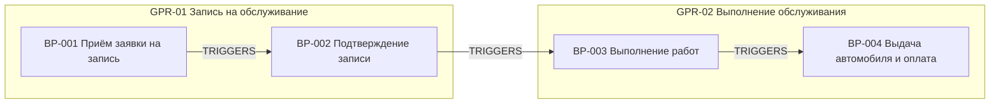

# Фаза 2 на примере СТО: вход → выход

**Вход:** «Клиент выбирает время и оставляет заявку. Администратор её
подтверждает. В день визита мастер выполняет работы по заказ-наряду.
Потом администратор выдаёт автомобиль и принимает оплату.»

**Выход — карта процессов:**

| BP | Триггер | Результат | Владелец | Декомп. |
|----|---------|-----------|----------|---------|
| BP-001 | клиент хочет записаться | заявка создана | Администратор | ✔ |
| BP-002 | заявка создана | запись подтверждена | Администратор | — |
| BP-003 | клиент приехал | работы выполнены | Мастер | ✔ |
| BP-004 | работы выполнены | авто выдано, оплачено | Администратор | — |

✔ в колонке «Декомп.» = `has_decomposition`: в фазе 3 процесс будет разложен
на шаги. «—» — шаги моделировать не будем.

<!--
Speaker notes:
- Вход — буквально 4 предложения прозой. Группы, имена, триггер-цепочку
  агент предложил сам.
- Роли (Администратор, Мастер) уже появились как предварительные узлы —
  фаза 5 их обогатит.
- Почему ✔ только у BP-001 и BP-003: там многошаговая логика, которую мы
  собираемся автоматизировать — детализация даст use case'ы. BP-002 и BP-004 —
  по сути одно действие администратора; раскладывать их на шаги — лишняя
  работа без нового знания. Это решение принимаю я на gate, не агент.
- Где посмотреть: Neo4j Browser →
  MATCH (g:ProcessGroup)-[:CONTAINS]->(bp:BusinessProcess) RETURN g, bp
-->
