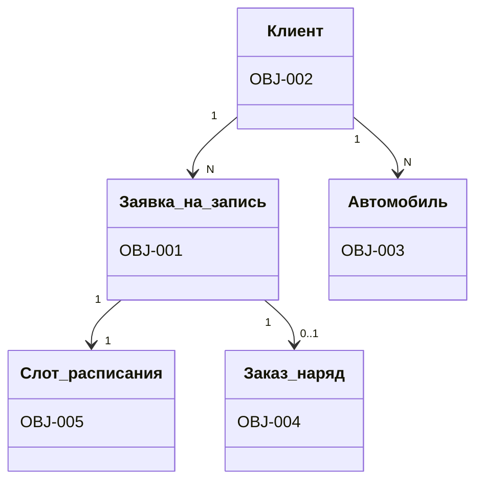

# Фаза 4 на примере СТО: вход → выход

**Вход:** подтверждаю 5 собранных сущностей; диктую атрибуты, например для
OBJ-001 «Заявка на запись»: номер (Число), дата и время слота (Дата),
услуга (Перечисление), комментарий (Текст), статус (Перечисление).

**Выход:**

Состояния OBJ-001: `новая → подтверждена → отменена` (+ `новая → отменена`).
CRUD-матрица: BP-001 **C**(Заявка) **R**(Слот); BP-002 **U**(Заявка);
BP-004 **U**(Заказ-наряд) — *C создаёт, R читает, U изменяет, D удаляет*.

<!--
Speaker notes:
- 5 сущностей × 3–6 атрибутов, два жизненных цикла (Заявка, Заказ-наряд).
- ДЕМО-ПРИЁМ: «забываю» дать атрибуты для OBJ-003 Автомобиль — фаза 8 поймает
  это как CRITICAL, покажем самовосстановление модели (слайд 23).
- Показать state-граф: MATCH (o {id:'OBJ-001'})-[:HAS_STATE]->(s) RETURN *
-->
