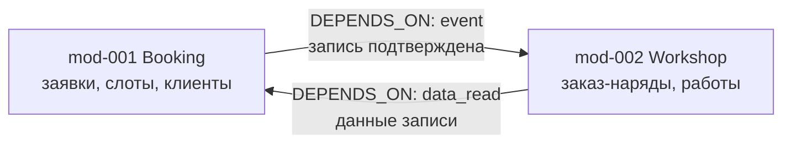

# SA Фаза 1 на примере СТО: вход → выход

**Вход:** соглашаюсь с предложением из BA-групп + добавляю NFR:
«подтверждение записи должно укладываться в рабочий день администратора».

**Выход — Context Map:**

| Узел | Источник |
|------|----------|
| mod-001 Booking | GPR-01 «Запись» (`SUGGESTS`) |
| mod-002 Workshop | GPR-02 «Обслуживание» (`SUGGESTS`) |
| RQ-NFR-001 «СМС — до 1 мин» | моё интервью |

Gate: **«Дерево модулей и Context Map верны? → yes»**

<!--
Speaker notes:
- Два модуля для демо достаточно; в реальных проектах 3–8.
- Обратить внимание: зависимость Workshop→Booking — чтение данных записи,
  Booking→Workshop — событие. Это ляжет в api-contracts на TL-слое.
-->
