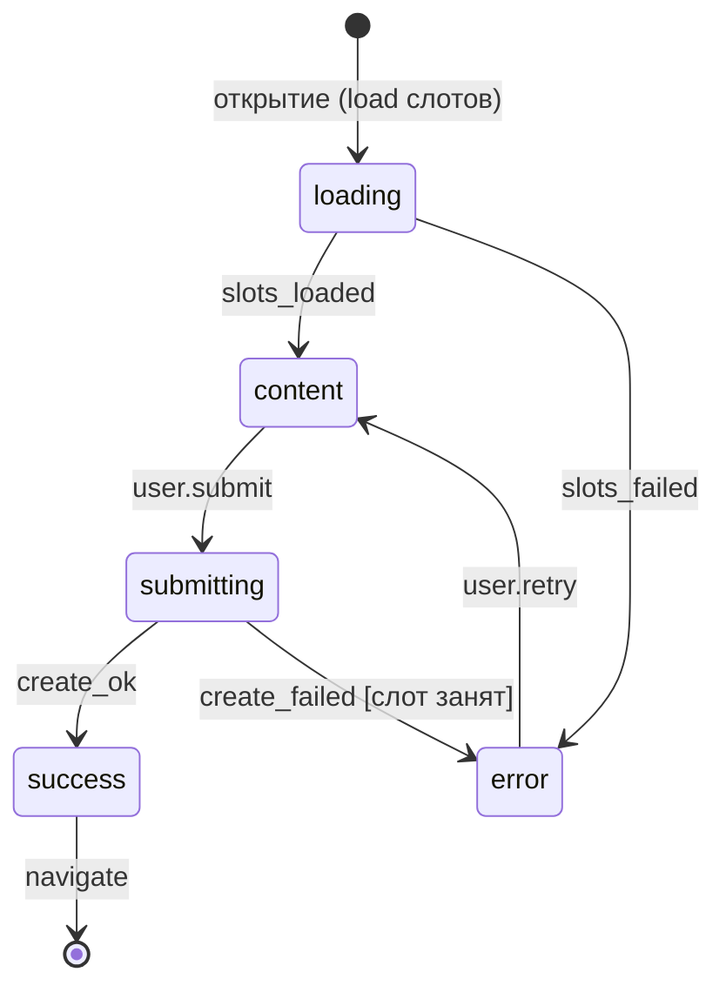

# 6b.1 — Screen State Machine (L10): SCR-BookingCreate

Экран — **детерминированный конечный автомат**, а не картинка:

Узлы: `Screen` — экран; `ScreenState` — состояние (начальное / загрузка /
контент / пусто / ошибка); `ScreenEvent` — событие (от пользователя / системы);
`Transition` — переход (отдельный узел: условие-guard, политика повторов,
граница транзакции); `ScreenEffect` — эффект (загрузка / изменение /
навигация / аналитика).

Валидатор L10: ровно одно начальное состояние; все состояния достижимы;
**из error есть выход**; нет двух переходов по одному событию без условий;
эффекты загрузки/изменения вызывают конкретный endpoint (адрес операции API).

<!--
Speaker notes:
- Frontend-разработчик получает БУКВАЛЬНО редьюсер: состояния, события,
  переходы. tl-plan вставит эту машину прямо в task-fe.md.
- «error без выхода» — классический прод-баг (вечный спиннер) — здесь
  отлавливается на этапе спецификации.
- Transition — узел, а не ребро: на нём живут guard и retry-семантика.
-->
