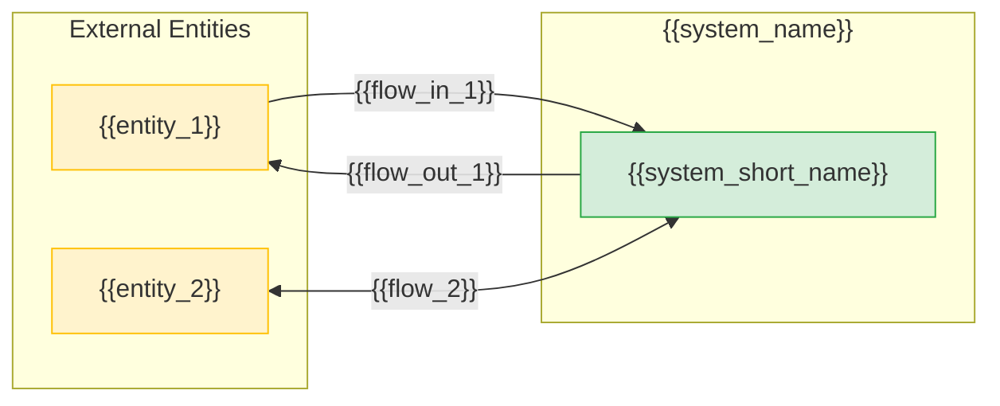

# /nacl-ba-context — System Context Diagram via Neo4j Graph

## Purpose

Define system boundaries: what is automated, what stays outside, who interacts with the system and what data is exchanged. All facts are persisted as Neo4j nodes and relationships — no markdown files are produced. Mermaid diagrams are generated from graph queries at render time.

The interactive protocol is identical; only the storage backend changes.

---

## Workflow

```
┌─────────────┐    ┌─────────────┐    ┌─────────────┐    ┌─────────────┐
│ Phase 1     │    │ Phase 2     │    │ Phase 3     │    │ Phase 4     │
│ System      │───▶│ External    │───▶│ Data        │───▶│ Context     │
│ Scope       │    │ Entities    │    │ Flows       │    │ Diagram     │
└─────────────┘    └─────────────┘    └─────────────┘    └─────────────┘
   interactive        interactive       constructive        automated
```

Each phase ends with:
1. **Summary** — what was understood / constructed
2. **Confirmation** — request verification from the user
3. **Graph write** — idempotent MERGE of nodes and relationships into Neo4j

**Do not proceed to the next phase without explicit user confirmation!**

---

## Neo4j Tools

| Tool | Purpose |
|---|---|
| `mcp__neo4j__read-cypher` | Read-only queries (list, verify, diagram data) |
| `mcp__neo4j__write-cypher` | Create / update nodes and relationships (MERGE) |

Connection details are in `nacl-core/SKILL.md`.

---

## ID Formats

| Node Label | Format | Example | Counter |
|---|---|---|---|
| SystemContext | SYS-NNN | SYS-001 | Global sequential |
| Stakeholder | STK-NN | STK-01 | Global sequential |
| ExternalEntity | EXT-NN | EXT-01 | Global sequential |
| DataFlow | DFL-NNN | DFL-001 | Global sequential |

To get the next available ID:

```cypher
// Example: next SystemContext ID
MATCH (n:SystemContext)
WITH max(toInteger(replace(n.id, 'SYS-', ''))) AS maxNum
RETURN 'SYS-' + apoc.text.lpad(toString(coalesce(maxNum, 0) + 1), 3, '0') AS nextId
```

---

## Pre-flight Check

### Mode `full`

1. Query existing SystemContext nodes:
   ```cypher
   MATCH (sc:SystemContext) RETURN sc.id, sc.name
   ```
2. If nodes exist — warn the user about potential overwrite and ask for confirmation
3. If no nodes — proceed directly

### Mode `update`

1. Query existing context:
   ```cypher
   MATCH (sc:SystemContext)
   OPTIONAL MATCH (sc)-[:HAS_STAKEHOLDER]->(stk:Stakeholder)
   OPTIONAL MATCH (sc)-[:HAS_EXTERNAL_ENTITY]->(ext:ExternalEntity)
   OPTIONAL MATCH (ext)-[flow:HAS_FLOW]->(sc)
   RETURN sc, collect(DISTINCT stk) AS stakeholders,
          collect(DISTINCT ext) AS external_entities,
          collect(DISTINCT {entity: ext.name, direction: flow.direction, data: flow.data_description}) AS data_flows
   ```
   (This is the named query `ba_system_context` from `graph-infra/queries/ba-queries.cypher`.)
2. If no SystemContext exists — suggest running in `full` mode
3. Show the user the current state and ask what needs to change

---

## Phase 1: System Scope (interactive)

**Goal:** Define automation boundaries — what the system does, for whom, what is excluded.

### Questions for the user

```
**Phase 1: System Scope**

1. What is the system called?
2. What are the automation goals? (what problems should it solve)
3. Who are the stakeholders? (who is interested and why)
4. What areas are automated? (what is in scope)
5. What is NOT in scope? (explicit exclusions)
6. Are there known constraints or assumptions?

Answer by number: 1 — ..., 2 — ..., 3 — ...
```

### Question format

Ask numbered questions. If the user cannot answer — propose reasonable assumptions explicitly marked `[assumption]`.

### Actions after receiving answers

1. Formulate automation goals (2-5 clear points)
2. List stakeholders (table: who, role, interest)
3. Describe boundaries (what is in, what is out)
4. Record constraints and assumptions
5. Define success criteria

### Graph Write — SystemContext node

```cypher
MERGE (sc:SystemContext {id: $sysId})
SET sc.name        = $systemName,
    sc.goals       = $goals,          // list of strings
    sc.in_scope    = $inScope,        // list of strings
    sc.out_of_scope = $outOfScope,    // list of strings
    sc.constraints = $constraints,    // list of strings
    sc.assumptions = $assumptions,    // list of strings
    sc.success_criteria = $criteria,  // list of strings
    sc.status      = 'draft',
    sc.created     = date(),
    sc.updated     = date()
```

### Graph Write — Stakeholder nodes

For each stakeholder:

```cypher
MERGE (stk:Stakeholder {id: $stkId})
SET stk.name     = $name,
    stk.role     = $role,
    stk.interest = $interest

WITH stk
MATCH (sc:SystemContext {id: $sysId})
MERGE (sc)-[:HAS_STAKEHOLDER]->(stk)
```

### Transition

Show the user a Phase 1 summary and ask:

```
Phase 1 summary:
- System: {{system_name}}
- Goals: {{brief list}}
- Scope: {{what is in}}
- Exclusions: {{what is out}}
- Stakeholders: {{count}} recorded

All correct? Proceed to external entities?
```

After confirmation -> Phase 2

---

## Phase 2: External Entities (interactive)

**Goal:** Identify who and what interacts with the system — users, external systems, organizations.

### Questions for the user

```
**Phase 2: External Entities**

Who and what interacts with the system?

For each entity provide:
- Name
- Type: User / External System / Organization
- Description: what it does, why it interacts

Examples:
- "Sales Manager" (User) — creates orders, tracks statuses
- "1C:Accounting" (External System) — receives shipment data
- "Suppliers" (Organization) — provide price lists
```

### Actions after receiving answers

For each entity record:
1. **Name** — how the business refers to the entity
2. **Type** — User / ExternalSystem / Organization
3. **Description** — 1-2 sentences about its interaction role

### Graph Write — ExternalEntity nodes

For each entity:

```cypher
MERGE (ext:ExternalEntity {id: $extId})
SET ext.name        = $name,
    ext.type        = $type,       // "User" | "ExternalSystem" | "Organization"
    ext.description = $description

WITH ext
MATCH (sc:SystemContext {id: $sysId})
MERGE (sc)-[:HAS_EXTERNAL_ENTITY]->(ext)
```

### Summary and confirmation

```
I have recorded the following external entities:

| # | Entity | Type | Description |
|---|--------|------|-------------|
| 1 | {{entity_1}} | {{type}} | {{description}} |
| 2 | {{entity_2}} | {{type}} | {{description}} |

Is the list complete? Anyone missing?
```

### Transition

After confirmation -> Phase 3

---

## Phase 3: Data Flows (constructive)

**Goal:** Determine what data enters and exits the system for each external entity.

### How it works

This is a **constructive** phase: the agent **proposes** data flows based on entity descriptions from Phase 2; the user **confirms or corrects**.

The agent does NOT invent flows from nothing — it structures and names flows based on what the user already described in Phase 1 and Phase 2.

### Actions

1. For each external entity from Phase 2 determine:
   - **Incoming flows (IN)** — what data the entity sends TO the system
   - **Outgoing flows (OUT)** — what data the system sends TO the entity

2. Name flows concretely:
   - Correct: "Purchase orders", "Stock balance report"
   - Incorrect: "Data", "Information"

3. If the direction is ambiguous for an entity — ask a clarifying question

### Proposal to the user

```
Based on entity descriptions I propose the following data flows:

| # | Entity | Incoming flows (-> system) | Outgoing flows (system ->) |
|---|--------|----------------------------|----------------------------|
| 1 | {{entity_1}} | {{data_in}} | {{data_out}} |
| 2 | {{entity_2}} | {{data_in}} | {{data_out}} |

Questions:
1. Are the flow directions correct?
2. Are there flows I missed?
3. Should any flows be renamed?
```

### Graph Write — DataFlow nodes and relationships

For each confirmed flow:

```cypher
MERGE (df:DataFlow {id: $dflId})
SET df.name             = $flowName,
    df.direction        = $direction,        // "IN" | "OUT" | "BOTH"
    df.data_description = $dataDescription

WITH df
MATCH (ext:ExternalEntity {id: $extId})
MATCH (sc:SystemContext {id: $sysId})
MERGE (ext)-[:HAS_FLOW {direction: $direction, data_description: $dataDescription}]->(sc)
```

### Transition

After confirmation -> Phase 4

---

## Phase 4: Context Diagram Generation (automated)

**Goal:** Build a Mermaid context diagram from the graph and present the final result.

### Actions

1. Query the full system context from the graph using `ba_system_context`:
   ```cypher
   MATCH (sc:SystemContext {id: $sysId})
   OPTIONAL MATCH (sc)-[:HAS_STAKEHOLDER]->(stk:Stakeholder)
   OPTIONAL MATCH (sc)-[:HAS_EXTERNAL_ENTITY]->(ext:ExternalEntity)
   OPTIONAL MATCH (ext)-[flow:HAS_FLOW]->(sc)
   RETURN sc,
          collect(DISTINCT stk) AS stakeholders,
          collect(DISTINCT {id: ext.id, name: ext.name, type: ext.type}) AS external_entities,
          collect(DISTINCT {entity: ext.name, direction: flow.direction, data: flow.data_description}) AS data_flows
   ```

2. Build a Mermaid flowchart from query results
3. Show the diagram to the user for final confirmation

### Diagram rules

1. Each external entity = a node in subgraph "External Entities"
2. The system = one node in a subgraph with the system name
3. Arrows are **always labeled** — what is being transferred
4. Arrow direction = data flow direction
5. `-->|"flow"|` for unidirectional flows
6. `<-->|"flow"|` for bidirectional flows
7. Use `flowchart LR` for horizontal layout
8. Use styles: `extStyle` for external entities, `sysStyle` for the system

### Mermaid template (generated from graph, NOT from files)



### Final confirmation

```
Context diagram generated from Neo4j graph.

Graph nodes created:
- SystemContext: {{sysId}} ({{system_name}})
- Stakeholders: {{count}} nodes
- External Entities: {{count}} nodes
- Data Flows: {{count}} nodes

Verification query:
  ba_system_context (graph-infra/queries/ba-queries.cypher)

Diagram correct? Ready to finalize?
```

---

## Autonomy Principle

### The agent does NOT invent

- Stakeholder and external entity names
- External entity types (user / system / organization)
- Specific data carried by flows
- Areas in or out of scope

### The agent CONSTRUCTS

- Data flow names based on user descriptions
- Flow directions (IN / OUT) based on entity roles
- Mermaid diagram from graph query results
- Cypher MERGE statements from collected facts

### The agent PROPOSES and ASKS

- "Did I understand correctly that the DPO sends data to the system, not the other way around?"
- "The flow between TeamCenter and the system is bidirectional — correct?"
- "I named the flow 'Purchase orders' — is that the right label?"

---

## Reads / Writes

```yaml
agent: nacl-ba-context
trigger: /nacl-ba-context
mode: interactive (dialogue with user)

reads:
  - Neo4j: SystemContext, Stakeholder, ExternalEntity, DataFlow (in update mode)
  - Reference query: ba_system_context (graph-infra/queries/ba-queries.cypher)

writes:
  - Neo4j node: SystemContext  (SYS-NNN)
  - Neo4j node: Stakeholder   (STK-NN)
  - Neo4j node: ExternalEntity (EXT-NN)
  - Neo4j node: DataFlow      (DFL-NNN)
  - Neo4j rel:  (:SystemContext)-[:HAS_STAKEHOLDER]->(:Stakeholder)
  - Neo4j rel:  (:SystemContext)-[:HAS_EXTERNAL_ENTITY]->(:ExternalEntity)
  - Neo4j rel:  (:ExternalEntity)-[:HAS_FLOW]->(:SystemContext)

creates_directories: []   # No file output — graph only

calls_next:
  - nacl-ba-process

parameters:
  scope: full | update  # full = from scratch, update = modify existing context
  lang: ru | en         # output language (default: ru)
```

---

## Language

Supports `--lang=en` for English output. See [nacl-core/lang-directive.md](../nacl-core/lang-directive.md).
When `--lang=en`: all generated text, node names, descriptions in English.
Default: Russian (ru).

---

## Working with Incomplete Answers

If the user cannot answer all questions:

1. Record what is known
2. Propose reasonable assumptions with justification:
   ```
   Assumption: The system has one external user role — "Client".
   Justification: Only one end-user type was mentioned in the description.
   ```
3. Store assumptions in the `SystemContext.assumptions` property (string list)
4. Continue with the assumptions in mind
5. If there are open questions, record them as a separate property or note in the summary

---

## Completion

After Phase 4:

1. Run the verification query to confirm graph state:
   ```cypher
   MATCH (sc:SystemContext)
   OPTIONAL MATCH (sc)-[:HAS_STAKEHOLDER]->(stk)
   OPTIONAL MATCH (sc)-[:HAS_EXTERNAL_ENTITY]->(ext)
   OPTIONAL MATCH (ext)-[flow:HAS_FLOW]->(sc)
   RETURN sc.id, sc.name,
          count(DISTINCT stk) AS stakeholder_count,
          count(DISTINCT ext) AS entity_count,
          count(DISTINCT flow) AS flow_count
   ```

2. Suggest next steps:
   ```
   System context defined in Neo4j graph.

   Next steps:
   1. /nacl-ba-process — define business processes in the graph
   2. /nacl-ba-full — run full BA cycle in graph mode
   ```

---

## Schema Reference

Node property documentation from `graph-infra/schema/ba-schema.cypher`:

```
SystemContext {
  id: String,           // SYS-NNN
  name: String,
  goals: [String],
  in_scope: [String],
  out_of_scope: [String],
  constraints: [String],
  assumptions: [String],
  success_criteria: [String],
  status: String,       // "draft" | "confirmed"
  created: Date,
  updated: Date
}

Stakeholder {
  id: String,           // STK-NN
  name: String,
  role: String,
  interest: String
}

ExternalEntity {
  id: String,           // EXT-NN
  name: String,
  type: String,         // "User" | "ExternalSystem" | "Organization"
  description: String
}

DataFlow {
  id: String,           // DFL-NNN
  name: String,
  direction: String,    // "IN" | "OUT" | "BOTH"
  data_description: String
}
```

Relationships:
```
(:SystemContext)-[:HAS_STAKEHOLDER]->(:Stakeholder)
(:SystemContext)-[:HAS_EXTERNAL_ENTITY]->(:ExternalEntity)
(:ExternalEntity)-[:HAS_FLOW {direction, data_description}]->(:SystemContext)
```

---

## Checklist /nacl-ba-context

Before completing, verify:

### Phase 1: System Scope
- [ ] SystemContext node created in Neo4j (SYS-NNN)
- [ ] System name recorded
- [ ] Automation goals formulated (2-5 points)
- [ ] Stakeholder nodes created with roles and interests
- [ ] Boundaries defined (in_scope and out_of_scope)
- [ ] Constraints and assumptions recorded
- [ ] Success criteria defined

### Phase 2: External Entities
- [ ] All external entities recorded as ExternalEntity nodes
- [ ] Each has a type: User / ExternalSystem / Organization
- [ ] Each has a description of its interaction role
- [ ] HAS_EXTERNAL_ENTITY relationships link to SystemContext
- [ ] User confirmed completeness of the list

### Phase 3: Data Flows
- [ ] For each entity, incoming flows (IN) are defined
- [ ] For each entity, outgoing flows (OUT) are defined
- [ ] Flows are named concretely (not "data" or "information")
- [ ] DataFlow nodes created with HAS_FLOW relationships
- [ ] User confirmed directions and names

### Phase 4: Context Diagram
- [ ] Mermaid flowchart generated from graph query
- [ ] All arrows are labeled
- [ ] All external entities from Phase 2 are present in diagram
- [ ] All flows from Phase 3 are reflected in diagram
- [ ] User approved the final diagram

### General
- [ ] User confirmed each phase
- [ ] Assumptions documented in SystemContext.assumptions
- [ ] No facts invented by the agent
- [ ] Verification query returns expected counts
