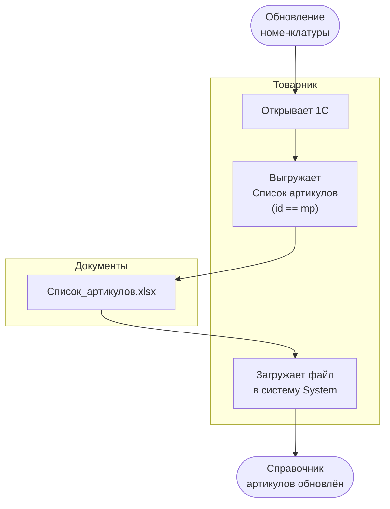

# BP-001: Workflow — Загрузка справочника артикулов

| Атрибут | Значение |
|---------|----------|
| **Процесс** | BP-001: Загрузка справочника артикулов |
| **Группа** | GPR-01: Подготовка данных |
| **Частота** | По потребности (при обновлении номенклатуры) |

---

## Шаги процесса

| # | Исполнитель | Стереотип | Действие | Артефакт |
|---|-------------|-----------|----------|----------|
| S01 | — | Событие | Обновление номенклатуры в 1С (новые артикулы или изменение характеристик) | — |
| S02 | Товарник | Ручная | Открывает 1С | — |
| S03 | Товарник | Ручная | Выгружает Список артикулов (товары с `id == mp`) | Список_артикулов.xlsx |
| S04 | Товарник | Ручная | Загружает файл в систему System | — |
| S05 | — | Результат | Справочник артикулов актуализирован, система готова к расчётам | — |

---

## Диаграмма

