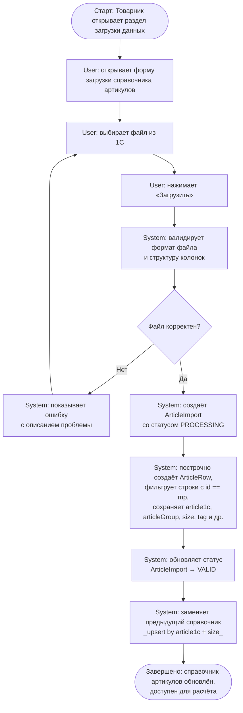

# UC101. Загрузка справочника артикулов

## Актор
`product_manager` — Товарник

## Цель
Загрузить файл «Список артикулов» из 1С, чтобы система располагала актуальным справочником товаров с характеристиками для последующего расчёта потребностей.

## Предусловия
- Товарник авторизован в системе
- Файл выгружен из 1С в Excel-формате

## User Story
"Как товарник, я хочу загрузить файл «Список артикулов» из 1С, чтобы система располагала актуальным справочником товаров с характеристиками для последующего расчёта."

## Activity Diagram

## Альтернативные сценарии

| # | Условие | Действие |
|---|---------|----------|
| A1 | Файл не является Excel (.xlsx) | System показывает «Неверный формат файла. Ожидается .xlsx» |
| A2 | Обязательные колонки отсутствуют (article1c, articleGroup, size) | System показывает «Файл не соответствует ожидаемой структуре: отсутствует колонка {название}» |
| A3 | Ошибка при обработке строки | System помечает строку как ошибочную, продолжает обработку остальных, итоговый статус = VALID (строки с ошибками пропущены) |
| A4 | Все строки отфильтрованы (нет строк с id == mp) | System устанавливает статус VALID, rowCount = 0, показывает предупреждение |

## Бизнес-правила
- **BR-AIM-01 (BRQ-001):** В систему включаются только строки с признаком `id == mp` — товары, присутствующие на маркетплейсах
- **BR-AIM-02:** Повторная загрузка заменяет справочник полностью (upsert by article1c + size)
- **BR-AIM-03:** При статусе ArticleImport = INVALID расчёт не может быть запущен
- **BR-ARW-01:** Пара (article1c + size) уникальна внутри одного importId

## Связанные экраны
- [ArticleImportForm — Загрузка справочника артикулов](../15-interfaces/screens/article-import-form.md)

## Требования
См. [Требования UC101](../16-requirements/UC101-requirements.md)

## Трассировка
- BA: BP-001
- Сущности: `ArticleImport`, `ArticleRow`
- Роль: `product_manager`
