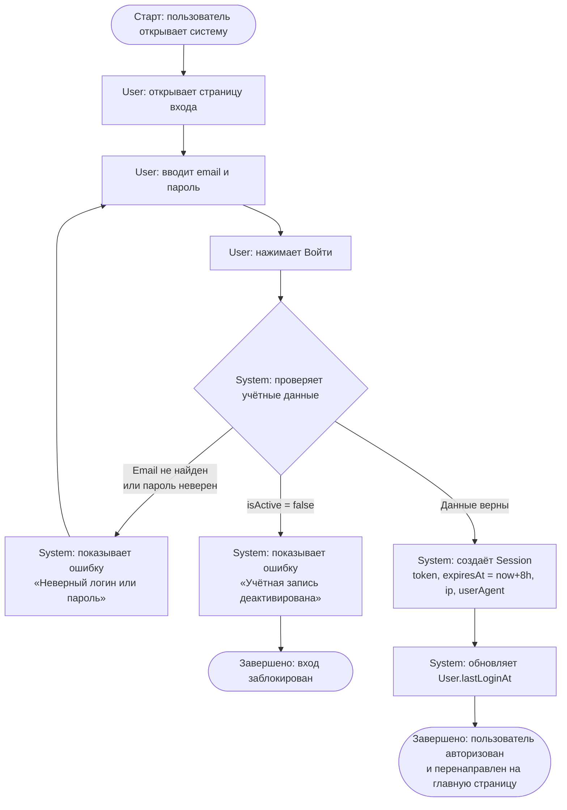

# UC001. Вход в систему

## Актор
Все роли системы: `product_manager`, `analyst`, `marketplace_manager`, `admin`

## Цель
Аутентификация пользователя по email и паролю с созданием сессии и предоставлением доступа к функциям, соответствующим его роли.

## Предусловия
- Пользователь не авторизован в системе
- В системе существует активная учётная запись с указанным email

## Activity Diagram

## Альтернативные сценарии

| # | Условие | Действие |
|---|---------|----------|
| A1 | Email не существует в системе | System показывает «Неверный логин или пароль» (без уточнения, чтобы не раскрывать наличие email) |
| A2 | Пароль неверен | System показывает «Неверный логин или пароль» |
| A3 | isActive = false | System показывает «Учётная запись деактивирована. Обратитесь к администратору» |

## Связанные экраны
- [LoginForm — Форма входа](../15-interfaces/screens/login-form.md)

## Требования
См. [Требования UC001](../16-requirements/UC001-requirements.md)
