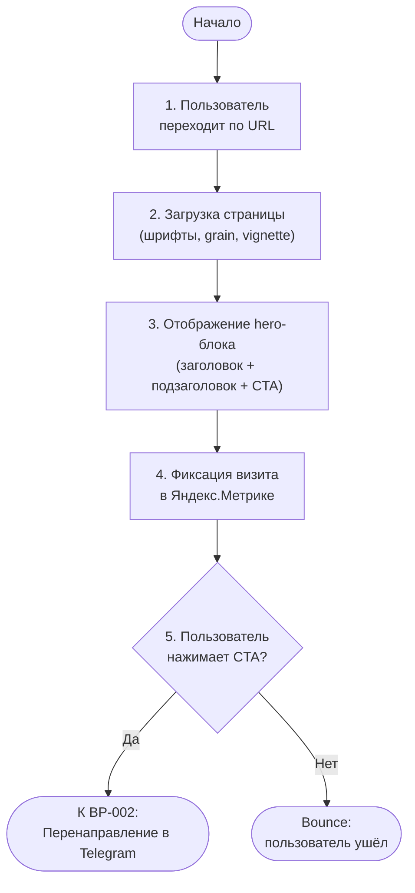

# BP-001 Workflow: Первый контакт (лендинг)

## Метаданные

| Поле | Значение |
|------|----------|
| **BP** | BP-001 |
| **Название** | Первый контакт (лендинг) |
| **Группа** | GPR-01 |
| **Кол-во шагов** | 5 |
| **Автоматизируемых** | 3 |

## Каноническая таблица

| # | Шаг | Исполнитель | Стереотип | Артефакты |
|---|-----|-------------|-----------|-----------|
| 1 | Пользователь переходит по URL сайта | Пользователь (ACT-01) | Ручной | URL сайта (вход) |
| 2 | Загрузка страницы (шрифты, grain, vignette-эффекты) | Система | Автоматизируется | -- |
| 3 | Отображение hero-блока (заголовок + подзаголовок + CTA) | Система | Автоматизируется | -- |
| 4 | Фиксация визита в Яндекс.Метрике | Система | Автоматизируется | Событие Я.Метрики (выход) |
| 5 | Пользователь принимает решение: нажать CTA или уйти | Пользователь (ACT-01) | Ручной | -- |

## Диаграмма процесса

## Точки принятия решений

| # | Условие | Да | Нет |
|---|---------|-----|-----|
| 1 | Пользователь нажимает CTA? | Переход к BP-002 (Перенаправление в Telegram) | Bounce -- пользователь покидает сайт |
