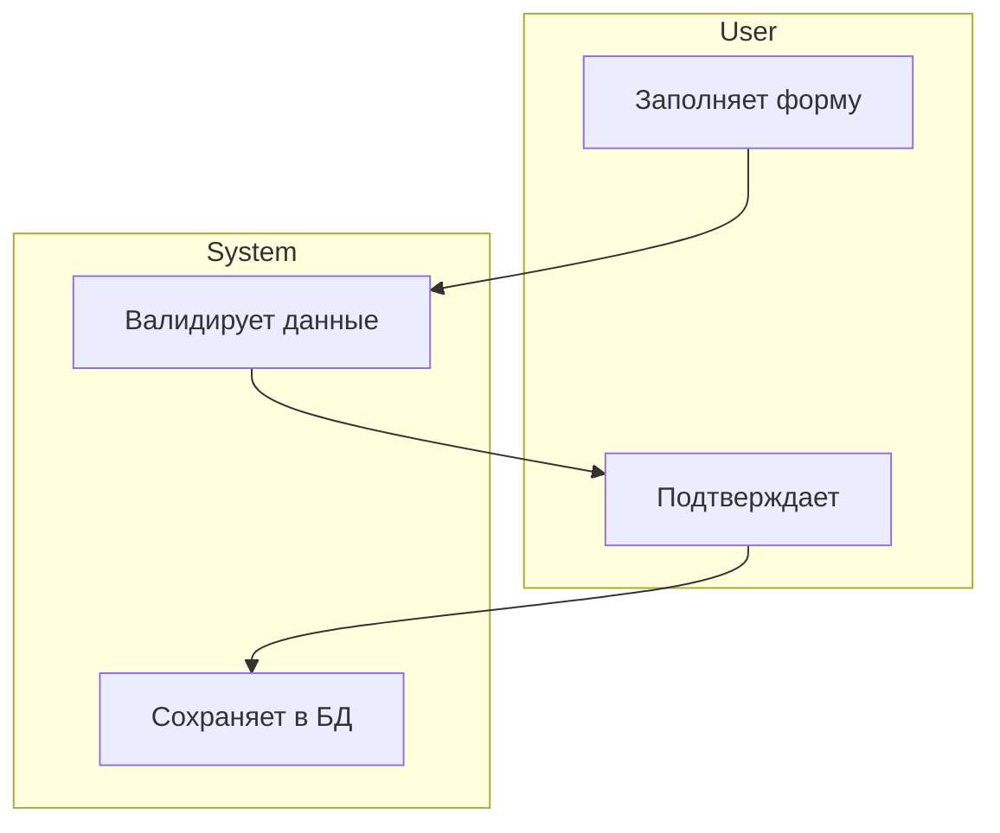

# nacl-render -- Graph to Markdown / Excalidraw Renderer

Skill converts Neo4j graph data into human-readable artifacts: Markdown documents with auto-generated Mermaid diagrams and Excalidraw visual boards.

## Invocation

```
/nacl-render md <command> [args] [--output <path>]
/nacl-render excalidraw <command> [args]
```

## Dependencies

- `nacl-core/SKILL.md` -- shared Neo4j connection and schema references
- Neo4j MCP tools: `mcp__neo4j__read-cypher`
- Graph-infra queries: `graph-infra/queries/sa-queries.cypher`, `graph-infra/queries/handoff-queries.cypher`, `graph-infra/queries/ba-queries.cypher`

## Shared Conventions

### Output Modes

Every `md` command supports two output modes:

1. **Terminal** (default) -- print the rendered markdown directly to the terminal so the user can review and copy.
2. **File** (`--output <path>`) -- write the rendered markdown to the specified file path and confirm with a short message.

When `--output` is provided, always use the absolute path. If the target directory does not exist, create it.

### Neo4j Access

All queries use `mcp__neo4j__read-cypher`. Never use `write-cypher` from this skill -- rendering is strictly read-only.

### Mermaid Generation Principle

Mermaid diagrams are AUTO-GENERATED from graph structure, never hand-written. The mapping rules are:

| Graph Pattern | Mermaid Syntax | Diagram Type |
|---|---|---|
| `(de:DomainEntity)` + `HAS_ATTRIBUTE` + `RELATES_TO` | `class` blocks + association arrows | `classDiagram` |
| `(as:ActivityStep)` + `step_number` ordering | `flowchart TD` nodes + arrows with swimlanes | `flowchart` |
| `(es:EntityState)` + `TRANSITIONS_TO` | `stateDiagram-v2` states + transitions | `stateDiagram` |
| `(ff:FormField)` + `MAPS_TO` + `DomainAttribute` | `flowchart LR` field -> attribute -> entity | `flowchart` |

### Mermaid ID Sanitization

Neo4j IDs may contain hyphens (e.g. `UC-101`). Mermaid node IDs must be alphanumeric. Rule:

```
mermaidId = graphId.replace(/-/g, '_')
```

Example: `UC-101` becomes `UC_101`, `OBJ-001-A01` becomes `OBJ_001_A01`.

---

## Commands: Markdown Rendering

---

### `/nacl-render md entity <id>`

Render a single DomainEntity as a full markdown document with class diagram.

#### Step 1: Fetch Data

```cypher
// Query: render_entity_full
// Params: $entityId -- DomainEntity.id (e.g. "DE-Order")
MATCH (de:DomainEntity {id: $entityId})
OPTIONAL MATCH (de)-[:HAS_ATTRIBUTE]->(da:DomainAttribute)
OPTIONAL MATCH (de)-[rel:RELATES_TO]->(de2:DomainEntity)
OPTIONAL MATCH (de)-[:HAS_ENUM]->(en:Enumeration)-[:HAS_VALUE]->(ev:EnumValue)
OPTIONAL MATCH (de)<-[:REALIZED_AS]-(be:BusinessEntity)
OPTIONAL MATCH (m:Module)-[:CONTAINS_ENTITY]->(de)
RETURN de,
       collect(DISTINCT da) AS attributes,
       collect(DISTINCT {target_id: de2.id, target_name: de2.name, rel_type: rel.rel_type, cardinality: rel.cardinality}) AS relationships,
       collect(DISTINCT {enum_name: en.name, enum_id: en.id, values: collect(DISTINCT ev.value)}) AS enumerations,
       be.id AS ba_source_id, be.name AS ba_source_name,
       m.id AS module_id, m.name AS module_name;
```

> Note: The enumerations subquery above may need to be split into two queries if Neo4j raises a nested `collect` error. In that case, run a separate query:
> ```cypher
> MATCH (de:DomainEntity {id: $entityId})-[:HAS_ENUM]->(en:Enumeration)
> OPTIONAL MATCH (en)-[:HAS_VALUE]->(ev:EnumValue)
> RETURN en.id, en.name, collect(ev.value) AS values;
> ```

#### Step 2: Generate Mermaid classDiagram

Map graph data to Mermaid syntax:

```
classDiagram
    class {de.name} {
        // For each da in attributes:
        +{da.data_type} {da.name}
    }

    // For each relationship:
    {de.name} "{rel.cardinality left}" --> "{rel.cardinality right}" {target_name} : {rel.rel_type}

    // For each enumeration:
    class {en.name} {
        <<enumeration>>
        // For each value:
        {ev.value}
    }
    {de.name} --> {en.name}
```

**Cardinality mapping** (`rel.cardinality` string to Mermaid):

| Graph `cardinality` | Left side | Right side | Example |
|---|---|---|---|
| `1:N` | `"1"` | `"*"` | `Order "1" --> "*" OrderItem` |
| `N:1` | `"*"` | `"1"` | `OrderItem "*" --> "1" Order` |
| `N:M` | `"*"` | `"*"` | `User "*" --> "*" Role` |
| `1:1` | `"1"` | `"1"` | `User "1" --> "1" Profile` |

#### Step 3: Fill Template

```markdown
---
title: "{de.name}"
type: entity
module: {module_name}
generated_from: graph
date: {YYYY-MM-DD}
---

# {de.name}

## Описание

{de.description}

## BA-источник

| BA-сущность | ID |
|---|---|
| {ba_source_name} | {ba_source_id} |

> Omit this section if ba_source_id is null.

## Диаграмма классов

```mermaid
classDiagram
    class {de.name} {
        +{da1.data_type} {da1.name}
        +{da2.data_type} {da2.name}
        ...
    }
    {de.name} "1" --> "*" {target_name} : {rel_type}
    ...
`` `

## Атрибуты

| Атрибут | Тип | Обязательный | Описание |
|---------|-----|--------------|----------|
| {da.name} | {da.data_type} | {da.required} | {da.description} |

## Связи

| Связь | Целевая сущность | Кардинальность | Тип |
|-------|-------------------|----------------|-----|
| {rel_type} | {target_name} | {cardinality} | {rel_type} |

## Справочники

| Справочник | Значения |
|------------|----------|
| {en.name} | {values joined with ", "} |

> Omit this section if no enumerations found.
```

---

### `/nacl-render md uc <id>`

Render a single UseCase as a full markdown document with activity flowchart.

#### Step 1: Fetch Data

```cypher
// Query: render_uc_full (reuses sa_uc_full_context pattern)
// Params: $ucId -- UseCase.id (e.g. "UC-101")
MATCH (uc:UseCase {id: $ucId})
OPTIONAL MATCH (uc)-[:HAS_STEP]->(as_step:ActivityStep)
OPTIONAL MATCH (uc)-[:USES_FORM]->(f:Form)-[:HAS_FIELD]->(ff:FormField)
OPTIONAL MATCH (ff)-[:MAPS_TO]->(da:DomainAttribute)<-[:HAS_ATTRIBUTE]-(de:DomainEntity)
OPTIONAL MATCH (uc)-[:HAS_REQUIREMENT]->(rq:Requirement)
OPTIONAL MATCH (uc)-[:ACTOR]->(sr:SystemRole)
OPTIONAL MATCH (m:Module)-[:CONTAINS_UC]->(uc)
OPTIONAL MATCH (uc)-[:DEPENDS_ON]->(dep:UseCase)
RETURN uc,
       collect(DISTINCT as_step) AS activity_steps,
       collect(DISTINCT f) AS forms,
       collect(DISTINCT {field: ff, attr: da, entity: de}) AS field_mappings,
       collect(DISTINCT rq) AS requirements,
       collect(DISTINCT sr) AS roles,
       m.id AS module_id, m.name AS module_name,
       collect(DISTINCT dep) AS dependencies;
```

#### Step 2: Generate Mermaid Flowchart from ActivitySteps

Sort `activity_steps` by `step_number`. Map each step to a flowchart node, using `actor` property to assign swimlanes.

**Mapping rules:**

| ActivityStep property | Mermaid element |
|---|---|
| `as.actor = "User"` | Node in `subgraph User` |
| `as.actor = "System"` | Node in `subgraph System` |
| `as.step_type = "action"` | Rectangle: `A1[description]` |
| `as.step_type = "decision"` | Diamond: `D1{description}` |
| `as.step_type = "start"` | Stadium: `Start([description])` |
| `as.step_type = "end"` | Stadium: `End([description])` |
| Sequential steps | Arrow: `A1 --> A2` |

**Generation algorithm:**

```
flowchart TD
    // For each step sorted by step_number:
    //   nodeId = sanitize(step.id)
    //   If step_type == "decision":
    //     {nodeId}{"{"}description{"}"}
    //   Else if step_type in ["start","end"]:
    //     {nodeId}(["description"])
    //   Else:
    //     {nodeId}["{step.actor}: {step.description}"]
    //
    // Connect sequential steps:
    //   {prev_nodeId} --> {curr_nodeId}
    //
    // For decisions, use labels from step.branch_yes / step.branch_no if available
```

If steps have an `actor` property, group them into swimlanes:



#### Step 3: Fill Template

```markdown
---
title: "{uc.id}. {uc.name}"
type: usecase
module: {module_name}
priority: {uc.priority}
generated_from: graph
date: {YYYY-MM-DD}
---

# {uc.id}. {uc.name}

## User Story

Как **{role.name}**, я хочу **{uc.goal}**, чтобы **{uc.benefit}**.

> Build the user story from uc.goal / uc.benefit properties. If those are absent, use uc.description.

## Актор

{role.name} ({role.id})

## Модуль

{module_name} ({module_id})

## Activity Diagram

```mermaid
flowchart TD
    ...auto-generated from activity_steps...
`` `

## Шаги сценария

| # | Актор | Описание | Тип |
|---|-------|----------|-----|
| {step.step_number} | {step.actor} | {step.description} | {step.step_type} |

## Формы

| Форма | Поля | Связанная сущность |
|-------|------|--------------------|
| {f.name} | {list of ff.name} | {de.name} |

## Требования

| ID | Описание | Тип | Приоритет |
|----|----------|-----|-----------|
| {rq.id} | {rq.description} | {rq.type} | {rq.priority} |

## Зависимости

| UC | Название |
|----|----------|
| {dep.id} | {dep.name} |

> Omit sections that have no data (empty collections).
```

---

### `/nacl-render md form <id>`

Render a form with field-to-attribute mapping diagram.

#### Step 1: Fetch Data

```cypher
// Query: render_form_mapping
// Params: $formId -- Form.id (e.g. "FORM-OrderCreate")
MATCH (f:Form {id: $formId})-[:HAS_FIELD]->(ff:FormField)
OPTIONAL MATCH (ff)-[:MAPS_TO]->(da:DomainAttribute)<-[:HAS_ATTRIBUTE]-(de:DomainEntity)
OPTIONAL MATCH (uc:UseCase)-[:USES_FORM]->(f)
RETURN f,
       collect(DISTINCT {
         field_name: ff.name,
         field_id: ff.id,
         field_type: ff.field_type,
         field_label: ff.label,
         attr_name: da.name,
         attr_id: da.id,
         attr_type: da.data_type,
         entity_name: de.name,
         entity_id: de.id
       }) AS field_mappings,
       collect(DISTINCT uc) AS use_cases;
```

#### Step 2: Generate Mermaid Mapping Diagram

Build a `flowchart LR` that shows field -> attribute -> entity chains:

```
flowchart LR
    subgraph Form["{f.name}"]
        // For each field:
        {ff_mermaidId}["{ff.label}<br/><small>{ff.field_type}</small>"]
    end

    subgraph Domain["Domain Model"]
        // For each unique entity:
        subgraph {de_mermaidId}["{de.name}"]
            // For each attribute mapped to from this form:
            {da_mermaidId}["{da.name} : {da.data_type}"]
        end
    end

    // For each mapping:
    {ff_mermaidId} --> {da_mermaidId}
```

Fields with no `MAPS_TO` get a dashed arrow to a "unmapped" node:

```
    {ff_mermaidId} -.-> Unmapped["unmapped"]
```

#### Step 3: Fill Template

```markdown
---
title: "Форма: {f.name}"
type: form-mapping
generated_from: graph
date: {YYYY-MM-DD}
---

# Форма: {f.name}

## Связанные UC

| UC | Название |
|----|----------|
| {uc.id} | {uc.name} |

## Диаграмма маппинга

```mermaid
flowchart LR
    ...auto-generated field->attribute->entity mapping...
`` `

## Таблица полей

| Поле | Label | Тип поля | Атрибут | Тип атрибута | Сущность |
|------|-------|----------|---------|--------------|----------|
| {ff.name} | {ff.label} | {ff.field_type} | {da.name} | {da.data_type} | {de.name} |

## Покрытие

- Полей: {total_fields}
- Замаплено: {mapped_count} ({mapped_pct}%)
- Незамаплено: {unmapped_count}
```

---

### `/nacl-render md domain-model`

Render the full domain model: all entities, relationships, and attributes as a single class diagram.

#### Step 1: Fetch Data

```cypher
// Query: render_domain_model_full (reuses sa_domain_model pattern)
MATCH (de:DomainEntity)
OPTIONAL MATCH (de)-[:HAS_ATTRIBUTE]->(da:DomainAttribute)
OPTIONAL MATCH (de)-[rel:RELATES_TO]->(de2:DomainEntity)
OPTIONAL MATCH (de)-[:HAS_ENUM]->(en:Enumeration)-[:HAS_VALUE]->(ev:EnumValue)
OPTIONAL MATCH (m:Module)-[:CONTAINS_ENTITY]->(de)
RETURN de,
       collect(DISTINCT da) AS attributes,
       collect(DISTINCT {target_id: de2.id, target_name: de2.name, rel_type: rel.rel_type, cardinality: rel.cardinality}) AS relationships,
       collect(DISTINCT {enum_id: en.id, enum_name: en.name, values: collect(DISTINCT ev.value)}) AS enumerations,
       m.name AS module_name;
```

> Same note as entity: if nested `collect` fails, run enumeration query separately.

#### Step 2: Generate Full Mermaid classDiagram

Build the class diagram from ALL entities at once:

```
classDiagram

    %% ===== ENTITIES =====
    // For each DomainEntity de:
    class {de.name} {
        // For each attribute da:
        +{da.data_type} {da.name}
    }

    %% ===== ENUMERATIONS =====
    // For each unique Enumeration en:
    class {en.name} {
        <<enumeration>>
        // For each value:
        {ev.value}
    }

    %% ===== RELATIONSHIPS =====
    // For each RELATES_TO edge (deduplicated):
    {source.name} "{left_card}" --> "{right_card}" {target.name} : {rel_type}

    // For each HAS_ENUM edge:
    {de.name} --> {en.name}
```

**Deduplication rule:** If both `A -> B` and `B -> A` exist for the same rel_type, keep only one (the one where `A.name < B.name` lexicographically).

#### Step 3: Fill Template

```markdown
---
title: "Domain Model"
type: domain-model
generated_from: graph
date: {YYYY-MM-DD}
---

# Domain Model

## Диаграмма классов

```mermaid
classDiagram
    ...auto-generated full class diagram...
`` `

## Сущности

| Сущность | Модуль | Атрибутов | Связей | Описание |
|----------|--------|-----------|--------|----------|
| {de.name} | {module_name} | {attr_count} | {rel_count} | {de.description} |

## Справочники

| Справочник | Значения |
|------------|----------|
| {en.name} | {values joined with ", "} |

## Ключевые связи

| Источник | Цель | Тип | Кардинальность |
|----------|------|-----|----------------|
| {source.name} | {target.name} | {rel_type} | {cardinality} |
```

---

### `/nacl-render md uc-index`

Render a UseCase registry table.

#### Step 1: Fetch Data

```cypher
// Query: render_uc_index
MATCH (uc:UseCase)
OPTIONAL MATCH (m:Module)-[:CONTAINS_UC]->(uc)
OPTIONAL MATCH (uc)-[:ACTOR]->(sr:SystemRole)
OPTIONAL MATCH (uc)-[:DEPENDS_ON]->(dep:UseCase)
RETURN uc.id AS id,
       uc.name AS name,
       uc.priority AS priority,
       uc.status AS status,
       m.name AS module_name,
       collect(DISTINCT sr.name) AS actors,
       collect(DISTINCT dep.id) AS depends_on
ORDER BY uc.id;
```

#### Step 2: Fill Template

No Mermaid diagram needed for the index -- it is a pure table.

```markdown
---
title: "UC Index"
type: uc-index
generated_from: graph
date: {YYYY-MM-DD}
---

# Реестр Use Cases

| ID | Название | Модуль | Приоритет | Статус | Актор(ы) | Зависимости |
|----|----------|--------|-----------|--------|----------|-------------|
| {id} | {name} | {module_name} | {priority} | {status} | {actors joined} | {depends_on joined} |

## Статистика

- Всего UC: {total}
- Primary: {count where priority = "primary"}
- Secondary: {count where priority = "secondary"}
- По модулям: {module_name}: {count}, ...
```

---

### `/nacl-render md traceability`

Render the BA to SA traceability matrix.

#### Step 1: Fetch Data

Run the `handoff_traceability_matrix` query:

```cypher
// Query: handoff_traceability_matrix
MATCH (ws:WorkflowStep)-[:AUTOMATES_AS]->(uc:UseCase)
RETURN 'Step→UC' AS category, ws.id AS ba_id, ws.function_name AS ba_name, uc.id AS sa_id, uc.name AS sa_name
UNION ALL
MATCH (be:BusinessEntity)-[:REALIZED_AS]->(de:DomainEntity)
RETURN 'Entity→Domain' AS category, be.id AS ba_id, be.name AS ba_name, de.id AS sa_id, de.name AS sa_name
UNION ALL
MATCH (br:BusinessRole)-[:MAPPED_TO]->(sr:SystemRole)
RETURN 'Role→SysRole' AS category, br.id AS ba_id, br.full_name AS ba_name, sr.id AS sa_id, sr.name AS sa_name
UNION ALL
MATCH (brq:BusinessRule)-[:IMPLEMENTED_BY]->(rq:Requirement)
RETURN 'Rule→Req' AS category, brq.id AS ba_id, brq.name AS ba_name, rq.id AS sa_id, rq.description AS sa_name;
```

Also fetch coverage stats:

```cypher
// Query: handoff_coverage_stats (from handoff-queries.cypher)
// ... full query as in graph-infra/queries/handoff-queries.cypher
```

#### Step 2: Fill Template

Group results by `category` and render four sections:

```markdown
---
title: "BA→SA Traceability Matrix"
type: traceability
generated_from: graph
date: {YYYY-MM-DD}
---

# Трассировочная матрица BA → SA

## Покрытие

| Категория | Покрыто | Всего | % |
|-----------|---------|-------|---|
| Шаги → UC | {covered} | {total} | {pct}% |
| Сущности → Domain | {covered} | {total} | {pct}% |
| Роли → SystemRole | {covered} | {total} | {pct}% |
| Правила → Requirements | {covered} | {total} | {pct}% |

## 1. Бизнес-шаги → Use Cases

| BA ID | BA Функция | SA ID | SA Use Case |
|-------|------------|-------|-------------|
| {ba_id} | {ba_name} | {sa_id} | {sa_name} |

## 2. Бизнес-сущности → Domain Entities

| BA ID | BA Сущность | SA ID | SA Domain Entity |
|-------|-------------|-------|------------------|
| {ba_id} | {ba_name} | {sa_id} | {sa_name} |

## 3. Бизнес-роли → System Roles

| BA ID | BA Роль | SA ID | SA System Role |
|-------|---------|-------|----------------|
| {ba_id} | {ba_name} | {sa_id} | {sa_name} |

## 4. Бизнес-правила → Requirements

| BA ID | BA Правило | SA ID | SA Requirement |
|-------|------------|-------|----------------|
| {ba_id} | {ba_name} | {sa_id} | {sa_name} |
```

---

## Graph-to-Mermaid Mapping Reference

This section is the canonical reference for how graph edges translate to Mermaid syntax. All `md` commands above use these rules.

### classDiagram (DomainEntity)

**Source:** `DomainEntity` + `HAS_ATTRIBUTE` edges + `RELATES_TO` edges + `HAS_ENUM` edges.

```
Graph Edge                          → Mermaid Syntax
────────────────────────────────────  ─────────────────────────────────────
(de)-[:HAS_ATTRIBUTE]->(da)         → attribute line inside class block:
                                        +{da.data_type} {da.name}

(de)-[:RELATES_TO {                 → association arrow:
   rel_type, cardinality}]->(de2)      {de.name} "{left}" --> "{right}" {de2.name} : {rel_type}

(de)-[:HAS_ENUM]->(en)              → dependency arrow + enumeration class:
                                        class {en.name} { <<enumeration>> ... }
                                        {de.name} --> {en.name}
```

### flowchart (ActivityStep)

**Source:** `UseCase` + `HAS_STEP` edges, `ActivityStep` nodes ordered by `step_number`.

```
Graph Data                          → Mermaid Syntax
────────────────────────────────────  ─────────────────────────────────────
as.step_type = "start"              → {id}(["description"])
as.step_type = "end"                → {id}(["description"])
as.step_type = "action"             → {id}["{actor}: description"]
as.step_type = "decision"           → {id}{"description"}
Sequential step_number              → {prev_id} --> {curr_id}
Decision branches                   → {id} -->|"Yes"| {yes_id}
                                      {id} -->|"No"| {no_id}
as.actor grouping                   → subgraph {actor}["..."] ... end
```

### stateDiagram (EntityState)

**Source:** `BusinessEntity` + `HAS_STATE` edges + `TRANSITIONS_TO` edges between `EntityState` nodes.

Used inside entity rendering when entity has lifecycle states.

```
Graph Edge                          → Mermaid Syntax
────────────────────────────────────  ─────────────────────────────────────
First state (no incoming            → [*] --> {state.name}
  TRANSITIONS_TO from other states)

(s1)-[:TRANSITIONS_TO               → {s1.name} --> {s2.name} : {condition}
  {condition}]->(s2)

Terminal state (no outgoing          → {state.name} --> [*]
  TRANSITIONS_TO)
```

**Cypher to fetch lifecycle (from ba-queries):**

```cypher
// Params: $entityId -- BusinessEntity.id that is linked via REALIZED_AS to this DomainEntity
MATCH (be:BusinessEntity {id: $entityId})-[:HAS_STATE]->(s:EntityState)
OPTIONAL MATCH (s)-[t:TRANSITIONS_TO]->(s2:EntityState)
RETURN s.name AS from_state, t.condition AS condition, s2.name AS to_state;
```

**Mermaid generation:**

```
stateDiagram-v2
    [*] --> {initial_state}
    {from_state} --> {to_state} : {condition}
    ...
    {terminal_state} --> [*]
```

### flowchart LR (Form Mapping)

**Source:** `Form` + `HAS_FIELD` + `MAPS_TO` + `DomainAttribute` + `HAS_ATTRIBUTE` + `DomainEntity`.

```
Graph Path                          → Mermaid Syntax
────────────────────────────────────  ─────────────────────────────────────
(f)-[:HAS_FIELD]->(ff)              → node in Form subgraph:
                                        {ff_id}["{ff.label}"]

(ff)-[:MAPS_TO]->(da)<-[:HAS_ATTR.. → arrow + node in Entity subgraph:
  IBUTE]-(de)                           {ff_id} --> {da_id}

ff with no MAPS_TO                  → dashed arrow to unmapped:
                                        {ff_id} -.-> Unmapped
```

---

## Commands: Excalidraw Rendering

All Excalidraw commands produce `.excalidraw` JSON files in `{$boards_dir}/` (where `$boards_dir` is from config.yaml → graph.boards_dir, default: "graph-infra/boards"). Each command:
1. Queries Neo4j for graph data (`mcp__neo4j__read-cypher`)
2. Computes layout positions using a grid-based algorithm
3. Generates Excalidraw JSON elements (shapes + bound text + arrows)
4. Writes the file and confirms the output path

### Shared: Excalidraw Element Factories

These factories are used by all commands below. They follow the templates and colors from `nacl-core/SKILL.md`.

#### `makeRect(id, x, y, w, h, bgColor, strokeColor, customData)`

Returns TWO elements: a rectangle and its bound text element.

```json
// Shape element
{
  "id": "{id}",
  "type": "rectangle",
  "x": {x}, "y": {y},
  "width": {w}, "height": {h},
  "strokeColor": "{strokeColor}",
  "backgroundColor": "{bgColor}",
  "fillStyle": "solid",
  "strokeWidth": 2,
  "strokeStyle": "solid",
  "roughness": 1,
  "opacity": 100,
  "angle": 0,
  "seed": {random_int},
  "version": 1,
  "versionNonce": {random_int},
  "isDeleted": false,
  "groupIds": [],
  "frameId": null,
  "boundElements": [{"id": "text-{id}", "type": "text"}],
  "updated": 1,
  "link": null,
  "locked": false,
  "customData": {customData}
}
// Bound text element
{
  "id": "text-{id}",
  "type": "text",
  "x": {x + 10}, "y": {y + h/2 - 10},
  "width": {w - 20}, "height": 20,
  "strokeColor": "#1e1e1e",
  "backgroundColor": "transparent",
  "fillStyle": "solid",
  "strokeWidth": 2,
  "strokeStyle": "solid",
  "roughness": 1,
  "opacity": 100,
  "angle": 0,
  "seed": {random_int},
  "version": 1,
  "versionNonce": {random_int},
  "isDeleted": false,
  "groupIds": [],
  "boundElements": [],
  "updated": 1,
  "link": null,
  "locked": false,
  "text": "{label}",
  "fontSize": 16,
  "fontFamily": 1,
  "textAlign": "center",
  "verticalAlign": "middle",
  "containerId": "{id}",
  "originalText": "{label}",
  "autoResize": true
}
```

#### `makeDiamond(id, x, y, w, h, label, customData)`

Same pattern as `makeRect` but with `"type": "diamond"`, `backgroundColor: "#fff3e0"` (orange), and text centered inside. Width/height should be larger (e.g., 160x120) to accommodate the diamond shape.

#### `makeArrow(id, fromId, toId, startX, startY, endX, endY, label)`

Returns ONE arrow element with bindings:

```json
{
  "id": "{id}",
  "type": "arrow",
  "x": {startX}, "y": {startY},
  "width": {endX - startX}, "height": {endY - startY},
  "strokeColor": "#1e1e1e",
  "backgroundColor": "transparent",
  "fillStyle": "solid",
  "strokeWidth": 2,
  "strokeStyle": "solid",
  "roughness": 1,
  "opacity": 100,
  "angle": 0,
  "seed": {random_int},
  "version": 1,
  "versionNonce": {random_int},
  "isDeleted": false,
  "groupIds": [],
  "boundElements": [],
  "updated": 1,
  "link": null,
  "locked": false,
  "points": [[0, 0], [{endX - startX}, {endY - startY}]],
  "lastCommittedPoint": null,
  "startBinding": {"elementId": "{fromId}", "focus": 0, "gap": 1},
  "endBinding": {"elementId": "{toId}", "focus": 0, "gap": 1},
  "startArrowhead": null,
  "endArrowhead": "arrow"
}
```

> When an arrow has a label (e.g., cardinality or rel_type), add a bound text element the same way as for rectangles, positioning the text at the midpoint of the arrow.

#### Color Reference (from `nacl-core/SKILL.md`)

| Concept | backgroundColor | strokeColor | customData.nodeType |
|---|---|---|---|
| DomainEntity | `#e3f2fd` (blue) | `#1565c0` | `DomainEntity` |
| DomainAttribute (inside entity) | `#e3f2fd` (blue) | `#1565c0` | `DomainAttribute` |
| Module | `#e8f5e9` (green) | `#2e7d32` | `Module` |
| WorkflowStep (business) | `#e8f5e9` (green) | `#2e7d32` | `WorkflowStep` |
| WorkflowStep (automated) | `#e3f2fd` (blue) | `#1565c0` | `WorkflowStep` |
| Decision | `#fff3e0` (orange) | `#e65100` | `Decision` |
| BusinessEntity / Document | `#f3e5f5` (purple) | `#6a1b9a` | `BusinessEntity` |
| BusinessRole (swimlane) | `#fafafa` (grey) | `#424242` | `BusinessRole` |
| ActivityStep (User) | `#e8f5e9` (green) | `#2e7d32` | `ActivityStep` |
| ActivityStep (System) | `#e3f2fd` (blue) | `#1565c0` | `ActivityStep` |
| Enumeration | `#fff8e1` (yellow) | `#f57f17` | `Enumeration` |

---

### `/nacl-render excalidraw domain-model`

Generate a visual domain model diagram with all DomainEntities, their attributes, RELATES_TO edges, and enumerations.

**Output:** `{$boards_dir}/domain-model.excalidraw`

#### Step 1: Fetch Data

```cypher
// Query 1: Entities with attributes
MATCH (de:DomainEntity)
OPTIONAL MATCH (de)-[:HAS_ATTRIBUTE]->(da:DomainAttribute)
OPTIONAL MATCH (de)-[rel:RELATES_TO]->(de2:DomainEntity)
OPTIONAL MATCH (m:Module)-[:CONTAINS_ENTITY]->(de)
RETURN de.id AS id, de.name AS name, de.description AS description,
       m.name AS module_name,
       collect(DISTINCT {attr_name: da.name, attr_type: da.data_type}) AS attributes,
       collect(DISTINCT {target_id: de2.id, target_name: de2.name, rel_type: rel.rel_type, cardinality: rel.cardinality}) AS relationships
ORDER BY de.id
```

```cypher
// Query 2: Enumerations (separate to avoid nested collect)
MATCH (de:DomainEntity)-[:HAS_ENUM]->(en:Enumeration)
OPTIONAL MATCH (en)-[:HAS_VALUE]->(ev:EnumValue)
RETURN de.id AS entity_id, en.id AS enum_id, en.name AS enum_name,
       collect(ev.value) AS enum_values
```

#### Step 2: Layout Algorithm — Grid with Entity Cards

Entities are rendered as "cards" (tall rectangles with attribute list inside). Layout uses a grid with configurable spacing.

```
Constants:
  CARD_WIDTH     = 220
  ATTR_ROW_H     = 22
  CARD_HEADER_H  = 40
  CARD_PADDING   = 10
  GRID_SPACING_X = 280   // horizontal gap between cards
  GRID_SPACING_Y = 60    // vertical gap between rows
  COLS           = 3      // entities per row

For each entity (index i):
  col = i % COLS
  row = floor(i / COLS)
  card_height = CARD_HEADER_H + (num_attributes * ATTR_ROW_H) + CARD_PADDING
  x = col * GRID_SPACING_X
  y = row * (max_card_height_in_row + GRID_SPACING_Y)

Entity card structure:
  1. Outer rectangle (CARD_WIDTH x card_height) — blue bg #e3f2fd
     - customData: {nodeId: de.id, nodeType: "DomainEntity", confidence: "high", synced: true}
  2. Header text: "{de.name}" (bold, fontSize 18) — bound to outer rect
  3. For each attribute: small text element below header
     - Text: "{da.data_type}  {da.name}"
     - Positioned at x+10, y + CARD_HEADER_H + (attr_index * ATTR_ROW_H)
     - NOT bound to container (free text, grouped with card via groupIds)

Enumerations:
  - Rendered as separate cards with yellow bg #fff8e1, strokeColor #f57f17
  - customData: {nodeId: en.id, nodeType: "Enumeration", confidence: "high", synced: true}
  - Placed to the right of the grid (col = COLS)
  - Connected to owning entity via arrow
```

#### Step 3: Generate Arrows for RELATES_TO

```
For each relationship (deduplicated: keep only where source.id < target.id for same rel_type):
  arrow_id = "arrow-{source.id}-{target.id}"
  startX = source.x + CARD_WIDTH         // right edge of source
  startY = source.y + card_height / 2    // vertical center
  endX   = target.x                      // left edge of target
  endY   = target.y + card_height / 2    // vertical center

  Arrow label: "{rel_type} ({cardinality})"
  Place label text at midpoint: ((startX+endX)/2, (startY+endY)/2 - 15)
```

#### Step 4: Assemble and Write

```json
{
  "type": "excalidraw",
  "version": 2,
  "source": "nacl-render",
  "elements": [
    // ... all entity cards (rect + header text + attribute texts)
    // ... all enumeration cards
    // ... all arrows with labels
  ],
  "appState": {"viewBackgroundColor": "#ffffff", "gridSize": null},
  "files": {}
}
```

Write to `{$boards_dir}/domain-model.excalidraw`. Confirm: `Wrote domain-model.excalidraw ({N} entities, {M} relationships, {K} elements total)`.

---

### `/nacl-render excalidraw context-map`

Generate a context map showing Modules as large boxes with inter-module dependency arrows.

**Output:** `{$boards_dir}/context-map.excalidraw`

#### Step 1: Fetch Data

```cypher
// Query: Modules with entity counts and UC counts
MATCH (m:Module)
OPTIONAL MATCH (m)-[:CONTAINS_ENTITY]->(de:DomainEntity)
OPTIONAL MATCH (m)-[:CONTAINS_UC]->(uc:UseCase)
OPTIONAL MATCH (m)-[:DEPENDS_ON]->(m2:Module)
RETURN m.id AS id, m.name AS name, m.description AS description,
       count(DISTINCT de) AS entity_count,
       count(DISTINCT uc) AS uc_count,
       collect(DISTINCT m2.id) AS depends_on
ORDER BY m.id
```

```cypher
// Query: Infer cross-module dependencies via entity relationships
MATCH (m1:Module)-[:CONTAINS_ENTITY]->(de1:DomainEntity)-[:RELATES_TO]-(de2:DomainEntity)<-[:CONTAINS_ENTITY]-(m2:Module)
WHERE m1.id <> m2.id
RETURN DISTINCT m1.id AS source_module, m2.id AS target_module
```

#### Step 2: Layout Algorithm — Horizontal Module Boxes

```
Constants:
  MODULE_WIDTH   = 300
  MODULE_HEIGHT  = 180
  MODULE_SPACING = 100   // gap between modules

For each module (index i):
  x = i * (MODULE_WIDTH + MODULE_SPACING)
  y = 100

Module box structure:
  1. Large rectangle (MODULE_WIDTH x MODULE_HEIGHT) — green bg #e8f5e9, strokeColor #2e7d32
     - customData: {nodeId: m.id, nodeType: "Module", confidence: "high", synced: true}
  2. Bound text: "{m.name}" (fontSize 20)
  3. Stats text (free, inside box): "{entity_count} entities, {uc_count} use cases"
     - Positioned at x+10, y + MODULE_HEIGHT - 40
     - fontSize 14, strokeColor #666666
```

#### Step 3: Generate Dependency Arrows

```
For each dependency (explicit DEPENDS_ON or inferred cross-module):
  arrow from source module right edge to target module left edge
  startX = source.x + MODULE_WIDTH
  startY = source.y + MODULE_HEIGHT / 2
  endX   = target.x
  endY   = target.y + MODULE_HEIGHT / 2

  If modules are on the same x-position (rare), use vertical offset.
  Arrow label: relationship type or "entity-ref" for inferred dependencies.
```

#### Step 4: Assemble and Write

Write to `{$boards_dir}/context-map.excalidraw`. Confirm: `Wrote context-map.excalidraw ({N} modules, {M} dependencies, {K} elements total)`.

---

### `/nacl-render excalidraw activity <UC-ID>`

Generate an activity diagram for a UseCase with User/System swimlanes, showing ActivitySteps as a top-down flowchart.

**Output:** `{$boards_dir}/activity-{UC-ID}.excalidraw`

#### Step 1: Fetch Data

```cypher
// Params: $ucId — UseCase.id (e.g. "UC-101")
MATCH (uc:UseCase {id: $ucId})-[:HAS_STEP]->(as_step:ActivityStep)
OPTIONAL MATCH (uc)-[:ACTOR]->(sr:SystemRole)
RETURN uc.id AS uc_id, uc.name AS uc_name,
       as_step.id AS step_id, as_step.description AS step_desc,
       as_step.actor_type AS actor_type, as_step.step_number AS step_number
ORDER BY as_step.step_number
```

> If no steps found, print: `ERROR: UseCase "{UC-ID}" not found or has no activity steps.`

#### Step 2: Layout Algorithm — Swimlane Flowchart (Top-Down)

```
Constants:
  SWIMLANE_WIDTH   = 300
  SWIMLANE_GAP     = 40
  SWIMLANE_HEADER  = 50
  STEP_WIDTH       = 220
  STEP_HEIGHT      = 60
  STEP_SPACING_Y   = 100    // vertical gap between steps
  START_Y          = 80     // top margin

Swimlane layout (2 lanes):
  Lane "User":
    x = 0
    header_rect at (0, 0, SWIMLANE_WIDTH, SWIMLANE_HEADER) — grey bg #fafafa
    header_text: "User"

  Lane "System":
    x = SWIMLANE_WIDTH + SWIMLANE_GAP
    header_rect at (x, 0, SWIMLANE_WIDTH, SWIMLANE_HEADER) — grey bg #fafafa
    header_text: "System"

Step placement:
  Sort steps by step_number.
  current_y = START_Y + SWIMLANE_HEADER

  For each step:
    lane_x = (actor_type == "User") ? 0 : SWIMLANE_WIDTH + SWIMLANE_GAP
    step_x = lane_x + (SWIMLANE_WIDTH - STEP_WIDTH) / 2   // centered in lane
    step_y = current_y

    Shape:
      - "action" → rectangle, bg = #e8f5e9 (User) or #e3f2fd (System)
      - "decision" → diamond, bg = #fff3e0, w=160, h=120
      - "start"/"end" → rectangle with rounded corners (roughness: 0, use strokeStyle "solid")

    customData: {nodeId: step.id, nodeType: "ActivityStep", confidence: "high", synced: true}
    Label: step.description

    current_y += STEP_HEIGHT + STEP_SPACING_Y

  // Extend swimlane backgrounds to cover all steps:
  swimlane_total_height = current_y + 40
  User lane bg rect:   (0, 0, SWIMLANE_WIDTH, swimlane_total_height) — #fafafa, opacity 30
  System lane bg rect: (SWIMLANE_WIDTH + SWIMLANE_GAP, 0, SWIMLANE_WIDTH, swimlane_total_height) — #fafafa, opacity 30
```

#### Step 3: Generate Sequential Arrows

```
For each pair of consecutive steps (sorted by step_number):
  prev_step and curr_step

  // Arrow goes from bottom-center of prev to top-center of curr
  startX = prev_step.step_x + STEP_WIDTH / 2
  startY = prev_step.step_y + STEP_HEIGHT
  endX   = curr_step.step_x + STEP_WIDTH / 2
  endY   = curr_step.step_y

  Arrow: makeArrow("arrow-{prev.id}-{curr.id}", prev.id, curr.id, startX, startY, endX, endY)
```

#### Step 4: Assemble and Write

Collect all elements in order:
1. Swimlane background rects (lowest z-order — add first)
2. Swimlane header rects + header texts
3. Step shapes + step texts
4. Arrows

Write to `{$boards_dir}/activity-{UC-ID}.excalidraw`. Confirm: `Wrote activity-{UC-ID}.excalidraw ({N} steps, {M} arrows, {K} elements total)`.

---

### `/nacl-render excalidraw ba-process <BP-ID>`

Generate a BA process diagram with role-based swimlanes (horizontal), workflow steps left-to-right, and document/entity annotations.

**Output:** `{$boards_dir}/process-{BP-ID}.excalidraw`

#### Step 1: Fetch Data

```cypher
// Params: $bpId — BusinessProcess.id (e.g. "BP-001")
MATCH (bp:BusinessProcess {id: $bpId})-[:HAS_STEP]->(ws:WorkflowStep)
OPTIONAL MATCH (ws)-[:PERFORMED_BY]->(br:BusinessRole)
OPTIONAL MATCH (ws)-[:READS]->(doc_r:BusinessEntity)
OPTIONAL MATCH (ws)-[:PRODUCES]->(doc_p:BusinessEntity)
OPTIONAL MATCH (ws)-[:MODIFIES]->(doc_m:BusinessEntity)
RETURN bp.id AS bp_id, bp.name AS bp_name,
       ws.id AS step_id, ws.function_name AS step_name,
       ws.stereotype AS stereotype, ws.step_number AS step_number,
       br.id AS role_id, br.full_name AS role_name,
       collect(DISTINCT {doc_id: doc_r.id, doc_name: doc_r.name, relation: "READS"}) +
       collect(DISTINCT {doc_id: doc_p.id, doc_name: doc_p.name, relation: "PRODUCES"}) +
       collect(DISTINCT {doc_id: doc_m.id, doc_name: doc_m.name, relation: "MODIFIES"}) AS documents
ORDER BY ws.step_number
```

> If no steps found, print: `ERROR: BusinessProcess "{BP-ID}" not found or has no workflow steps.`

#### Step 2: Layout Algorithm — Horizontal Role Swimlanes

```
Constants:
  SWIMLANE_HEIGHT    = 200   // height of each role band
  SWIMLANE_LABEL_W   = 150   // width of role label column
  STEP_WIDTH         = 200
  STEP_HEIGHT        = 60
  STEP_SPACING_X     = 220   // horizontal gap between steps
  DOC_WIDTH          = 160
  DOC_HEIGHT         = 50
  DOC_OFFSET_Y       = 70    // below the step

Determine unique roles:
  roles = distinct role_name values from results, preserving order of first appearance
  If a step has no role, assign to "Не указана" lane.

For each role (index r):
  lane_y = r * SWIMLANE_HEIGHT

  // Swimlane label
  label_rect at (0, lane_y, SWIMLANE_LABEL_W, SWIMLANE_HEIGHT) — grey bg #fafafa, strokeColor #424242
  label_text: role_name
  customData: {nodeId: role_id, nodeType: "BusinessRole", confidence: "high", synced: true}

  // Swimlane background (full width)
  bg_rect at (SWIMLANE_LABEL_W, lane_y, total_width, SWIMLANE_HEIGHT) — #fafafa, opacity 20

Step placement:
  Sort steps by step_number.
  For each step (index s in overall order):
    role_index = index of step's role in roles array
    step_x = SWIMLANE_LABEL_W + 30 + s * STEP_SPACING_X
    step_y = role_index * SWIMLANE_HEIGHT + (SWIMLANE_HEIGHT - STEP_HEIGHT) / 2

    Shape color by stereotype:
      "Бизнес-функция" → bg #e8f5e9 (green), strokeColor #2e7d32
      "Автоматизируется" → bg #e3f2fd (blue), strokeColor #1565c0

    customData: {nodeId: ws.id, nodeType: "WorkflowStep", confidence: "high", synced: true}
    Label: ws.function_name

  total_width = SWIMLANE_LABEL_W + 30 + num_steps * STEP_SPACING_X + 60

Document annotations:
  For each step that has documents (filter out null doc_id):
    doc_x = step_x + (STEP_WIDTH - DOC_WIDTH) / 2
    doc_y = step_y + STEP_HEIGHT + DOC_OFFSET_Y

    For each document (stacked vertically if multiple):
      doc_rect — purple bg #f3e5f5, strokeColor #6a1b9a
      doc_text: "{doc_name} ({relation})"
      customData: {nodeId: doc_id, nodeType: "BusinessEntity", confidence: "high", synced: true}

      // Dashed arrow from step to document
      Arrow with strokeStyle "dashed" from step bottom to doc top
```

#### Step 3: Generate Sequential Arrows (NEXT_STEP)

```
For each pair of consecutive steps (by step_number):
  startX = prev.step_x + STEP_WIDTH
  startY = prev.step_y + STEP_HEIGHT / 2
  endX   = curr.step_x
  endY   = curr.step_y + STEP_HEIGHT / 2

  makeArrow("arrow-{prev.id}-{curr.id}", prev.id, curr.id, startX, startY, endX, endY)
```

#### Step 4: Title and Legend

Add a title text element above the diagram:

```
Title text at (SWIMLANE_LABEL_W + 30, -50):
  text: "{bp_name} ({bp_id})"
  fontSize: 24
  Not bound to any container
```

#### Step 5: Assemble and Write

Element order (bottom to top z-order):
1. Swimlane background rects
2. Swimlane label rects + texts
3. Step rects + step texts
4. Document rects + doc texts
5. Sequential arrows (solid)
6. Step-to-document arrows (dashed)
7. Title text

Write to `{$boards_dir}/process-{BP-ID}.excalidraw`. Confirm: `Wrote process-{BP-ID}.excalidraw ({N} steps, {M} documents, {K} elements total)`.

---

## Error Handling

| Situation | Action |
|---|---|
| Entity/UC/Form not found | Print: `ERROR: {type} with id "{id}" not found in graph.` |
| Neo4j connection failed | Print: `ERROR: Cannot connect to Neo4j. Check config.yaml → graph.neo4j_bolt_port (default: 3587) and ensure Docker is running.` |
| Empty graph (no nodes) | Print: `WARNING: No {type} nodes found. Run seed data first (graph-infra/schema/seed-data.cypher).` |
| Mermaid ID collision after sanitization | Append numeric suffix: `{id}_1`, `{id}_2` |

## Examples

### Example: Render a single entity

```
/nacl-render md entity DE-Order
```

Output (abbreviated):

```markdown
# Order

## Диаграмма классов

` ``mermaid
classDiagram
    class Order {
        +UUID id
        +String orderNumber
        +DateTime orderDate
        +Decimal totalAmount
    }
    class OrderStatus {
        <<enumeration>>
        DRAFT
        CONFIRMED
        DELIVERED
        CANCELLED
    }
    Order "1" --> "*" OrderItem : contains
    Order "*" --> "1" Client : belongs_to
    Order --> OrderStatus
` ``

## Атрибуты

| Атрибут | Тип | Обязательный | Описание |
|---------|-----|--------------|----------|
| id | UUID | Да | Уникальный идентификатор |
| orderNumber | String | Да | Номер заказа |
| orderDate | DateTime | Да | Дата создания |
| totalAmount | Decimal | Нет | Сумма заказа |
...
```

### Example: Render UC with file output

```
/nacl-render md uc UC-101 --output docs/13-usecases/UC101-order-creation.md
```

### Example: Full traceability matrix

```
/nacl-render md traceability --output docs/20-traceability/ba-sa-matrix.md
```
