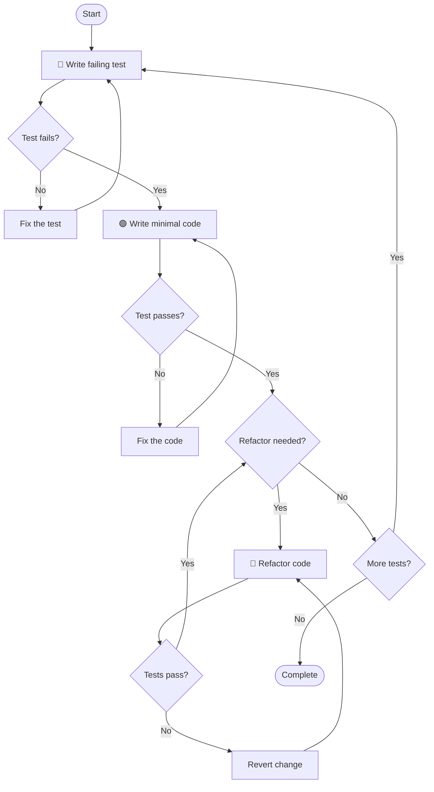

# TDD Workflow for Node.js/TypeScript

## Core Principle: RED-GREEN-REFACTOR

The TDD cycle consists of three distinct phases:

```
🔴 RED:      Write a failing test first
🟢 GREEN:    Write minimal code to make the test pass
🔵 REFACTOR: Improve code while keeping tests green
```

**Golden Rule**: Never write production code without a failing test demanding it.

## Phase Details

### 🔴 RED Phase

Write a test that describes the expected behavior. The test MUST fail.

**What to do:**
- Write a single test for one specific behavior
- Run the test and verify it fails
- Confirm the failure is for the expected reason

**Example (TypeScript with Jest):**
```typescript
// user.service.test.ts
describe('UserService', () => {
  describe('createUser', () => {
    it('should create a user with valid data', async () => {
      const userService = new UserService();

      const user = await userService.createUser({
        email: 'test@example.com',
        name: 'Test User'
      });

      expect(user.id).toBeDefined();
      expect(user.email).toBe('test@example.com');
      expect(user.name).toBe('Test User');
    });
  });
});
```

**Expected output:**
```
FAIL  src/user.service.test.ts
  UserService
    createUser
      ✕ should create a user with valid data (2 ms)

  ● UserService › createUser › should create a user with valid data

    ReferenceError: UserService is not defined
```

### 🟢 GREEN Phase

Write the minimum code necessary to make the test pass.

**What to do:**
- Implement just enough code to pass the test
- Avoid premature optimization
- Keep the implementation simple, even if "ugly"

**Example (Minimal implementation):**
```typescript
// user.service.ts
interface CreateUserInput {
  email: string;
  name: string;
}

interface User {
  id: string;
  email: string;
  name: string;
}

export class UserService {
  async createUser(input: CreateUserInput): Promise<User> {
    return {
      id: crypto.randomUUID(),
      email: input.email,
      name: input.name
    };
  }
}
```

**Expected output:**
```
PASS  src/user.service.test.ts
  UserService
    createUser
      ✓ should create a user with valid data (3 ms)
```

### 🔵 REFACTOR Phase

Improve the code without changing behavior. Tests must remain GREEN.

**What to do:**
- Extract common patterns
- Improve naming
- Remove duplication
- Optimize if necessary
- Run tests after each change

**Refactoring checklist:**
- [ ] Tests still pass
- [ ] No duplication
- [ ] Clear naming
- [ ] Single responsibility
- [ ] Proper error handling

## TDD Cycle Visualization



## Test Structure

### File Organization

```
src/
├── user/
│   ├── user.service.ts
│   ├── user.service.test.ts      # Unit tests
│   ├── user.repository.ts
│   ├── user.repository.test.ts
│   └── __tests__/
│       └── user.integration.test.ts  # Integration tests
```

### Test File Naming

| Type | Pattern | Example |
|------|---------|---------|
| Unit test | `*.test.ts` | `user.service.test.ts` |
| Integration test | `*.integration.test.ts` | `user.integration.test.ts` |
| E2E test | `*.e2e.test.ts` | `auth.e2e.test.ts` |

### Test Block Structure

```typescript
describe('ClassName/FunctionName', () => {
  // Setup
  beforeEach(() => {
    // Reset state before each test
  });

  describe('methodName', () => {
    describe('when condition', () => {
      it('should expected behavior', () => {
        // Arrange
        const input = createTestInput();

        // Act
        const result = systemUnderTest.method(input);

        // Assert
        expect(result).toEqual(expected);
      });
    });
  });
});
```

## Arrange-Act-Assert (AAA) Pattern

Every test should follow the AAA pattern:

```typescript
it('should calculate total price with discount', () => {
  // Arrange - Set up test data and dependencies
  const cart = new ShoppingCart();
  cart.addItem({ price: 100, quantity: 2 });
  const discount = 0.1; // 10% discount

  // Act - Execute the behavior under test
  const total = cart.calculateTotal(discount);

  // Assert - Verify the expected outcome
  expect(total).toBe(180);
});
```

## Mocking Dependencies

### When to Mock

| Scenario | Mock? | Reason |
|----------|-------|--------|
| External API | Yes | Unreliable, slow |
| Database | Depends | Unit: mock, Integration: real |
| File system | Yes | Side effects |
| Time/Date | Yes | Non-deterministic |
| Pure functions | No | Fast, deterministic |

### Mock Example

```typescript
// With Jest mocks
import { UserRepository } from './user.repository';

jest.mock('./user.repository');

describe('UserService', () => {
  let userService: UserService;
  let mockRepository: jest.Mocked<UserRepository>;

  beforeEach(() => {
    mockRepository = new UserRepository() as jest.Mocked<UserRepository>;
    userService = new UserService(mockRepository);
  });

  it('should find user by id', async () => {
    // Arrange
    const expectedUser = { id: '123', name: 'Test' };
    mockRepository.findById.mockResolvedValue(expectedUser);

    // Act
    const user = await userService.getUser('123');

    // Assert
    expect(user).toEqual(expectedUser);
    expect(mockRepository.findById).toHaveBeenCalledWith('123');
  });
});
```

## Test Commands

### Running Tests

```bash
# Run all tests
npm test

# Run tests in watch mode (during development)
npm test -- --watch

# Run specific test file
npm test -- user.service.test.ts

# Run tests matching pattern
npm test -- --testNamePattern="should create user"

# Run with coverage
npm test -- --coverage

# Run only changed files
npm test -- --onlyChanged
```

### Expected Coverage Thresholds

| Metric | Minimum | Target |
|--------|---------|--------|
| Statements | 80% | 90%+ |
| Branches | 75% | 85%+ |
| Functions | 80% | 90%+ |
| Lines | 80% | 90%+ |

## Error Handling Tests

Always test error scenarios:

```typescript
describe('UserService', () => {
  describe('getUser', () => {
    it('should throw NotFoundError when user does not exist', async () => {
      // Arrange
      mockRepository.findById.mockResolvedValue(null);

      // Act & Assert
      await expect(userService.getUser('999'))
        .rejects
        .toThrow(NotFoundError);
    });

    it('should throw ValidationError for invalid id format', async () => {
      // Act & Assert
      await expect(userService.getUser(''))
        .rejects
        .toThrow(ValidationError);
    });
  });
});
```

## Async Testing

### Promise-based

```typescript
it('should resolve with user data', async () => {
  const result = await userService.getUser('123');
  expect(result).toBeDefined();
});

it('should reject with error', async () => {
  await expect(userService.getUser('invalid'))
    .rejects
    .toThrow('User not found');
});
```

### Callback-based (legacy)

```typescript
it('should call callback with result', (done) => {
  userService.getUser('123', (err, result) => {
    expect(err).toBeNull();
    expect(result).toBeDefined();
    done();
  });
});
```

## Anti-patterns

### RED Phase Anti-patterns

| Pattern | Problem | Correct |
|---------|---------|---------|
| Testing implementation | Brittle tests | Test behavior |
| Too many assertions | Unclear failures | One concept per test |
| No failure verification | False positives | See test fail first |

### GREEN Phase Anti-patterns

| Pattern | Problem | Correct |
|---------|---------|---------|
| Over-engineering | Wasted effort | Minimal code |
| Copying production code | Missing cases | Write fresh |
| Skip to refactor | Unstable base | Make it work first |

### REFACTOR Phase Anti-patterns

| Pattern | Problem | Correct |
|---------|---------|---------|
| Big-bang refactoring | Risk of breakage | Small steps |
| No test run | Broken code | Test after each change |
| Adding features | Scope creep | Only improve existing |

### Examples

**Anti-pattern: Testing implementation**

```typescript
// ❌ Bad - tied to implementation
it('should call repository.save', async () => {
  await userService.createUser(data);
  expect(mockRepo.save).toHaveBeenCalled();
});

// ✅ Good - tests behavior
it('should persist user and return with id', async () => {
  const user = await userService.createUser(data);
  expect(user.id).toBeDefined();

  const found = await userService.getUser(user.id);
  expect(found).toEqual(user);
});
```

**Anti-pattern: Over-engineering in GREEN phase**

```typescript
// ❌ Bad - too much too soon
class UserService {
  constructor(
    private repo: UserRepository,
    private cache: CacheService,
    private validator: ValidationService,
    private logger: LoggerService,
    private eventBus: EventBus
  ) {}
}

// ✅ Good - minimal to pass test
class UserService {
  async createUser(input) {
    return { id: uuid(), ...input };
  }
}
```

## TDD Checklist

### Before Starting

- [ ] Requirements are clear and testable
- [ ] Test environment is set up
- [ ] Dependencies are identified

### RED Phase Checklist

- [ ] Test describes expected behavior
- [ ] Test uses meaningful names
- [ ] Test follows AAA pattern
- [ ] Test ran and FAILED
- [ ] Failure is for the RIGHT reason

### GREEN Phase Checklist

- [ ] Implementation is minimal
- [ ] No premature optimization
- [ ] All tests pass
- [ ] No new tests added during GREEN

### REFACTOR Phase Checklist

- [ ] Tests still pass
- [ ] Code is cleaner
- [ ] No behavior changed
- [ ] Changes are small and incremental
- [ ] Ready for next RED cycle

## Integration with TL Workflow

The `/nacl-tl-dev` skill enforces TDD by:

1. Reading test specifications from `task.md`
2. Writing tests FIRST (RED phase)
3. Running tests to confirm failure
4. Implementing minimal code (GREEN phase)
5. Running tests to confirm pass
6. Refactoring if needed
7. Recording TDD cycle in `result.md`

### Example result.md Entry

```markdown
## TDD Cycle Log

### Test 1: Create user with valid data
- 🔴 RED: Test written, fails with "UserService is not defined"
- 🟢 GREEN: Implemented UserService.createUser(), test passes
- 🔵 REFACTOR: Extracted User interface, tests still pass

### Test 2: Validate email format
- 🔴 RED: Test written, fails with "Expected ValidationError"
- 🟢 GREEN: Added email validation, test passes
- 🔵 REFACTOR: Skipped, implementation is clean
```
