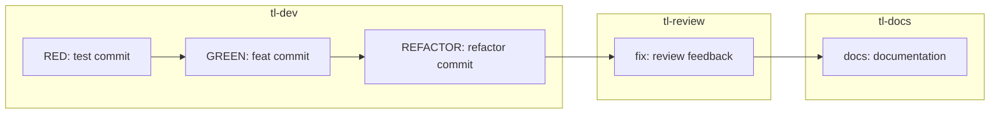

# Commit Conventions

## Overview

This document defines the commit message format and conventions for the TL workflow. Following consistent commit conventions enables automated changelog generation, semantic versioning, and clear project history. All commits made by TL skills MUST follow the Conventional Commits specification.

## Key Principle: Meaningful History

**CRITICAL**: Every commit should tell a story. The commit message should explain WHY the change was made, not just WHAT was changed. The code diff shows what changed — the message explains the intent.

```
📝 Format:    type(scope): description
📊 History:   Searchable, filterable, meaningful
🔄 Automation: Changelog generation, version bumping
```

---

## Commit Message Format

### Basic Structure

```
<type>(<scope>): <description>

[optional body]

[optional footer(s)]
```

### Full Example

```
feat(orders): add order cancellation endpoint

Implement POST /orders/{id}/cancel endpoint that allows users
to cancel pending orders. Cancelled orders trigger refund
workflow automatically.

Closes: UC007
Refs: SA-orders/UC007.md
Co-Authored-By: Claude <noreply@anthropic.com>
```

---

## Commit Types

### Primary Types

| Type | Description | Changelog Section | Version Bump |
|------|-------------|-------------------|--------------|
| `feat` | New feature | Features | MINOR |
| `fix` | Bug fix | Bug Fixes | PATCH |
| `docs` | Documentation only | Documentation | - |
| `style` | Formatting, whitespace | - | - |
| `refactor` | Code change (no feature/fix) | - | - |
| `perf` | Performance improvement | Performance | PATCH |
| `test` | Adding/fixing tests | - | - |
| `build` | Build system changes | - | - |
| `ci` | CI configuration | - | - |
| `chore` | Maintenance tasks | - | - |

### Breaking Changes

Any type can include breaking changes. Add `!` after type/scope or include `BREAKING CHANGE:` in footer:

```
feat(api)!: change order response format

BREAKING CHANGE: Order response now uses ISO dates instead of Unix timestamps
```

This triggers a MAJOR version bump.

---

## Scope Guidelines

### What is Scope?

Scope describes the section of the codebase affected. Use consistent scope names throughout the project.

### Standard Scopes for TL Projects

| Scope | Description | Example |
|-------|-------------|---------|
| `orders` | Order management | `feat(orders): add bulk create` |
| `users` | User management | `fix(users): resolve login race` |
| `api` | API layer | `refactor(api): extract middleware` |
| `db` | Database layer | `perf(db): add order index` |
| `auth` | Authentication | `fix(auth): token refresh logic` |
| `tests` | Test infrastructure | `chore(tests): update fixtures` |
| `config` | Configuration | `docs(config): add env examples` |

### Scope Rules

1. **Lowercase only** — Use `orders` not `Orders`
2. **Singular form** — Use `order` not `orders` (project choice, be consistent)
3. **Short and clear** — Prefer `db` over `database`
4. **Optional** — Omit scope for cross-cutting changes

```
✅ Good:
feat(orders): add order export
fix(api): handle timeout errors
refactor: extract validation utils

❌ Bad:
feat(Orders): add order export     # Uppercase
fix(order-api): handle errors      # Compound scope
refactor(misc): cleanup           # Meaningless scope
```

---

## Description Guidelines

### Writing Good Descriptions

| Guideline | Good | Bad |
|-----------|------|-----|
| Use imperative mood | `add validation` | `added validation` |
| No capitalization | `fix null check` | `Fix null check` |
| No period at end | `update config` | `update config.` |
| Be specific | `fix order total rounding` | `fix bug` |
| 50 chars or less | `add order cancel endpoint` | `add a new endpoint for cancelling orders` |

### Description Formula

```
<verb> <what> [<where/why>]
```

Examples:
- `add` order cancellation endpoint
- `fix` null check in order validator
- `update` timeout to 30s for slow queries
- `remove` deprecated orderV1 handler
- `refactor` order service to use repository pattern

### Common Verbs

| Verb | Use When |
|------|----------|
| `add` | New functionality |
| `remove` | Deleting code/features |
| `fix` | Bug corrections |
| `update` | Modifying existing behavior |
| `refactor` | Restructuring without behavior change |
| `rename` | Changing names |
| `move` | Relocating files/code |
| `extract` | Pulling out into separate unit |
| `inline` | Removing abstraction |
| `replace` | Swapping implementations |

---

## Commit Body

### When to Include Body

Include a body when:
- Change is non-obvious
- Multiple approaches were considered
- There's important context
- Breaking changes need explanation

### Body Format

```
feat(orders): add order cancellation endpoint

Implement POST /orders/{id}/cancel endpoint that allows users
to cancel pending orders. Cancelled orders trigger refund
workflow automatically.

The refund is processed asynchronously to avoid blocking the
response. Users receive an email confirmation when the refund
completes.

Considered synchronous refund but rejected due to:
- 3rd party payment API latency (2-5s)
- Risk of timeout during high load
```

### Body Guidelines

1. **Wrap at 72 characters** — For terminal readability
2. **Blank line** — Separate from subject
3. **Explain why** — Not what (code shows what)
4. **Bullet points OK** — For listing items

---

## Commit Footer

### Standard Footers

| Footer | Purpose | Example |
|--------|---------|---------|
| `Closes:` | Links to task | `Closes: UC007` |
| `Refs:` | References SA artifact | `Refs: SA-orders/UC007.md` |
| `Fixes:` | Bug/issue reference | `Fixes: #123` |
| `BREAKING CHANGE:` | Breaking change description | See below |
| `Co-Authored-By:` | Credit co-author | `Co-Authored-By: Name <email>` |
| `Reviewed-By:` | Credit reviewer | `Reviewed-By: Name <email>` |

### Breaking Change Footer

```
feat(api)!: change order response format

Migrate order endpoints to use new response schema.

BREAKING CHANGE: Order response now includes nested `customer`
object instead of flat `customerName` and `customerEmail` fields.

Before: { "customerName": "John" }
After:  { "customer": { "name": "John" } }
```

### TL Workflow Footers

```
feat(orders): add order creation

Implement order creation use case with full validation.

Closes: UC001
Refs: SA-orders/UC001.md
TDD-Cycle: complete
Tests: 7 passing
Coverage: 87%
Co-Authored-By: Claude <noreply@anthropic.com>
```

---

## TDD Phase Commits

### RED Phase

```
test(orders): add failing tests for order creation

Add test cases for UC001 requirements:
- Create order with valid data
- Reject empty items array
- Reject invalid client ID
- Calculate total correctly

All tests currently failing (RED phase).

Refs: .tl/tasks/UC001/test-spec.md
```

### GREEN Phase

```
feat(orders): implement order creation

Add OrderService.createOrder() to pass all UC001 tests.

Implementation includes:
- Input validation
- Client lookup
- Total calculation
- Database persistence

All 7 tests now passing (GREEN phase).

Refs: .tl/tasks/UC001/impl-brief.md
```

### REFACTOR Phase

```
refactor(orders): extract order number generator

Move order number generation to dedicated utility class
for reuse across order operations.

No behavior change - all tests still passing.

Extracted: OrderNumberGenerator.generate()
```

---

## Commit Frequency

### Guidelines

| Situation | Recommendation |
|-----------|----------------|
| TDD RED phase | Single commit with all tests |
| TDD GREEN phase | Single commit with implementation |
| TDD REFACTOR | One commit per refactoring |
| Bug fix | Single atomic commit |
| Feature | Multiple logical commits |

### Atomic Commits

Each commit should:
- Be self-contained
- Pass all tests
- Not break the build
- Be revertable independently

```
✅ Good Commit Sequence:
1. test(orders): add failing tests for validation
2. feat(orders): implement input validation
3. test(orders): add failing tests for persistence
4. feat(orders): implement order persistence
5. refactor(orders): extract validation to decorator

❌ Bad Commit Sequence:
1. feat(orders): add order creation (WIP)
2. fix(orders): forgot validation
3. fix(orders): typo
4. feat(orders): actually working now
```

---

## Examples by Phase

### tl-dev Commits

```
# RED phase
test(orders): add failing tests for UC001

# GREEN phase
feat(orders): implement order creation for UC001

# REFACTOR phase
refactor(orders): extract OrderValidator class
```

### tl-review Commits

```
# Addressing review feedback
fix(orders): add missing audit log per review

# Style fixes
style(orders): fix formatting per review checklist
```

### tl-docs Commits

```
# Documentation updates
docs(api): add order creation endpoint docs

docs(readme): add orders module to feature list
```

---

## Anti-Patterns

### Message Anti-Patterns

```
❌ Bad Messages:

"fix"                          # Too vague
"WIP"                          # Work in progress commit
"misc changes"                 # Meaningless
"Updated files"                # Obvious
"Fixed bug"                    # Which bug?
"Review fixes"                 # What was fixed?
"Monday work"                  # Irrelevant
"asdfasdf"                     # Random
"please work"                  # Desperate

✅ Good Messages:

fix(orders): resolve null pointer in total calc
feat(orders): add bulk order creation
refactor(orders): extract validation logic
docs(orders): add API usage examples
```

### Commit Anti-Patterns

```
❌ Bad Practices:

1. Giant commits with unrelated changes
2. Commits that break the build
3. Commits without running tests
4. Mixing refactoring with features
5. Squashing meaningful history
6. Force-pushing to shared branches

✅ Good Practices:

1. Small, focused commits
2. Every commit passes CI
3. Run tests before committing
4. Separate refactoring commits
5. Preserve meaningful history
6. Only force-push personal branches
```

---

## Integration with TL Workflow

### Commit Flow



### Auto-Generated Footers

TL skills automatically add these footers:

```
# tl-dev adds:
Closes: {TASK_ID}
Refs: .tl/tasks/{TASK_ID}/task.md
TDD-Phase: {RED|GREEN|REFACTOR}
Co-Authored-By: Claude <noreply@anthropic.com>

# tl-review adds:
Reviewed-By: tl-review
Review-Status: {approved|changes_requested}

# tl-docs adds:
Docs-Updated: {list of files}
```

---

## Quick Reference Card

### Format
```
type(scope): description (50 chars max)

Body explaining why (wrap at 72 chars)

Footer: value
```

### Types
`feat` `fix` `docs` `style` `refactor` `perf` `test` `build` `ci` `chore`

### Breaking Changes
```
feat(api)!: description
# or
BREAKING CHANGE: explanation in footer
```

### TDD Commits
```
test(scope): RED phase - failing tests
feat(scope): GREEN phase - implementation
refactor(scope): REFACTOR phase - improvements
```

---

## Checklist: Commit Quality

### Before Committing

- [ ] All tests pass
- [ ] Code compiles without errors
- [ ] No debugging code left behind
- [ ] Changes are logically grouped

### Message Quality

- [ ] Type is correct (feat/fix/refactor/etc)
- [ ] Scope is appropriate and consistent
- [ ] Description uses imperative mood
- [ ] Description is 50 chars or less
- [ ] No capitalization or period in description

### Body (if included)

- [ ] Explains why, not what
- [ ] Wrapped at 72 characters
- [ ] Blank line after subject

### Footer

- [ ] Task ID referenced (Closes: UC###)
- [ ] SA artifact referenced (Refs: path)
- [ ] Breaking changes documented
- [ ] Co-author credited

### TL Workflow

- [ ] TDD phase commit follows pattern
- [ ] Review fixes in separate commits
- [ ] Documentation in separate commits
